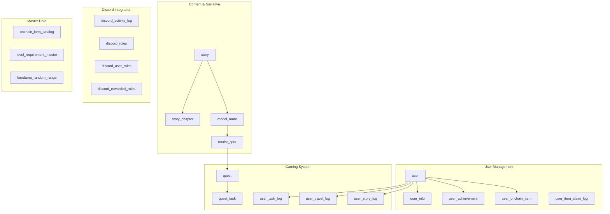

# 🗃️ Tourii Database Architecture

> **Complete database documentation for the Tourii tourism platform**

This document provides comprehensive information about the database schema, models, relationships, and operations for the Tourii Backend system.

## 📊 Database Overview

### Technology Stack

- **Database**: PostgreSQL 14+
- **ORM**: Prisma 6.5.0+
- **Migration Tool**: Prisma Migrate
- **Query Builder**: Prisma Client with TypeScript
- **Caching**: Redis for session and API response caching

### Schema Generation

The database includes auto-generated documentation:
- **Schema Docs**: `prisma/docs/tourii-db-docs.md`
- **ER Diagram**: `prisma/docs/tourii-er-diagram.md`
- **Migration History**: `prisma/migrations/`

---

## 🏗️ Database Architecture

### Entity Groups

The database is organized into logical entity groups:



---

## 👥 User Management

### Core User Entity

The `user` table serves as the foundation for all user-related data:

```sql
-- User table with multi-provider authentication
user (
  user_id              VARCHAR(255) PRIMARY KEY,  -- Generated: TSU202506-rand1-DDHHMI-rand2-counter
  username             VARCHAR(255) UNIQUE,
  
  -- Authentication providers
  discord_id           VARCHAR UNIQUE,
  discord_username     VARCHAR(255),
  twitter_id           VARCHAR UNIQUE,
  twitter_username     VARCHAR(255),
  google_email         VARCHAR UNIQUE,
  email                VARCHAR UNIQUE,
  password             VARCHAR,                    -- Hashed
  refresh_token        VARCHAR,                    -- JWT refresh token
  
  -- Blockchain wallet addresses
  passport_wallet_address VARCHAR UNIQUE,
  perks_wallet_address    VARCHAR UNIQUE,
  encrypted_private_key   VARCHAR,
  
  -- User metrics
  is_premium              BOOLEAN DEFAULT false,
  total_quest_completed   INTEGER DEFAULT 0,
  total_travel_distance   FLOAT DEFAULT 0.0,
  role                    UserRoleType DEFAULT 'USER',
  
  -- System fields
  registered_at           TIMESTAMP DEFAULT now(),
  is_banned              BOOLEAN DEFAULT false,
  del_flag               BOOLEAN DEFAULT false,
  ins_date_time          TIMESTAMP DEFAULT now(),
  upd_date_time          TIMESTAMP DEFAULT now()
);
```

### User Profile Extension

The `user_info` table contains extended profile data:

```sql
-- Extended user profile information
user_info (
  user_info_id                VARCHAR(255) PRIMARY KEY,
  user_id                     VARCHAR(255) UNIQUE,      -- FK to user
  
  -- Digital passport details
  digital_passport_address    VARCHAR UNIQUE,
  log_nft_address            VARCHAR,
  passport_token_id          VARCHAR(255),
  user_digital_passport_type PassportType DEFAULT 'BONJIN',
  level                      LevelType DEFAULT 'BONJIN',
  discount_rate              FLOAT,
  
  -- Game currency & metrics
  magatama_points            INTEGER DEFAULT 0,
  magatama_bags              INTEGER DEFAULT 0,
  total_quest_completed      INTEGER DEFAULT 0,
  total_travel_distance      FLOAT DEFAULT 0.0,
  is_premium                 BOOLEAN DEFAULT false,
  
  -- Collectibles
  prayer_bead                INTEGER DEFAULT 0,
  sword                      INTEGER DEFAULT 0,
  orge_mask                  INTEGER DEFAULT 0
);
```

### User Progress Tracking

Multiple tables track different aspects of user progress:

```sql
-- Quest task completion tracking
user_task_log (
  user_task_log_id           VARCHAR(255) PRIMARY KEY,
  user_id                    VARCHAR(255),
  quest_id                   VARCHAR(255),
  task_id                    VARCHAR(255),
  
  status                     TaskStatus DEFAULT 'AVAILABLE',
  action                     TaskType DEFAULT 'SELECT_OPTION',
  user_response              TEXT,
  group_activity_members     JSON[],
  submission_data            JSON,
  failed_reason              TEXT,
  
  completed_at               TIMESTAMP,
  total_magatama_point_awarded INTEGER DEFAULT 0,
  reward_earned              VARCHAR(255),
  
  UNIQUE(user_id, quest_id, task_id)
);

-- Travel and location tracking
user_travel_log (
  user_travel_log_id         VARCHAR(255) PRIMARY KEY,
  user_id                    VARCHAR(255),
  quest_id                   VARCHAR(255),
  task_id                    VARCHAR(255),
  tourist_spot_id            VARCHAR(255),
  
  user_longitude             FLOAT,
  user_latitude              FLOAT,
  travel_distance_from_target FLOAT,
  travel_distance            FLOAT DEFAULT 0.0,
  
  qr_code_value              VARCHAR(255),
  check_in_method            CheckInMethod,
  
  detected_fraud             BOOLEAN,
  fraud_reason               VARCHAR(255)
);

-- Story reading progress
user_story_log (
  user_story_log_id          VARCHAR(255) PRIMARY KEY,
  user_id                    VARCHAR(255),
  story_chapter_id           VARCHAR(255),
  
  status                     StoryStatus DEFAULT 'UNREAD',
  unlocked_at                TIMESTAMP,
  finished_at                TIMESTAMP
);
```

---

## 📚 Content & Narrative System

### Story Management

The story system creates immersive narratives tied to real locations:

```sql
-- Story sagas (e.g., "Bungo Ono", "Aomori")
story (
  story_id              VARCHAR(255) PRIMARY KEY,
  saga_name             VARCHAR(255),              -- "Bungo Ono"
  saga_desc             TEXT,
  background_media      VARCHAR(255),              -- Cover image/video URL
  map_image             VARCHAR(255),              -- Saga map image
  location              VARCHAR(255),              -- "Oita, Japan"
  order                 INTEGER,                   -- Display order
  is_prologue           BOOLEAN DEFAULT false,
  is_selected           BOOLEAN DEFAULT false
);

-- Individual story chapters
story_chapter (
  story_chapter_id      VARCHAR(255) PRIMARY KEY,
  story_id              VARCHAR(255),              -- FK to story
  tourist_spot_id       VARCHAR(255),              -- Linked location
  
  chapter_number        VARCHAR(255),              -- "Prologue", "Chapter 1"
  chapter_title         VARCHAR(255),
  chapter_desc          TEXT,
  chapter_image         VARCHAR(255),              -- Fictional chapter image
  character_name_list   VARCHAR(255)[],            -- ["Kagura", "Kagutsuchi"]
  real_world_image      VARCHAR(255),              -- Real location photo
  
  -- Rich media content
  chapter_video_url         VARCHAR(255),          -- Desktop video
  chapter_video_mobile_url  VARCHAR(255),          -- Mobile-optimized video
  chapter_pdf_url           VARCHAR(255),          -- Downloadable PDF
  
  is_unlocked           BOOLEAN DEFAULT false
);
```

### Location & Route Management

Travel routes connect locations into cohesive journeys:

```sql
-- Travel routes within story sagas
model_route (
  model_route_id        VARCHAR(255) PRIMARY KEY,
  story_id              VARCHAR(255),              -- FK to story
  
  route_name            VARCHAR(255),
  recommendation        JSON[],                    -- ["Local Food", "Nature"]
  region                VARCHAR(255),              -- From story.saga_name
  region_desc           TEXT,
  region_latitude       FLOAT,
  region_longitude      FLOAT,
  region_background_media VARCHAR(255)             -- From story.background_media
);

-- Physical tourist destinations
tourist_spot (
  tourist_spot_id       VARCHAR(255) PRIMARY KEY,
  model_route_id        VARCHAR(255),              -- FK to model_route
  story_chapter_id      VARCHAR(255),              -- FK to story_chapter
  
  tourist_spot_name     VARCHAR(255),              -- "Harajiri Falls"
  tourist_spot_desc     TEXT,
  latitude              FLOAT,                     -- GPS coordinates
  longitude             FLOAT,
  
  best_visit_time       VARCHAR(255),              -- "10:00 - 18:00"
  address               VARCHAR(255),              -- Google Maps address
  story_chapter_link    VARCHAR(255),
  tourist_spot_hashtag  VARCHAR(255)[],            -- ["#Tokyo", "#Japan"]
  
  -- Image collection
  image_set             JSON                       -- {"main": "url", "small": ["url1", "url2"]}
);
```

---

## 🎯 Quest & Gaming System

### Quest Structure

Quests provide gamified challenges tied to locations:

```sql
-- Location-based challenges
quest (
  quest_id              VARCHAR(255) PRIMARY KEY,
  tourist_spot_id       VARCHAR(255),              -- FK to tourist_spot
  
  quest_name            VARCHAR(255),              -- "Waterfall Seeker"
  quest_desc            TEXT,
  quest_type            QuestType DEFAULT 'UNKNOWN',
  quest_image           VARCHAR(255),
  
  is_unlocked           BOOLEAN DEFAULT false,
  is_premium            BOOLEAN DEFAULT false,     -- Requires subscription
  
  -- Rewards
  total_magatama_point_awarded INTEGER DEFAULT 0,
  reward_type           RewardType DEFAULT 'UNKNOWN',
  reward_items          JSON[]                     -- Detailed reward information
);

-- Individual tasks within quests
quest_task (
  quest_task_id         VARCHAR(255) PRIMARY KEY,
  quest_id              VARCHAR(255),              -- FK to quest
  
  task_theme            TaskTheme DEFAULT 'STORY',
  task_type             TaskType DEFAULT 'SELECT_OPTION',
  task_name             VARCHAR(255),
  task_desc             TEXT,
  accepted_answer       VARCHAR(255),              -- For validation
  is_unlocked           BOOLEAN DEFAULT false,
  
  -- Task configuration
  required_action       VARCHAR(255),              -- Task-specific requirements
  group_activity_members JSON[],                   -- For group tasks
  select_options        JSON[],                    -- Multiple choice options
  anti_cheat_rules      JSON,                      -- Abuse prevention
  
  -- Rewards
  magatama_point_awarded INTEGER DEFAULT 0,
  reward_earned         VARCHAR(255)
);
```

### Task Types & Validation

The system supports multiple task interaction types:

| Task Type | Description | Validation |
|-----------|-------------|------------|
| `VISIT_LOCATION` | GPS-based check-ins | Location proximity |
| `PHOTO_UPLOAD` | Image capture | File type, size limits |
| `QR_SCAN` | QR code verification | Code uniqueness |
| `ANSWER_TEXT` | Open-ended responses | Text matching |
| `SELECT_OPTION` | Multiple choice | Option validation |
| `SHARE_SOCIAL` | Social media sharing | URL verification |
| `GROUP_ACTIVITY` | Collaborative challenges | Member validation |
| `CHECK_IN` | Location confirmation | GPS tolerance |

---

## ⛓️ Blockchain Integration

### NFT & Digital Assets

The system tracks blockchain items across different networks:

```sql
-- User-owned blockchain assets
user_onchain_item (
  user_onchain_item_id  VARCHAR(255) PRIMARY KEY,
  user_id               VARCHAR(255),              -- FK to user
  
  item_type             OnchainItemType DEFAULT 'UNKNOWN',
  item_txn_hash         VARCHAR UNIQUE,            -- Blockchain transaction
  blockchain_type       BlockchainType DEFAULT 'UNKNOWN',
  minted_at             TIMESTAMP,
  onchain_item_id       VARCHAR UNIQUE,
  status                OnchainItemStatus DEFAULT 'ACTIVE'
);

-- Master catalog of available NFTs
onchain_item_catalog (
  onchain_item_id       VARCHAR(255) PRIMARY KEY,
  
  item_type             OnchainItemType DEFAULT 'UNKNOWN',
  blockchain_type       BlockchainType DEFAULT 'UNKNOWN',
  
  nft_name              VARCHAR(255),
  nft_description       VARCHAR(255),
  image_url             VARCHAR(255),
  contract_address      VARCHAR(255),
  
  -- Blockchain metadata
  token_id              VARCHAR(255),
  metadata_url          VARCHAR(255),
  attributes            JSON[],
  
  -- Availability
  release_date          TIMESTAMP,
  expiry_date           TIMESTAMP,
  max_supply            INTEGER DEFAULT 0
);
```

### Digital Passport Levels

The progression system defines user advancement:

```sql
-- Level progression requirements
level_requirement_master (
  level                 LevelType PRIMARY KEY,
  
  discord_role_id       VARCHAR(255),
  
  -- Point requirements
  min_get_magatama_points INTEGER,
  max_get_magatama_points INTEGER,
  
  -- Item requirements
  total_onchain_item    INTEGER DEFAULT 0,
  prayer_bead           INTEGER DEFAULT 0,
  sword                 INTEGER DEFAULT 0,
  orge_mask             INTEGER DEFAULT 0
);
```

**Progression Levels:**
```
BONJIN (Base) → E_CLASS → D_CLASS → C_CLASS → B_CLASS → A_CLASS → S_CLASS
```

**Passport Types:**
- `BONJIN`: Standard human passport
- `AMATSUKAMI`: Celestial deity passport  
- `KUNITSUKAMI`: Earthly deity passport
- `YOKAI`: Supernatural being passport

---

## 👥 Discord Integration

### Community Features

Discord integration provides social and community features:

```sql
-- Discord role management
discord_roles (
  role_id               BIGINT PRIMARY KEY,        -- Discord's role ID
  name                  VARCHAR(255) UNIQUE
);

-- User role assignments
discord_user_roles (
  discord_user_roles_id VARCHAR(255) PRIMARY KEY,
  user_id               VARCHAR(255),              -- FK to user
  role_id               BIGINT                     -- FK to discord_roles
);

-- Activity tracking
discord_activity_log (
  discord_activity_log_id VARCHAR(255) PRIMARY KEY,
  user_id               VARCHAR(255),              -- FK to user
  
  activity_type         VARCHAR(255),              -- "message_sent", "voice_participation"
  activity_details      TEXT,
  magatama_point_awarded INTEGER
);

-- Role-based rewards
discord_rewarded_roles (
  discord_rewarded_roles_id VARCHAR(255) PRIMARY KEY,
  user_id               VARCHAR(255),              -- FK to user
  role_id               BIGINT,
  magatama_point_awarded INTEGER
);
```

---

## 📊 Analytics & Feeds

### Activity Aggregation

The system includes a materialized view for user activity feeds:

```sql
-- Activity feed aggregation
VIEW moment_view AS (
  SELECT 
    id,
    user_id,
    username,
    image_url,
    description,
    reward_text,
    ins_date_time,
    moment_type                     -- 'QUEST_COMPLETION', 'STORY_PROGRESS', 'TRAVEL_LOG'
  FROM (
    -- Quest completions
    UNION quest_completion_moments
    -- Story progress
    UNION story_progress_moments  
    -- Travel activities
    UNION travel_activity_moments
  )
  ORDER BY ins_date_time DESC
);
```

---

## 🔧 Database Operations

### Setup & Migration

**Initial Setup:**
```bash
# Install dependencies
pnpm install

# Setup database
pnpm prisma:migrate:dev

# Execute custom SQL scripts (views, functions)
pnpm prisma:db:execute

# Open database GUI
pnpm prisma:studio
```

**Migration Commands:**
```bash
# Development migrations
pnpm prisma:migrate:dev          # Apply migrations with prompts
pnpm prisma:migrate:test         # Reset test database

# Custom SQL execution
pnpm prisma:db:execute           # Execute moment_view.sql script
```

### Data Seeding

The system includes a modular seeding approach:

**Modular Seeding (Recommended):**
```bash
# Full database seeding
npx tsx prisma/seed-new.ts

# Partial seeding options
npx tsx prisma/seed-new.ts --users-only      # Create test users only
npx tsx prisma/seed-new.ts --stories-only    # Create stories & content
npx tsx prisma/seed-new.ts --clean           # Clean database first
```

**Default Test Data:**
- **Users**: `alice` (USER), `bob` (MODERATOR), `admin` (ADMIN)
- **Stories**: Sample sagas with chapters and routes
- **Quests**: Example location-based challenges
- **Master Data**: Level requirements and item catalogs

### Database Maintenance

**Performance Optimization:**
```sql
-- Key indexes for query performance
CREATE INDEX idx_user_email ON user(email);
CREATE INDEX idx_user_discord_id ON user(discord_id);
CREATE INDEX idx_quest_tourist_spot_type ON quest(tourist_spot_id, quest_type);
CREATE INDEX idx_user_task_log_completion ON user_task_log(status, completed_at);
CREATE INDEX idx_user_travel_log_location ON user_travel_log(user_longitude, user_latitude);
```

**Data Cleanup:**
```sql
-- Soft delete cleanup (periodic maintenance)
DELETE FROM user WHERE del_flag = true AND upd_date_time < now() - INTERVAL '90 days';
DELETE FROM quest WHERE del_flag = true AND upd_date_time < INTERVAL '30 days';
```

---

## 🔒 Security & Data Protection

### Row-Level Security

**User Data Isolation:**
```sql
-- Ensure users can only access their own data
CREATE POLICY user_isolation ON user_task_log
  FOR ALL TO authenticated_users
  USING (user_id = current_user_id());

CREATE POLICY travel_log_isolation ON user_travel_log
  FOR ALL TO authenticated_users
  USING (user_id = current_user_id());
```

### Data Encryption

**Sensitive Data Protection:**
- **Passwords**: Bcrypt hashing with salt
- **Private Keys**: AES-256 encryption with environment key
- **PII Data**: Field-level encryption for sensitive information

### Audit Trail

**Request Tracking:**
- **request_id**: Unique identifier for distributed tracing
- **ins_user_id/upd_user_id**: User who created/modified records
- **ins_date_time/upd_date_time**: Creation and modification timestamps

---

## 📈 Performance Considerations

### Query Optimization

**Common Query Patterns:**
```sql
-- User quest progress with location data
SELECT 
  q.quest_name,
  ts.tourist_spot_name,
  ts.latitude,
  ts.longitude,
  utl.status,
  utl.completed_at
FROM quest q
JOIN tourist_spot ts ON q.tourist_spot_id = ts.tourist_spot_id
LEFT JOIN user_task_log utl ON q.quest_id = utl.quest_id
WHERE utl.user_id = $1
  AND utl.status = 'COMPLETED'
ORDER BY utl.completed_at DESC;

-- Activity feed with pagination
SELECT * FROM moment_view
WHERE user_id = $1
ORDER BY ins_date_time DESC
LIMIT $2 OFFSET $3;
```

### Caching Strategy

**Redis Implementation:**
- **User Sessions**: 24-hour TTL
- **Location Data**: 1-hour TTL for Google Places API results
- **Quest Data**: 15-minute TTL for frequently accessed quests
- **Leaderboards**: 5-minute TTL for dynamic rankings

### Connection Management

**Prisma Configuration:**
```typescript
// Connection pool settings
const prisma = new PrismaClient({
  datasources: {
    db: {
      url: process.env.DATABASE_URL,
    },
  },
  log: ['query', 'info', 'warn', 'error'],
});

// Read replica support
const prismaReadReplica = new PrismaClient({
  datasources: {
    db: {
      url: process.env.DATABASE_READ_URL,
    },
  },
}).$extends(readReplicas({
  url: process.env.DATABASE_READ_URL
}));
```

---

## 🚨 Backup & Recovery

### Backup Strategy

**Automated Backups:**
- **Daily**: Full database backup with 30-day retention
- **Hourly**: Transaction log backup for point-in-time recovery
- **Weekly**: Full backup with long-term storage (1 year retention)

**Backup Commands:**
```bash
# Manual backup
pg_dump -h localhost -U username -d tourii_backend > backup_$(date +%Y%m%d).sql

# Restore from backup
psql -h localhost -U username -d tourii_backend < backup_20250620.sql
```

### Disaster Recovery

**Recovery Procedures:**
1. **Point-in-Time Recovery**: Restore to specific timestamp
2. **Cross-Region Replication**: Automated failover to secondary region
3. **Data Validation**: Integrity checks after recovery
4. **Application Testing**: Verify functionality post-recovery

---

## 🔍 Monitoring & Diagnostics

### Database Health

**Key Metrics:**
- **Connection Pool**: Active/idle connections
- **Query Performance**: Slow query identification
- **Lock Contention**: Blocking queries and deadlocks
- **Disk Usage**: Table and index size growth
- **Cache Hit Ratio**: Buffer cache effectiveness

**Monitoring Queries:**
```sql
-- Slow queries
SELECT query, mean_time, calls, total_time
FROM pg_stat_statements
ORDER BY mean_time DESC
LIMIT 10;

-- Connection status
SELECT state, count(*)
FROM pg_stat_activity
GROUP BY state;

-- Database size
SELECT 
  schemaname,
  tablename,
  pg_size_pretty(pg_total_relation_size(schemaname||'.'||tablename)) as size
FROM pg_tables
ORDER BY pg_total_relation_size(schemaname||'.'||tablename) DESC;
```

---

## 🚀 Future Considerations

### Scalability Planning

**Horizontal Scaling:**
- **Read Replicas**: Distribute read traffic across multiple instances
- **Database Sharding**: Partition data by geographic region or user segments
- **Connection Pooling**: External connection pooler (PgBouncer) for high concurrency

**Vertical Scaling:**
- **Resource Optimization**: CPU, memory, and storage scaling
- **Index Optimization**: Regular index maintenance and analysis
- **Query Optimization**: Continuous performance monitoring and tuning

### Schema Evolution

**Migration Strategy:**
- **Blue-Green Deployments**: Zero-downtime schema changes
- **Feature Flags**: Gradual rollout of database changes
- **Backward Compatibility**: Maintain API compatibility during transitions

---

_Last Updated: June 20, 2025_