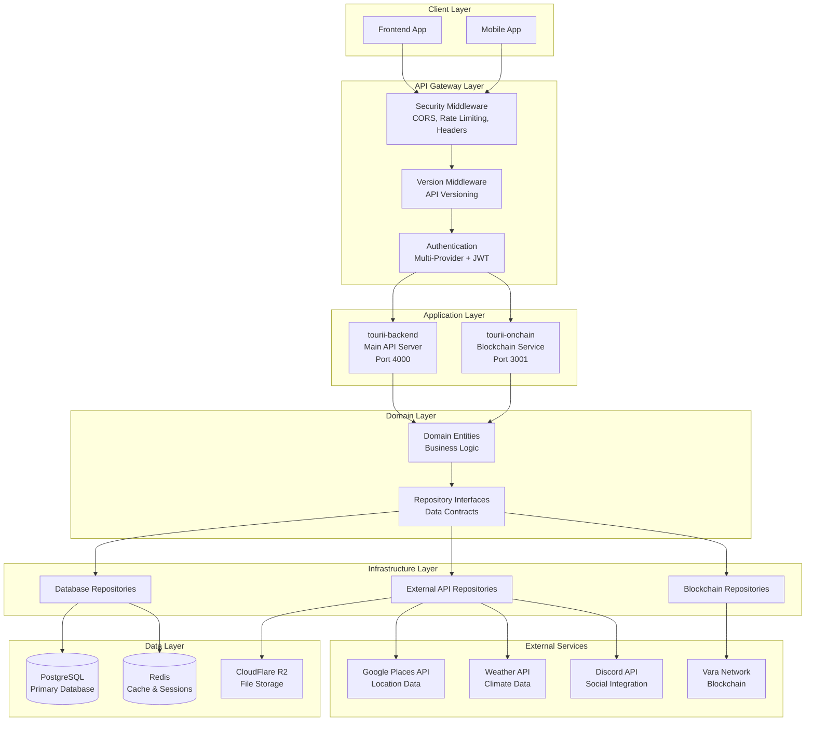
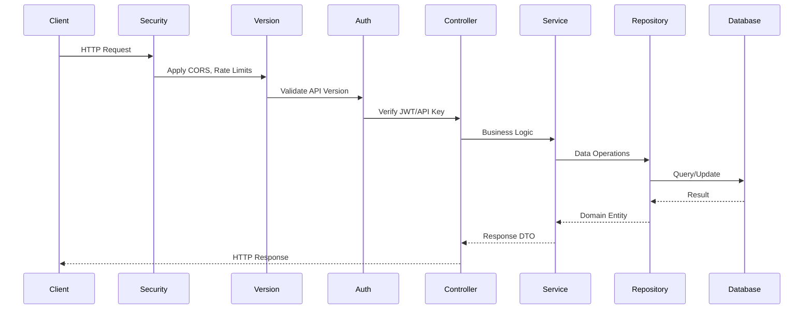
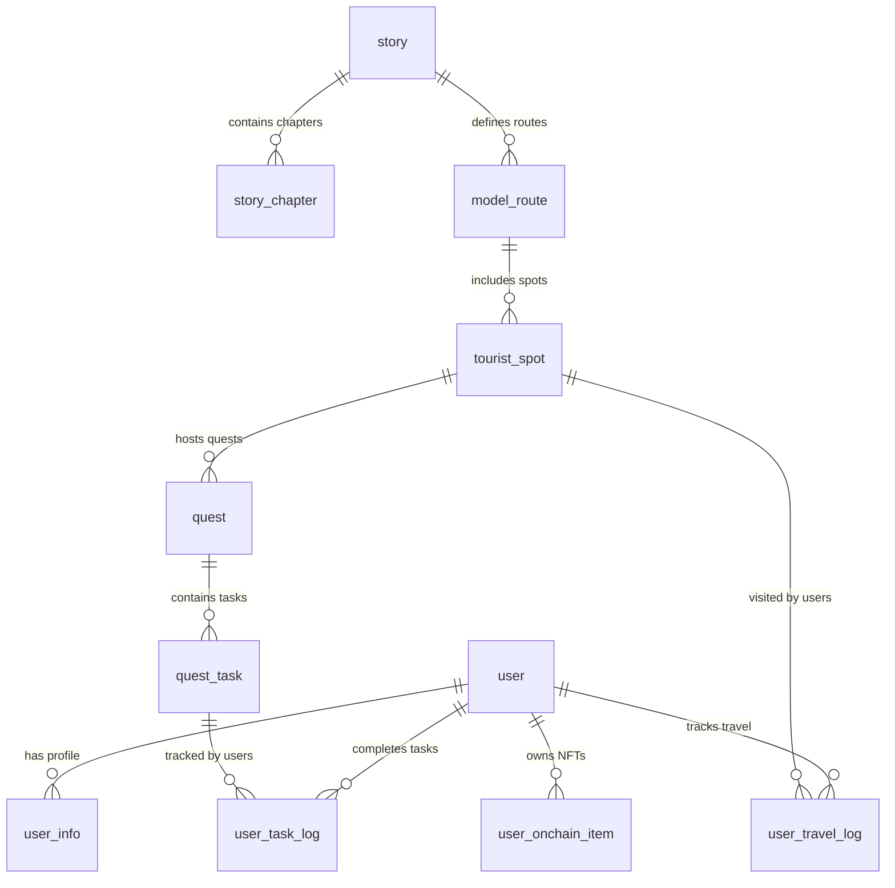
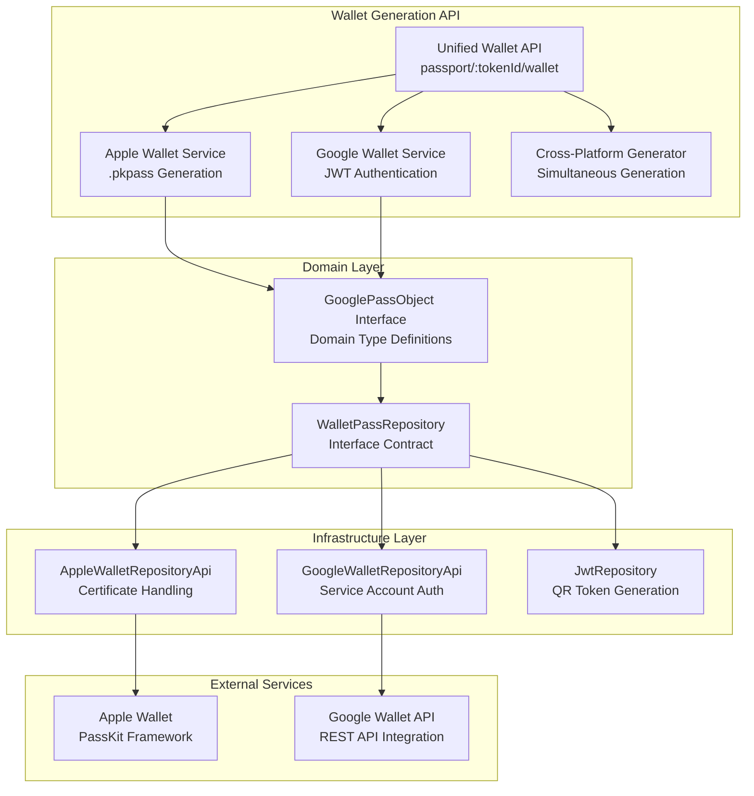
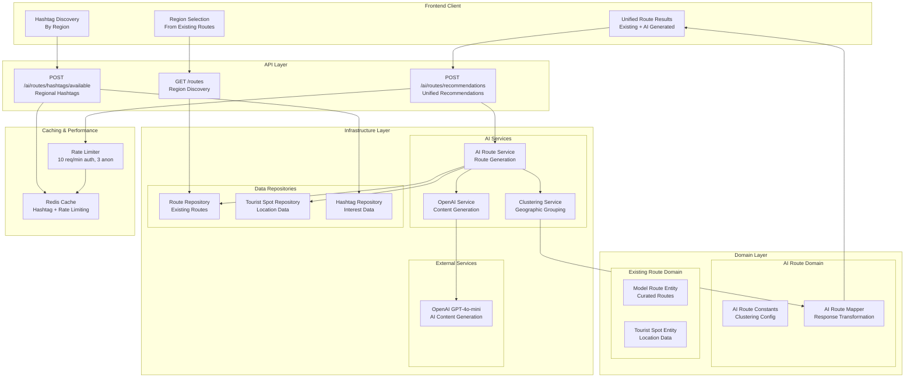
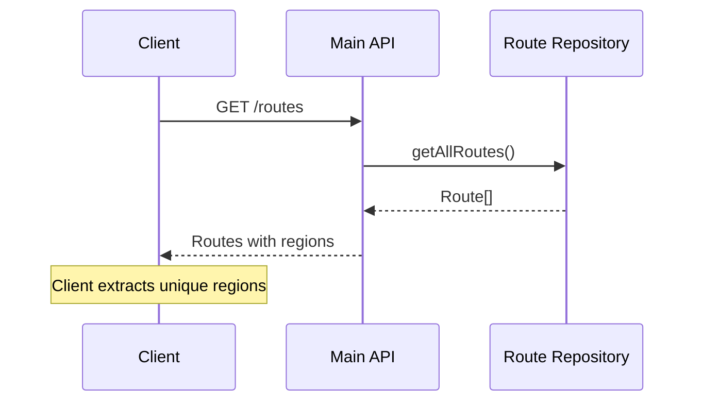
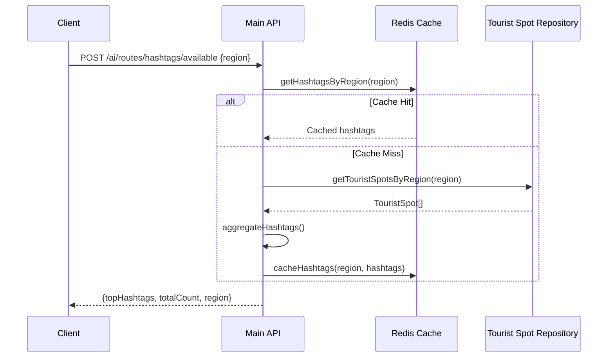
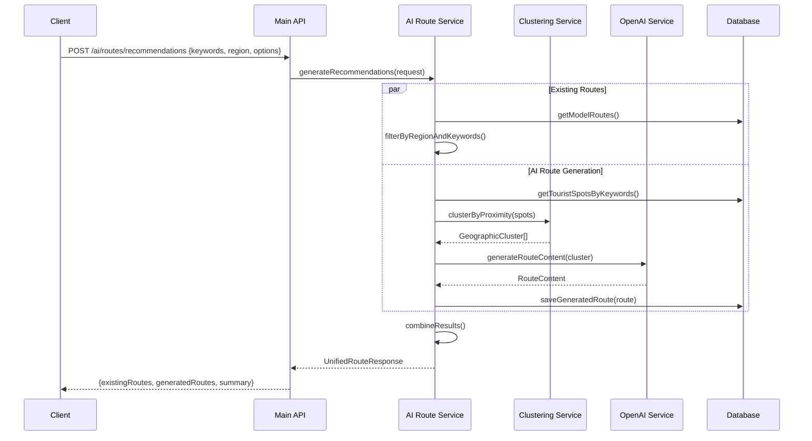
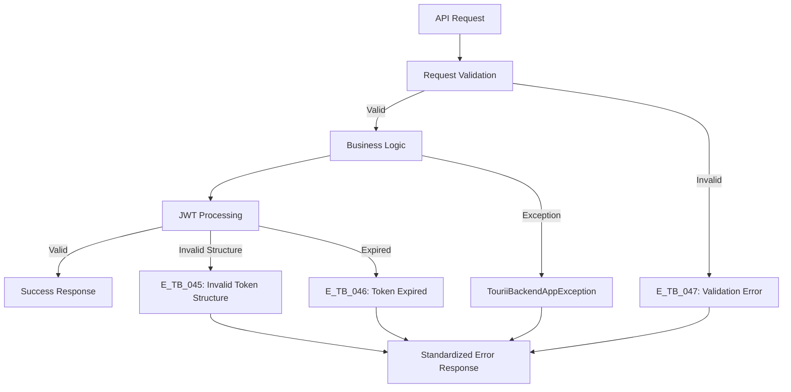

# 🏗️ Tourii Backend System Architecture

> **Complete technical architecture documentation for the Tourii tourism platform backend system**

## 🎯 Overview

Tourii is a **location-based tourism platform** that combines interactive storytelling, gamified quests, and blockchain technology to create immersive travel experiences. The backend system enables users to explore real-world locations through narrative-driven adventures while earning digital rewards and building their travel passport.

### Core Concept

- **Interactive Storytelling**: Chapter-based narratives tied to real tourist locations
- **Gamified Quests**: Location-based challenges with multiple task types (QR scanning, photo uploads, social sharing)
- **Digital Passport System**: Blockchain-verified travel credentials with progression levels
- **Social Integration**: Discord community features and group activities
- **Real-World Integration**: GPS tracking, location verification, and place discovery

---

## 🚀 High-Level Architecture

### Monorepo Structure

```
tourii-backend/
├── apps/
│   ├── tourii-backend/         # Main API Server (Port 4000)
│   └── tourii-onchain/         # Blockchain Service (Port 3001)
├── libs/core/                  # Shared Domain Logic
├── prisma/                     # Database Schema & Migrations
└── contracts/                  # Smart Contracts (Vara Network)
```

### Service Architecture



---

## 🏛️ Domain-Driven Design

### Domain Structure

The system follows Domain-Driven Design principles with clear boundaries:

```
libs/core/src/domain/
├── auth/                       # Authentication & Security
├── user/                       # User Management & Profiles
├── game/                       # Gaming Logic
│   ├── story/                  # Narrative System
│   ├── quest/                  # Quest & Task Management
│   └── model-route/            # Travel Routes & Tourist Spots
├── geo/                        # Location & Weather Services
├── passport/                   # Digital Passport & Wallet Integration
│   ├── digital-passport-metadata.ts      # NFT Metadata Definitions
│   ├── passport-metadata.repository.ts   # Metadata Repository Interface
│   ├── passport-pdf.repository.ts        # PDF Generation Interface
│   ├── wallet-pass.repository.ts         # Wallet Pass Repository Interface
│   └── google-wallet-types.ts           # Google Wallet Domain Types
├── storage/                    # File Upload & Management
└── vara/                       # Blockchain Integration
```

### Key Domain Entities

#### User Management
- **User**: Core user entity with multi-provider authentication
- **UserInfo**: Extended profile with game metrics and collectibles
- **UserAchievement**: Progress tracking and milestones
- **Admin API**: Comprehensive user management with pagination, filtering, and analytics

#### Gaming System
- **Story/StoryChapter**: Interactive narratives tied to locations
- **Quest/QuestTask**: Gamified challenges with multiple task types
- **ModelRoute/TouristSpot**: Travel paths and destination management

#### Blockchain Integration
- **UserOnchainItem**: NFT ownership tracking
- **PassportMetadata**: Digital passport blockchain data
- **DigitalPassport**: Travel credential system

---

## 🔧 Technical Stack

### Core Technologies

| Category | Technology | Purpose |
|----------|------------|---------|
| **Framework** | NestJS | TypeScript backend framework |
| **Database** | PostgreSQL + Prisma | Primary data storage with ORM |
| **Cache** | Redis | Session management and caching |
| **Blockchain** | Vara Network | NFT minting and digital passports |
| **File Storage** | CloudFlare R2 | Media and document storage |
| **Authentication** | JWT + Passport.js | Multi-provider auth system |

### Key Dependencies

```json
{
  "core": {
    "@nestjs/core": "^10.4.15",
    "@prisma/client": "^6.6.0",
    "ethers": "^6.14.3",
    "axios": "^1.8.4"
  },
  "blockchain": {
    "@gear-js/api": "0.38.3",
    "sails-js": "0.3.1",
    "@polkadot/api": "13.2.1"
  },
  "storage": {
    "@aws-sdk/client-s3": "^3.817.0"
  },
  "validation": {
    "zod": "^3.25.56",
    "nestjs-zod": "^4.3.1"
  }
}
```

---

## 🔄 Request Flow

### API Request Lifecycle



### Context Management

The system uses request-scoped context for distributed tracing:

```typescript
// Request context includes:
{
  requestId: string,        // Unique request identifier
  userId?: string,          // Authenticated user
  ip: string,              // Client IP address
  userAgent: string,       // Client information
  timestamp: DateTime      // Request timestamp
}
```

---

## 📊 Data Architecture

### Database Design

The database follows normalized design with these key entity groups:

#### User & Authentication
- **user**: Core user data with multi-provider auth
- **user_info**: Extended profile with game metrics
- **user_achievement**: Progress and milestone tracking

#### Content & Narrative
- **story**: Story sagas (e.g., "Bungo Ono", "Aomori")
- **story_chapter**: Individual narrative chapters
- **model_route**: Travel routes connecting locations
- **tourist_spot**: Real-world destinations

#### Gaming & Quests
- **quest**: Location-based challenges
- **quest_task**: Individual tasks within quests
- **user_task_log**: User progress on tasks
- **user_travel_log**: GPS tracking and check-ins

#### Blockchain & NFTs
- **user_onchain_item**: User-owned blockchain assets
- **onchain_item_catalog**: Master NFT catalog
- **digital_passport**: Travel credential system

### Entity Relationships



---

## 🎮 Core Features

### 1. Multi-Provider Authentication

**Supported Methods:**
- **Social Login**: Discord, Google, Twitter
- **Web3 Wallet**: EIP-191 signature verification
- **JWT**: Access tokens with refresh rotation

**Implementation:**
```typescript
// Authentication flow
POST /auth/signup
{
  "email": "user@example.com",
  "socialProvider": "DISCORD",
  "socialId": "123456789"
}
```

### 2. Interactive Story System

**Features:**
- Chapter-based narratives tied to real locations
- Progress tracking with status management
- Rich media support (videos, PDFs, images)
- Character and location integration

**Key Models:**
- **StoryStatus**: `UNREAD` → `IN_PROGRESS` → `COMPLETED`
- **Chapter Content**: Videos, PDFs, real-world images
- **Location Binding**: GPS coordinates linking narrative to places

### 3. Quest System

**Task Types:**
- **VISIT_LOCATION**: GPS-based check-ins
- **PHOTO_UPLOAD**: Image capture with validation
- **QR_SCAN**: QR code verification
- **ANSWER_TEXT**: Open-ended responses
- **SELECT_OPTION**: Multiple choice questions
- **SHARE_SOCIAL**: Social media integration
- **GROUP_ACTIVITY**: Collaborative challenges

**Anti-Cheat Mechanisms:**
- Location verification with GPS tolerance
- QR code uniqueness validation
- Social media link verification
- Cooldown periods and attempt limits

### 4. Admin Management System

**Features:**
- Comprehensive user analytics with pagination and filtering
- Advanced search across username, email, and social handles
- Role-based filtering (USER, MODERATOR, ADMIN)
- Activity metrics and engagement tracking
- Task submission verification system

**Key Capabilities:**
- **User Overview**: Paginated lists with summary statistics
- **Advanced Filtering**: By role, premium status, registration date, activity level
- **Real-time Search**: Case-insensitive search across multiple fields
- **Analytics Dashboard**: Top performers, recent signups, engagement metrics
- **Task Verification**: Manual approval/rejection of photo and social media submissions

**API Endpoints:**
```typescript
GET /admin/users                    # Get all users with filters
GET /admin/pending-submissions      # Get pending task verifications
POST /admin/submissions/{id}/verify # Approve/reject task submissions
```

### 5. Digital Passport & Wallet Integration System

**Progression Levels:**
```
BONJIN (Base) → E_CLASS → D_CLASS → C_CLASS → B_CLASS → A_CLASS → S_CLASS
```

**Passport Types:**
- **BONJIN**: Standard human passport
- **AMATSUKAMI**: Celestial deity passport
- **KUNITSUKAMI**: Earthly deity passport
- **YOKAI**: Supernatural being passport

#### Wallet Integration Architecture

**Multi-Platform Wallet Support:**


**QR Token Architecture:**
- **Two-Tier Expiration System**: 
  - Wallet passes: 2 years (long-term mobile use)
  - PDF documents: 24 hours (security for printed materials)
- **JWT-based Verification**: Secure token generation and validation
- **Cross-Platform Consistency**: Same QR tokens work across all formats

**Apple Wallet Integration:**
- **Certificate Management**: Secure .p12 certificate handling
- **PassKit Framework**: Native .pkpass file generation
- **Design Consistency**: Japanese-themed passport styling
- **QR Integration**: Embedded verification tokens

**Google Wallet Integration:**
- **Service Account Authentication**: Production-ready API access
- **Real Google API**: Live integration with Google Wallet services
- **Pass Class Management**: Centralized class definitions
- **Domain Architecture**: `GooglePassObject` interface in domain layer

**Mock Testing System:**
- **Multiple User Personas**: 6+ test profiles (alice, bob, charlie, 123, 456, 789)
- **Diverse Attributes**: Different levels, quest completion, travel distance
- **Consistent Data**: Same mock data across all formats (PDF, Apple, Google)
- **Development Ready**: No authentication required for testing

### 5. Location Intelligence

**Google Places Integration:**
- Cost-optimized API usage (85-90% reduction achieved)
- Hybrid approach with automatic fallback
- Location search with bias and address enhancement
- Image and place details retrieval

**Weather Integration:**
- Location-aware weather data
- Caching for performance optimization
- Fallback mechanisms for reliability

### 6. Blockchain Integration

**Vara Network Features:**
- **Digital Passport NFTs**: Travel credential verification
- **Log NFTs**: Activity and achievement tracking
- **Travel Perks**: Reward items and benefits

**Implementation Stack:**
- **Gear.js**: Vara Network blockchain interaction
- **Sails.js**: Smart contract interface framework
- **Ethers.js**: General blockchain operations

### 7. AI Route Recommendation System

**Intelligent Tourism Route Discovery:**
- **3-Step User Flow**: Region selection → Interest discovery → Unified route results
- **Hybrid Intelligence**: Combines curated routes with AI-generated recommendations
- **Geographic Clustering**: Proximity-based tourist spot grouping with Haversine formula
- **OpenAI Integration**: ✅ **FULLY OPERATIONAL** - GPT-4o-mini powered content generation with cost optimization
- **Smart Fallback System**: Domain-driven recommendation logic ensures meaningful results even without AI

#### Architecture Overview



#### Core Components

**1. Geographic Clustering Service**
```typescript
interface ClusteringConfig {
  DEFAULT_PROXIMITY_RADIUS_KM: 50;     // Search radius
  MIN_PROXIMITY_RADIUS_KM: 1;          // Minimum allowed
  MAX_PROXIMITY_RADIUS_KM: 200;        // Maximum allowed
  DEFAULT_MIN_SPOTS_PER_CLUSTER: 2;    // Minimum spots per route
  DEFAULT_MAX_SPOTS_PER_CLUSTER: 8;    // Maximum spots per route
  HAVERSINE_EARTH_RADIUS_KM: 6371;     // Earth radius for calculations
}
```

**2. Haversine Distance Algorithm**
- **Purpose**: Calculate geographic distance between tourist spots
- **Formula**: Great-circle distance between two points on Earth's surface
- **Precision**: Accurate to within 0.5% for distances < 1000km
- **Performance**: O(n²) complexity for spot comparison, optimized with early termination

**3. OpenAI Integration Architecture**
```typescript
interface AIContentConfig {
  MODEL: 'gpt-4o-mini';                // Cost-optimized model
  MAX_TOKENS: 150;                     // Content generation limit
  TEMPERATURE: 0.7;                    // Creative vs consistent balance
  PROMPT_TEMPLATE: 'japanese-tourism'; // Cultural context prompting
  FALLBACK_ENABLED: true;              // Graceful degradation
}
```

#### Request Flow & Processing

**Step 1: Region Discovery**


**Step 2: Regional Hashtag Discovery**


**Step 3: Unified Route Generation**


#### Performance Optimization

**Caching Strategy:**
- **Hashtag Cache**: 1-hour TTL for regional hashtag aggregations
- **Route Cache**: 5-minute TTL for AI-generated route content
- **Rate Limiting**: User-specific quotas with Redis-backed counters

**Algorithm Efficiency:**
- **Early Termination**: Stop clustering when maximum routes reached
- **Spatial Indexing**: Tourist spots pre-indexed by region for faster filtering
- **Batch Processing**: Database operations grouped into 50-item batches
- **Memory Management**: Process maximum 1000 tourist spots per request

**Cost Optimization:**
- **Model Selection**: GPT-4o-mini (20x cheaper than GPT-4)
- **Token Optimization**: Structured prompts with 150-token limit
- **Intelligent Fallback**: Template-based content when AI unavailable
- **Request Deduplication**: Cache identical requests for 5 minutes

#### Database Schema Integration

**Extended Model Route Table:**
```sql
model_route {
  -- Existing fields --
  model_route_id        String   @id
  route_name           String
  region               String?
  region_latitude      Float?
  region_longitude     Float?
  
  -- AI Route Extensions --
  is_ai_generated      Boolean  @default(false)  -- NEW: AI vs manual flag
  ai_confidence_score  Float?                    -- NEW: AI quality score
  ai_algorithm_version String?                   -- NEW: Algorithm tracking
  created_at          DateTime @default(now())   -- Enhanced with AI metadata
}
```

**Junction Table for Route-Spot Relationships:**
```sql
route_tourist_spot {
  route_tourist_spot_id String @id @default(cuid())
  model_route_id       String
  tourist_spot_id      String
  sequence_order       Int?     -- Order within route
  created_at          DateTime @default(now())
  
  @@unique([model_route_id, tourist_spot_id])
}
```

#### Error Handling & Resilience

**AI Route Error Codes:**
- `E_MR_005`: No tourist spots found matching keywords
- `E_MR_006`: AI content generation failed  
- `E_MR_007`: AI route recommendation validation failed
- `E_MR_008`: No tourist spots found matching criteria
- `E_MR_009`: Geographic clustering failed
- `E_MR_010`: AI content generation service unavailable
- `E_MR_011`: Route creation failed during database operation
- `E_MR_012-018`: Request validation errors (keywords, limits, clustering options)

**Graceful Degradation:**
1. **AI Service Down**: Domain-driven fallback provides intelligent recommendations based on keywords and hashtags
2. **Clustering Failure**: Fall back to simple distance-based grouping
3. **Content Generation Failure**: Enhanced template system with keyword-aware recommendations
4. **Rate Limit Exceeded**: Provide clear retry guidance and estimated wait time
5. **Domain-Driven Fallbacks**: RouteRecommendation.generateFallbackRecommendations() ensures consistent quality

#### Quality Assurance

**Content Quality Control:**
- **Confidence Scoring**: AI routes rated 0.0-1.0 based on keyword match quality
- **Cultural Validation**: Japan-specific prompting for appropriate content
- **Length Validation**: Route names (max 100 chars), descriptions (max 500 chars)
- **Metadata Tracking**: Full audit trail of AI generation parameters

**Performance Monitoring:**
- **Processing Time**: Track slow requests >5 seconds for optimization
- **Success Rates**: Monitor AI generation success vs fallback usage
- **Cache Hit Rates**: Optimize cache TTL based on hit/miss ratios
- **User Engagement**: Track which AI routes users actually explore

---

## 🔒 Security Architecture

### Authentication & Authorization

**Multi-Layer Security:**
1. **API Key Validation**: Required for all endpoints
2. **JWT Verification**: User session management
3. **Role-Based Access**: USER, MODERATOR, ADMIN levels
4. **Rate Limiting**: Prevents abuse and DoS attacks

### Data Protection

**Security Measures:**
- **Input Validation**: Zod schemas for all inputs
- **SQL Injection Prevention**: Prisma ORM parameterization
- **File Upload Security**: MIME type and size validation
- **Encryption**: Sensitive data encrypted at rest
- **Request Tracing**: Full audit trail with request IDs

### Infrastructure Security

**Production Hardening:**
- **CORS Protection**: Configured for specific origins
- **Security Headers**: Helmet.js implementation
- **HTTPS Enforcement**: SSL/TLS in production
- **Environment Separation**: Distinct configs per environment

### Exception Handling & Error Management

**Centralized Error System:**
- **TouriiBackendAppException**: Standardized application errors with metadata
- **TouriiOnchainAppException**: Blockchain service-specific errors
- **30+ Error Codes**: Comprehensive error classification (E_TB_000-047, E_GEO_001-005, etc.)
- **JWT & Token Validation**: Specialized QR token error handling (E_TB_045-047)
- **Request Validation**: Enhanced input validation errors (E_TB_047, E_OC_047)

**Error Handling Architecture:**


**Security Benefits:**
- **No Information Leakage**: Standardized error messages prevent sensitive data exposure
- **Consistent Debugging**: Structured error codes enable faster issue resolution
- **Audit Trail**: All errors logged with request IDs for security monitoring
- **Type Safety**: Compile-time error checking prevents runtime security issues

---

## ⚡ Performance Optimization

### Database Performance

**Optimization Strategies:**
- **Strategic Indexing**: Query-specific database indexes
- **Connection Pooling**: Prisma connection management
- **Read Replicas**: Separation of read/write operations
- **Query Optimization**: N+1 query elimination

### Caching Strategy

**Redis Implementation:**
- **API Response Caching**: Location and weather data
- **Session Management**: User authentication state
- **Rate Limiting**: Request throttling data
- **Configurable TTL**: Per-cache-type expiration

### External API Optimization

**Google Places Cost Reduction:**
- **Hybrid Strategy**: New Places API with legacy fallback
- **Call Reduction**: 56 Places + 15 Geocoding → ~4 Text Search calls
- **Cost Savings**: 85-90% reduction in API costs
- **Performance**: Maintained response times with improved reliability

---

## 🔄 Development Workflow

### Build & Deployment

**Available Commands:**
```bash
# Development
pnpm start:dev                     # Start all services
pnpm start:dev:tourii-backend      # Main API only
pnpm start:dev:tourii-onchain      # Blockchain service only

# Production
pnpm build                         # Build all applications
pnpm start:prod                    # Run production build

# Database
pnpm prisma:migrate:dev            # Apply migrations
pnpm prisma:studio                 # Database GUI
```

### Testing Strategy

**Test Types:**
- **Unit Tests**: Repository and service layer testing
- **Integration Tests**: API endpoint testing
- **End-to-End Tests**: Complete workflow testing
- **Security Tests**: Vulnerability assessment

### Code Quality

**Standards:**
- **Biome**: TypeScript/JavaScript linting and formatting
- **Prettier**: YAML/Markdown formatting
- **Husky**: Pre-commit hooks
- **TypeScript**: Strict type checking with no `any` types

---

## 📊 Monitoring & Observability

### Request Tracing

**Distributed Tracing:**
- **Request ID**: Unique identifier per request
- **User Context**: Authentication and user state
- **Performance Metrics**: Response time tracking
- **Error Tracking**: Exception monitoring

### Database Monitoring

**Prisma Insights:**
- **Query Performance**: Slow query identification
- **Connection Pool**: Database connection monitoring
- **Migration Tracking**: Schema change management

### External Service Monitoring

**API Monitoring:**
- **Rate Limit Tracking**: Usage against quotas
- **Response Time**: Performance benchmarking
- **Error Rate**: Failure tracking and alerting
- **Cost Optimization**: Usage and spend tracking

---

## 🚀 Scalability Considerations

### Horizontal Scaling

**Stateless Design:**
- **No Server State**: All state stored in database/cache
- **Load Balancer Ready**: Multiple instance deployment
- **Redis Session**: Shared session storage
- **Microservice Architecture**: Independent service scaling

### Database Scaling

**Scaling Strategies:**
- **Read Replicas**: Query load distribution
- **Connection Pooling**: Efficient connection management
- **Database Partitioning**: Large table optimization
- **Caching Layer**: Reduced database load

### File Storage Scaling

**CloudFlare R2:**
- **CDN Distribution**: Global content delivery
- **Unlimited Bandwidth**: No egress fees
- **Object Storage**: Scalable file management
- **Performance**: Optimized media delivery

---

## 🔧 Configuration Management

### Environment Variables

**Required Configuration:**
```env
# Core Application
PORT=4000
NODE_ENV=production
DATABASE_URL=postgresql://...

# Security (Required)
JWT_SECRET=<64-char-random-string>
ENCRYPTION_KEY=<32-char-random-string>
API_KEYS=<comma-separated-keys>

# External Services
GOOGLE_MAPS_API_KEY=your_key
GOOGLE_PLACES_API_KEY=your_key
OPEN_WEATHER_API_KEY=your_key

# Blockchain
PROVIDER_URL=https://rpc.vara.network
CONTRACT_ADDRESS=0x...

# Storage
AWS_ACCESS_KEY_ID=your_key
AWS_SECRET_ACCESS_KEY=your_secret
R2_BUCKET=tourii-production
```

### Feature Flags

**Runtime Configuration:**
- **Quest Types**: Enable/disable quest features
- **Payment Processing**: Premium quest access
- **Blockchain Features**: NFT minting controls
- **External Integrations**: API service toggles

---

## 📚 API Design Principles

### RESTful Design

**Endpoint Structure:**
```
/health-check                    # System health
/auth/signup                     # Authentication
/user/me                         # User profile
/stories                         # Story creation
/stories/sagas                   # Story management  
/quests                          # Quest creation
/quests/{id}                     # Quest management
/routes                          # Route creation
/routes/{id}                     # Route management
/tasks/{id}/*                    # Task operations
/locations/info                  # Location services
/moments                         # Activity feeds
/admin/users                     # Admin user management
/admin/submissions/*             # Admin task verification
```

### Request/Response Format

**Standardized Responses:**
- **Success**: HTTP 200/201 with data payload
- **Error**: HTTP 4xx/5xx with error details
- **Pagination**: Consistent page/limit/total structure
- **Validation**: Zod schema validation with detailed errors

### API Versioning

**Version Management:**
- **Header-Based**: `accept-version: 1.0.0`
- **Backward Compatibility**: Multiple version support
- **Deprecation Strategy**: Gradual version migration

---

_Last Updated: June 29, 2025_