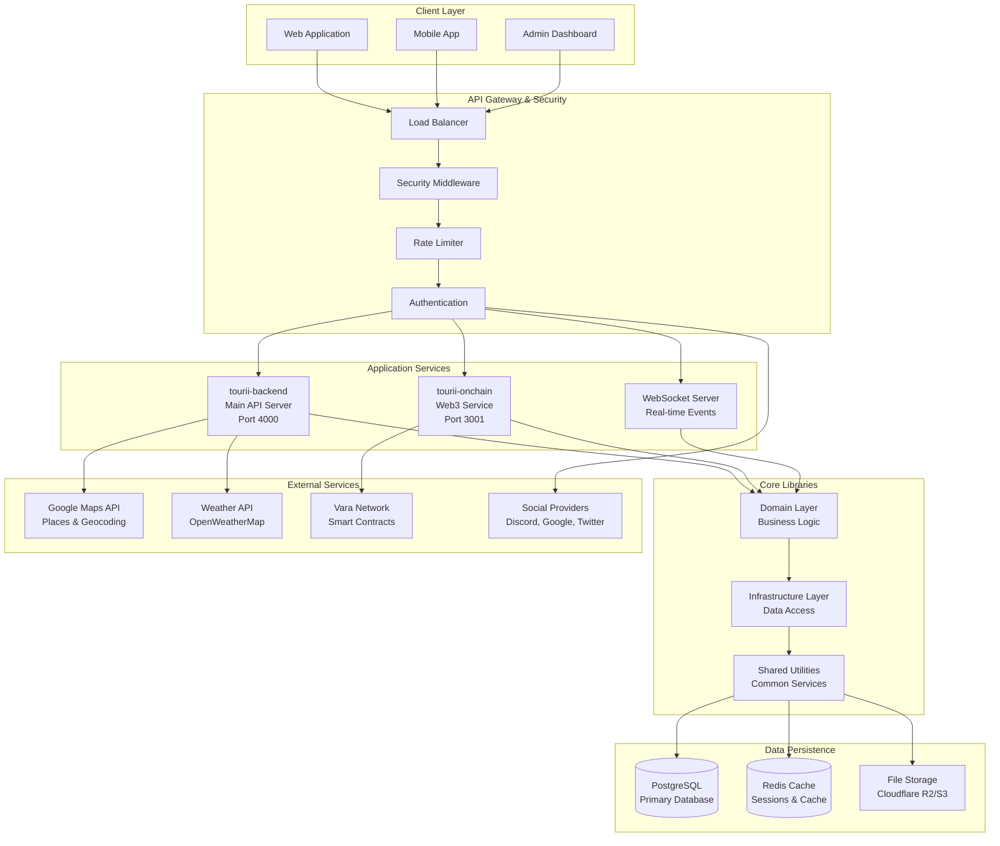
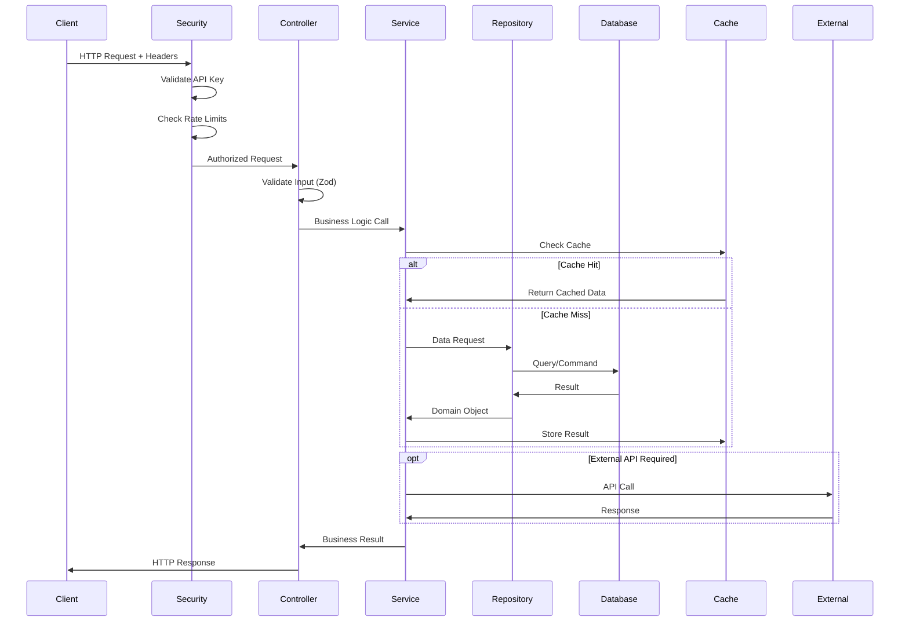
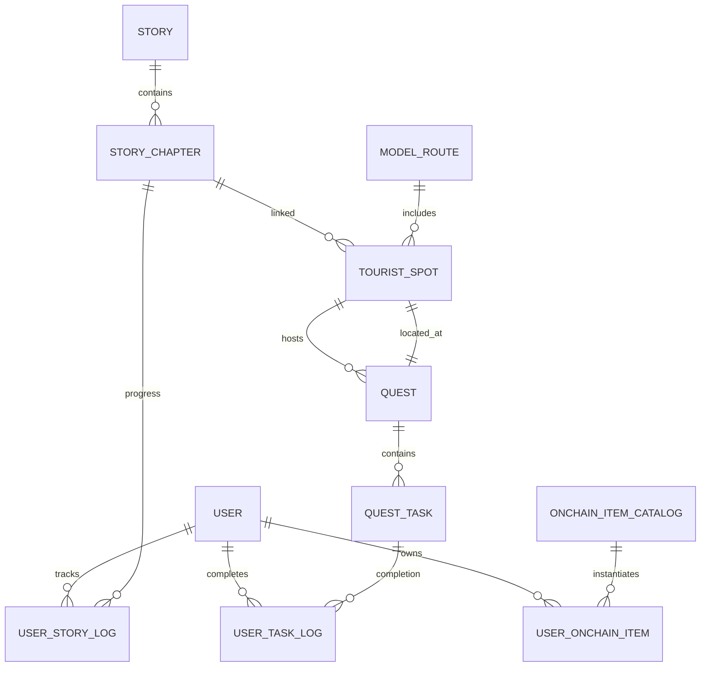
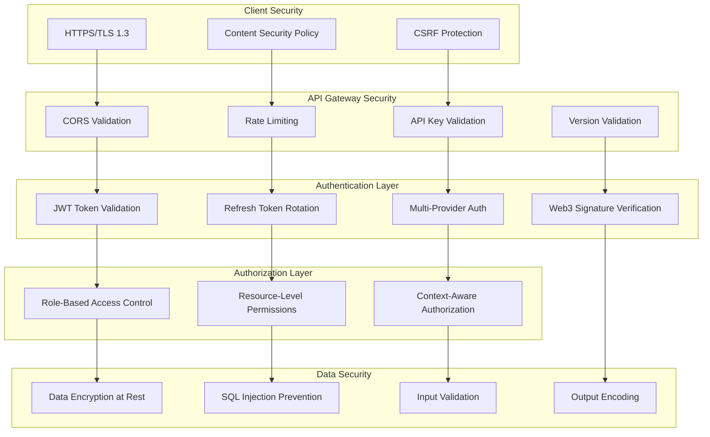
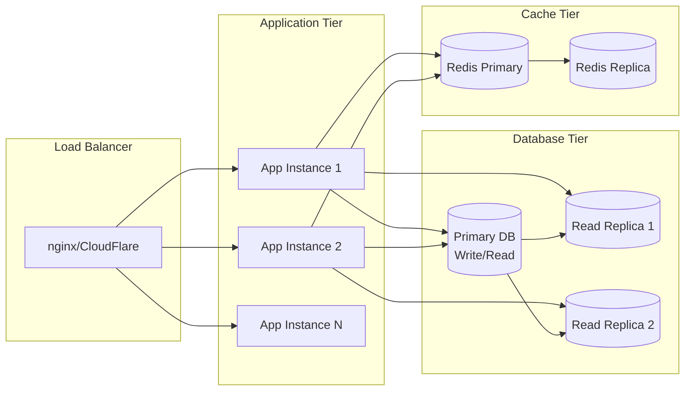

# 🏗️ **Tourii Backend System Architecture**

_Comprehensive architecture documentation for the Tourii tourism platform backend_

_Last Updated: June 18, 2025_

## 🎯 **Core Features**

### **🔐 Authentication & Web3**

- Social auth (Discord, Twitter, Google)
- Web3 wallet integration with EIP-191 signature verification
- NFT-based digital passport system
- JWT session management with refresh token rotation

### **📚 Story & Tourism**

- Story saga management with chapter progression
- Location-based content delivery
- Media asset management (video/image)
- Interactive storytelling with progress tracking

### **🎮 Quest & Gamification**

- Online/offline quest management
- Multi-type task validation (GPS, photo, text, QR)
- Progress tracking and reward distribution
- Location-based challenges with Magatama points

### **🎫 Digital Assets**

- EVM-compatible NFT minting
- Digital passport management
- Reward perks as NFTs
- Blockchain transaction handling

### **🗺️ Location & Routes**

- Model route management
- Location check-in system
- Cost-optimized Google Places API integration (90% cost reduction)
- Weather API integration with geographic data handling

### **👥 Social Features**

- Memory wall with activity feeds
- Achievement sharing
- Discord integration with role mapping

### **🛒 Shop & Rewards**

- Point system management
- NFT reward shop
- Perk redemption with burn-on-redeem logic
- Transaction history tracking

### **🎛️ Admin Panel**

- Content management for stories, quests, routes
- User management and analytics dashboard
- System configuration and monitoring

## 📋 **Table of Contents**

1. [High-Level Architecture](#high-level-architecture)
2. [Application Structure](#application-structure)
3. [Domain-Driven Design](#domain-driven-design)
4. [Data Architecture](#data-architecture)
5. [Security Architecture](#security-architecture)
6. [External Integrations](#external-integrations)
7. [Performance & Scalability](#performance--scalability)
8. [Deployment Architecture](#deployment-architecture)

## 🎯 **High-Level Architecture**

### **System Overview**



### **Architecture Principles**

- **🔄 Domain-Driven Design**: Clear separation of business logic from infrastructure
- **🔌 Dependency Injection**: Modular, testable, and maintainable code structure
- **📦 Monorepo with Microservices**: Shared libraries with focused service boundaries
- **🛡️ Security-First**: Multi-layered security with fail-safe defaults
- **⚡ Performance-Optimized**: Intelligent caching and optimized database queries
- **🔧 Configuration-Driven**: Environment-specific behavior without code changes

## 🏢 **Application Structure**

### **Monorepo Organization**

```
tourii-backend/
├── apps/                        # Application services
│   ├── tourii-backend/          # Main API application
│   │   ├── src/
│   │   │   ├── controller/      # HTTP endpoints (REST API)
│   │   │   ├── service/         # Business logic coordination
│   │   │   ├── support/         # Application-specific utilities
│   │   │   │   ├── middleware/  # Request/response processing
│   │   │   │   ├── interceptors/ # Cross-cutting concerns
│   │   │   │   └── decorators/  # Custom decorators
│   │   │   └── main.ts          # Application bootstrap
│   │   └── test/                # E2E and integration tests
│   └── tourii-onchain/          # Blockchain service
│       ├── src/
│       │   ├── controller/      # Web3 endpoints
│       │   ├── service/         # Blockchain business logic
│       │   └── main.ts          # Service bootstrap
│       └── test/                # Blockchain-specific tests
├── libs/                        # Shared libraries
│   └── core/                    # Core domain library
│       ├── src/
│       │   ├── domain/          # Business entities & interfaces
│       │   │   ├── auth/        # Authentication domain
│       │   │   ├── game/        # Quest & story domain
│       │   │   ├── geo/         # Location & weather domain
│       │   │   └── user/        # User management domain
│       │   ├── infrastructure/  # Repository implementations
│       │   │   ├── api/         # External API integrations
│       │   │   ├── datasource/  # Database repositories
│       │   │   └── repository/  # Repository patterns
│       │   ├── provider/        # Shared services
│       │   │   ├── caching.service.ts     # Redis caching
│       │   │   ├── prisma.service.ts      # Database ORM
│       │   │   └── http-service.ts        # HTTP client
│       │   └── support/         # Utilities & exceptions
│       │       ├── exception/   # Error handling
│       │       └── utils/       # Helper functions
│       └── test/                # Unit tests & test utilities
├── prisma/                      # Database schema & migrations
├── docs/                        # Documentation
├── contracts/                   # Smart contract definitions
└── etc/                         # Configuration files
```

### **Service Responsibilities**

| Service            | Port | Responsibility                                             | Dependencies                   |
| ------------------ | ---- | ---------------------------------------------------------- | ------------------------------ |
| **tourii-backend** | 4000 | Main API, authentication, stories, quests, user management | PostgreSQL, Redis, Google APIs |
| **tourii-onchain** | 3001 | Web3 operations, NFT minting, blockchain interactions      | Vara Network, Smart Contracts  |

### **Request Flow Architecture**



## 🎯 **Domain-Driven Design**

### **Domain Boundaries**

#### **🔐 Authentication Domain**

```typescript
// Domain Entities
User Entity
- userId: string
- username: string
- email: string
- authProviders: AuthProvider[]

// Repository Interfaces
interface UserRepository {
    createUser(user: UserEntity): Promise<UserEntity>
    getUserByUsername(username: string): Promise<UserEntity>
    getUserByDiscordId(discordId: string): Promise<UserEntity>
}

// Use Cases
- User Registration
- Multi-provider Login
- Token Refresh
- User Profile Management
```

#### **🎮 Game Domain**

```typescript
// Aggregates
Story Aggregate
├── StoryEntity (root)
├── StoryChapter
└── StoryProgress

Quest Aggregate
├── QuestEntity (root)
├── QuestTask
└── UserTaskLog

ModelRoute Aggregate
├── ModelRouteEntity (root)
├── TouristSpot
└── WeatherInfo

// Domain Services
interface QuestProgressService {
    completeTask(userId: string, taskId: string): Promise<QuestResult>
    unlockQuests(userId: string, criteria: UnlockCriteria): Promise<Quest[]>
}

interface StoryProgressService {
    startStoryReading(userId: string, chapterId: string): Promise<void>
    completeStoryWithQuestUnlocking(userId: string, chapterId: string): Promise<StoryCompletionResult>
}
```

#### **🌍 Geo Domain**

```typescript
// Value Objects
GeoInfo {
    touristSpotName: string
    latitude: number
    longitude: number
    formattedAddress: string
}

LocationInfo {
    name: string
    formattedAddress: string
    phoneNumber?: string
    website?: string
    rating?: number
    images?: LocationImage[]
}

// Domain Services
interface LocationService {
    getLocationInfo(query: string, coordinates?: Coordinates): Promise<LocationInfo>
    optimizeRoute(spots: TouristSpot[]): Promise<OptimizedRoute>
}
```

### **Repository Pattern Implementation**

```typescript
// Domain Interface (libs/core/src/domain)
interface QuestRepository {
    createQuest(quest: QuestEntity): Promise<QuestEntity>
    fetchQuestById(questId: string, userId?: string): Promise<QuestWithTasks>
    fetchQuestsWithPagination(filters: QuestFilters): Promise<PaginatedQuests>
}

// Infrastructure Implementation (libs/core/src/infrastructure/datasource)
@Injectable()
export class QuestRepositoryDb implements QuestRepository {
    constructor(private readonly prisma: PrismaService) {}

    async createQuest(quest: QuestEntity): Promise<QuestEntity> {
        // Database-specific implementation
    }
}

// Dependency Injection (apps/tourii-backend/src)
const QUEST_REPOSITORY_TOKEN = 'QUEST_REPOSITORY_TOKEN'

@Module({
    providers: [
        {
            provide: QUEST_REPOSITORY_TOKEN,
            useClass: QuestRepositoryDb
        }
    ]
})
```

## 🗄️ **Data Architecture**

### **Database Design**

#### **Core Tables**

```sql
-- User Management
user                    # Core user information
user_info              # Extended user profile
user_achievement       # User achievement tracking
user_level             # Level progression system

-- Authentication & Security
discord_user_roles     # Discord integration
user_story_log         # Story progress tracking
user_task_log          # Quest task completion
user_travel_log        # Travel verification

-- Content & Stories
story                  # Story/saga definitions
story_chapter          # Individual chapters
model_route            # Tourist route definitions
tourist_spot           # Location information

-- Quest System
quest                  # Quest definitions
quest_task             # Individual quest tasks
group_quest            # Group quest management
quest_completion       # Quest completion tracking

-- Blockchain Integration
onchain_item_catalog   # NFT type definitions
user_onchain_item      # User NFT ownership
digital_passport       # Digital passport NFTs

-- Analytics & Reporting
moment_view            # Aggregated user activity
discord_activity_log   # Discord activity tracking
```

#### **Key Relationships**



### **Caching Strategy**

#### **Cache Layers**

```typescript
// Application-level caching
interface CachingService {
  // Generic caching with TTL
  getOrSet<T>(
    key: string,
    fetchFn: () => Promise<T>,
    ttlSeconds: number,
  ): Promise<T>;

  // Pattern-based invalidation
  clearPattern(pattern: string): Promise<void>;

  // Cache warming for predictable data
  warmCache(keys: string[]): Promise<void>;
}

// Cache Configuration
const CACHE_CONFIGS = {
  USER_PROFILE: { ttl: 3600, pattern: 'user:*' },
  QUEST_DATA: { ttl: 1800, pattern: 'quest:*' },
  LOCATION_INFO: { ttl: 86400, pattern: 'location:*' },
  WEATHER_DATA: { ttl: 3600, pattern: 'weather:*' },
  STORY_CONTENT: { ttl: 7200, pattern: 'story:*' },
};
```

#### **Cache Invalidation Strategy**

```typescript
// Event-driven cache invalidation
class CacheInvalidationService {
  async onQuestUpdated(questId: string) {
    await this.cachingService.clearPattern(`quest:${questId}:*`);
    await this.cachingService.clearPattern('quest:list:*');
  }

  async onUserProfileUpdated(userId: string) {
    await this.cachingService.clearPattern(`user:${userId}:*`);
  }

  async onStoryContentUpdated(storyId: string) {
    await this.cachingService.clearPattern(`story:${storyId}:*`);
    await this.cachingService.clearPattern('story:list:*');
  }
}
```

## 🔒 **Security Architecture**

### **Multi-Layer Security Model**



### **Authentication Flow**

```typescript
// Multi-provider authentication strategy
interface AuthenticationStrategy {
  // Social OAuth providers
  discord: DiscordOAuthStrategy;
  google: GoogleOAuthStrategy;
  twitter: TwitterOAuthStrategy;

  // Web3 wallet authentication
  web3: Web3SignatureStrategy;

  // Traditional credentials
  local: LocalCredentialsStrategy;
}

// JWT token structure
interface JWTPayload {
  sub: string; // User ID
  email: string; // User email
  roles: string[]; // User roles
  provider: string; // Auth provider used
  iat: number; // Issued at
  exp: number; // Expiration
  jti: string; // JWT ID for blacklisting
}

// Refresh token rotation
interface TokenPair {
  accessToken: string; // Short-lived (15 minutes)
  refreshToken: string; // Long-lived (7 days)
  expiresAt: Date; // Access token expiration
}
```

### **Security Configuration**

```typescript
// Security middleware configuration
interface SecurityConfig {
  cors: {
    origins: string[]; // Allowed origins
    credentials: boolean; // Include credentials
    methods: string[]; // Allowed methods
  };
  rateLimit: {
    windowMs: number; // Time window
    max: number; // Max requests per window
    skipSuccessfulRequests: boolean;
  };
  helmet: {
    contentSecurityPolicy: CSPOptions;
    hsts: HSTSOptions;
    xssFilter: boolean;
  };
}
```

## 🔌 **External Integrations**

### **Google Maps API Integration**

#### **Cost-Optimized Implementation**

```typescript
interface GooglePlacesIntegration {
    // Cost-optimized Places API with field masks
    searchWithFieldMask(query: string, fields: string[]): Promise<PlaceResult[]>

    // Hybrid approach with fallback
    getLocationInfo(query: string): Promise<LocationInfo> {
        try {
            // Try new cost-optimized API first (85-90% cost reduction)
            return await this.fetchWithNewPlacesApi(query)
        } catch (error) {
            // Fallback to legacy API for reliability
            return await this.fetchWithLegacyApi(query)
        }
    }
}

// Cost comparison
const COST_OPTIMIZATION = {
    before: {
        placesApiCalls: 56,
        geocodingCalls: 15,
        totalCost: '$2.80-$3.50 per 4 locations'
    },
    after: {
        textSearchCalls: 4,
        totalCost: '$0.12-$0.28 per 4 locations',
        savings: '85-90%'
    }
}
```

### **Weather API Integration**

```typescript
interface WeatherIntegration {
    getCurrentWeather(coordinates: Coordinates): Promise<WeatherInfo>
    getForecast(coordinates: Coordinates, days: number): Promise<ForecastInfo[]>

    // Intelligent caching strategy
    getCachedWeatherWithFallback(location: GeoInfo): Promise<WeatherInfo> {
        const cacheKey = `weather:${location.latitude}:${location.longitude}`
        return this.cachingService.getOrSet(
            cacheKey,
            () => this.weatherApi.getCurrentWeather(location),
            3600 // 1 hour TTL for weather data
        )
    }
}
```

### **Blockchain Integration**

```typescript
interface BlockchainIntegration {
  // Vara Network integration
  varaNetwork: {
    mintDigitalPassport(userAddress: string): Promise<NFTResult>;
    verifySignature(signature: string, message: string): Promise<boolean>;
    querySmartContract(contractId: string, method: string): Promise<any>;
  };

  // Multi-chain support
  ethereum: {
    signMessage(message: string): Promise<string>;
    verifyEIP191Signature(
      signature: string,
      message: string,
      address: string,
    ): Promise<boolean>;
  };
}
```

## ⚡ **Performance & Scalability**

### **Performance Optimization Strategies**

#### **Database Optimization**

```sql
-- Optimized queries with proper indexing
CREATE INDEX CONCURRENTLY idx_user_story_log_user_chapter
ON user_story_log (user_id, story_chapter_id);

CREATE INDEX CONCURRENTLY idx_quest_task_quest_id
ON quest_task (quest_id)
WHERE del_flag = false;

-- Materialized views for complex aggregations
CREATE MATERIALIZED VIEW user_quest_progress AS
SELECT
    u.user_id,
    COUNT(DISTINCT q.quest_id) as total_quests,
    COUNT(DISTINCT utl.quest_id) as completed_quests
FROM user u
LEFT JOIN quest q ON true
LEFT JOIN user_task_log utl ON u.user_id = utl.user_id
    AND q.quest_id = utl.quest_id
GROUP BY u.user_id;
```

#### **Caching Optimization**

```typescript
// Multi-level caching strategy
class OptimizedCachingService {
  private readonly L1_CACHE = new Map<string, any>(); // In-memory
  private readonly L2_CACHE: Redis; // Redis

  async getOrSet<T>(
    key: string,
    fetchFn: () => Promise<T>,
    ttl: number,
  ): Promise<T> {
    // L1 Cache check (fastest)
    if (this.L1_CACHE.has(key)) {
      return this.L1_CACHE.get(key);
    }

    // L2 Cache check (Redis)
    const cached = await this.L2_CACHE.get(key);
    if (cached) {
      this.L1_CACHE.set(key, cached);
      return JSON.parse(cached);
    }

    // Fetch from source
    const result = await fetchFn();

    // Store in both cache levels
    await this.L2_CACHE.setex(key, ttl, JSON.stringify(result));
    this.L1_CACHE.set(key, result);

    return result;
  }
}
```

#### **Query Optimization**

```typescript
// Batch operations to reduce N+1 queries
class OptimizedQuestRepository {
  async getQuestsWithDetails(questIds: string[]): Promise<QuestWithDetails[]> {
    // Single query with joins instead of multiple queries
    return await this.prisma.quest.findMany({
      where: { quest_id: { in: questIds } },
      include: {
        quest_tasks: {
          where: { del_flag: false },
        },
        tourist_spot: {
          include: {
            model_route: true,
          },
        },
      },
    });
  }
}
```

### **Scalability Architecture**

#### **Horizontal Scaling Strategy**



#### **Microservice Decomposition Strategy**

```typescript
// Future microservice boundaries
interface MicroserviceArchitecture {
  userService: {
    port: 4001;
    responsibilities: ['authentication', 'user management', 'profiles'];
    database: 'user_db';
  };

  contentService: {
    port: 4002;
    responsibilities: ['stories', 'chapters', 'content management'];
    database: 'content_db';
  };

  questService: {
    port: 4003;
    responsibilities: ['quests', 'tasks', 'quest progression'];
    database: 'quest_db';
  };

  locationService: {
    port: 4004;
    responsibilities: ['tourist spots', 'routes', 'weather'];
    database: 'location_db';
  };

  web3Service: {
    port: 4005;
    responsibilities: ['NFT operations', 'blockchain interactions'];
    database: 'web3_db';
  };
}
```

## 🚀 **Deployment Architecture**

### **Environment Strategy**

```yaml
# Development Environment
development:
  database: PostgreSQL (local)
  cache: Redis (local)
  storage: Local filesystem
  external_apis: Development keys
  monitoring: Console logs

# Staging Environment
staging:
  database: PostgreSQL (managed)
  cache: Redis (managed)
  storage: Cloudflare R2
  external_apis: Staging keys
  monitoring: Basic logging

# Production Environment
production:
  database: PostgreSQL (HA cluster)
  cache: Redis Cluster
  storage: Cloudflare R2 + CDN
  external_apis: Production keys
  monitoring: Full observability stack
```

### **Container Strategy**

```dockerfile
# Multi-stage production build
FROM node:20-alpine AS builder
WORKDIR /app
COPY package*.json ./
RUN npm ci --only=production

FROM node:20-alpine AS runtime
WORKDIR /app
COPY --from=builder /app/node_modules ./node_modules
COPY dist ./dist
COPY prisma ./prisma

EXPOSE 4000
CMD ["node", "dist/apps/tourii-backend/main.js"]
```

### **Infrastructure as Code**

```yaml
# Kubernetes deployment example
apiVersion: apps/v1
kind: Deployment
metadata:
  name: tourii-backend
spec:
  replicas: 3
  selector:
    matchLabels:
      app: tourii-backend
  template:
    metadata:
      labels:
        app: tourii-backend
    spec:
      containers:
        - name: tourii-backend
          image: tourii/backend:latest
          ports:
            - containerPort: 4000
          env:
            - name: DATABASE_URL
              valueFrom:
                secretKeyRef:
                  name: database-secret
                  key: url
            - name: JWT_SECRET
              valueFrom:
                secretKeyRef:
                  name: auth-secret
                  key: jwt-secret
          resources:
            requests:
              memory: '512Mi'
              cpu: '250m'
            limits:
              memory: '1Gi'
              cpu: '500m'
          livenessProbe:
            httpGet:
              path: /health-check
              port: 4000
            initialDelaySeconds: 30
            periodSeconds: 10
          readinessProbe:
            httpGet:
              path: /health-check
              port: 4000
            initialDelaySeconds: 5
            periodSeconds: 5
```

---

**📋 This architecture documentation should be reviewed quarterly and updated whenever significant architectural changes are made to the system.**

_For implementation details, refer to the specific component documentation in the `/docs` directory._
