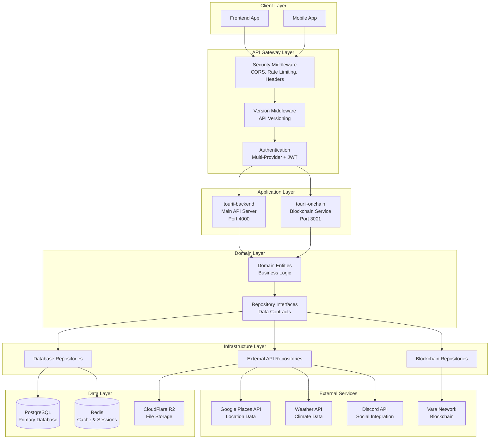
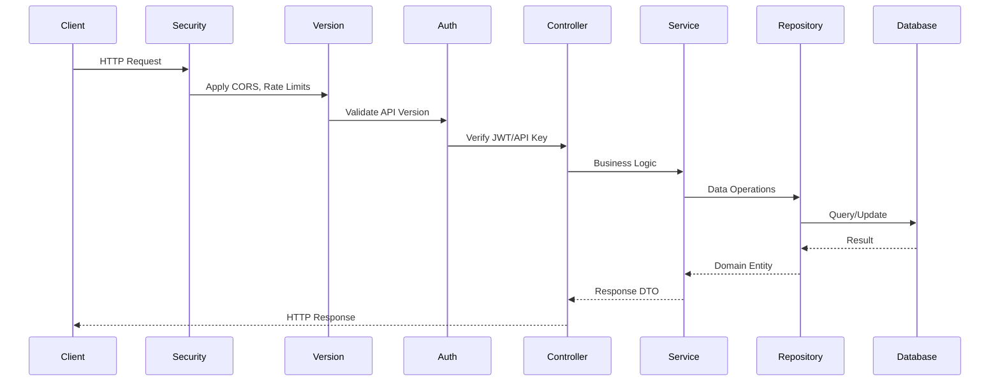
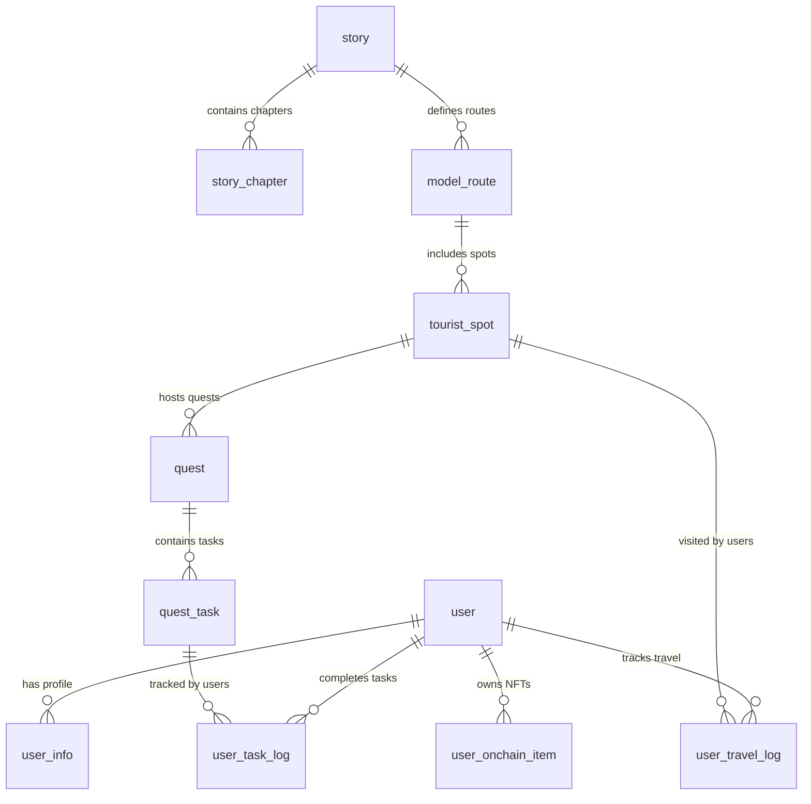

# 🏗️ Tourii Backend System Architecture

> **Complete technical architecture documentation for the Tourii tourism platform backend system**

## 🎯 Overview

Tourii is a **location-based tourism platform** that combines interactive storytelling, gamified quests, and blockchain technology to create immersive travel experiences. The backend system enables users to explore real-world locations through narrative-driven adventures while earning digital rewards and building their travel passport.

### Core Concept

- **Interactive Storytelling**: Chapter-based narratives tied to real tourist locations
- **Gamified Quests**: Location-based challenges with multiple task types (QR scanning, photo uploads, social sharing)
- **Digital Passport System**: Blockchain-verified travel credentials with progression levels
- **Social Integration**: Discord community features and group activities
- **Real-World Integration**: GPS tracking, location verification, and place discovery

---

## 🚀 High-Level Architecture

### Monorepo Structure

```
tourii-backend/
├── apps/
│   ├── tourii-backend/         # Main API Server (Port 4000)
│   └── tourii-onchain/         # Blockchain Service (Port 3001)
├── libs/core/                  # Shared Domain Logic
├── prisma/                     # Database Schema & Migrations
└── contracts/                  # Smart Contracts (Vara Network)
```

### Service Architecture



---

## 🏛️ Domain-Driven Design

### Domain Structure

The system follows Domain-Driven Design principles with clear boundaries:

```
libs/core/src/domain/
├── auth/                       # Authentication & Security
├── user/                       # User Management & Profiles
├── game/                       # Gaming Logic
│   ├── story/                  # Narrative System
│   ├── quest/                  # Quest & Task Management
│   └── model-route/            # Travel Routes & Tourist Spots
├── geo/                        # Location & Weather Services
├── passport/                   # Digital Passport & NFT Metadata
├── storage/                    # File Upload & Management
└── vara/                       # Blockchain Integration
```

### Key Domain Entities

#### User Management
- **User**: Core user entity with multi-provider authentication
- **UserInfo**: Extended profile with game metrics and collectibles
- **UserAchievement**: Progress tracking and milestones

#### Gaming System
- **Story/StoryChapter**: Interactive narratives tied to locations
- **Quest/QuestTask**: Gamified challenges with multiple task types
- **ModelRoute/TouristSpot**: Travel paths and destination management

#### Blockchain Integration
- **UserOnchainItem**: NFT ownership tracking
- **PassportMetadata**: Digital passport blockchain data
- **DigitalPassport**: Travel credential system

---

## 🔧 Technical Stack

### Core Technologies

| Category | Technology | Purpose |
|----------|------------|---------|
| **Framework** | NestJS | TypeScript backend framework |
| **Database** | PostgreSQL + Prisma | Primary data storage with ORM |
| **Cache** | Redis | Session management and caching |
| **Blockchain** | Vara Network | NFT minting and digital passports |
| **File Storage** | CloudFlare R2 | Media and document storage |
| **Authentication** | JWT + Passport.js | Multi-provider auth system |

### Key Dependencies

```json
{
  "core": {
    "@nestjs/core": "^10.4.15",
    "@prisma/client": "^6.5.0",
    "ethers": "^6.14.3",
    "axios": "^1.8.4"
  },
  "blockchain": {
    "@gear-js/api": "0.38.3",
    "sails-js": "0.3.1",
    "@polkadot/api": "13.2.1"
  },
  "storage": {
    "@aws-sdk/client-s3": "^3.817.0"
  },
  "validation": {
    "zod": "^3.25.56",
    "nestjs-zod": "^4.3.1"
  }
}
```

---

## 🔄 Request Flow

### API Request Lifecycle



### Context Management

The system uses request-scoped context for distributed tracing:

```typescript
// Request context includes:
{
  requestId: string,        // Unique request identifier
  userId?: string,          // Authenticated user
  ip: string,              // Client IP address
  userAgent: string,       // Client information
  timestamp: DateTime      // Request timestamp
}
```

---

## 📊 Data Architecture

### Database Design

The database follows normalized design with these key entity groups:

#### User & Authentication
- **user**: Core user data with multi-provider auth
- **user_info**: Extended profile with game metrics
- **user_achievement**: Progress and milestone tracking

#### Content & Narrative
- **story**: Story sagas (e.g., "Bungo Ono", "Aomori")
- **story_chapter**: Individual narrative chapters
- **model_route**: Travel routes connecting locations
- **tourist_spot**: Real-world destinations

#### Gaming & Quests
- **quest**: Location-based challenges
- **quest_task**: Individual tasks within quests
- **user_task_log**: User progress on tasks
- **user_travel_log**: GPS tracking and check-ins

#### Blockchain & NFTs
- **user_onchain_item**: User-owned blockchain assets
- **onchain_item_catalog**: Master NFT catalog
- **digital_passport**: Travel credential system

### Entity Relationships



---

## 🎮 Core Features

### 1. Multi-Provider Authentication

**Supported Methods:**
- **Social Login**: Discord, Google, Twitter
- **Web3 Wallet**: EIP-191 signature verification
- **JWT**: Access tokens with refresh rotation

**Implementation:**
```typescript
// Authentication flow
POST /auth/signup
{
  "email": "user@example.com",
  "socialProvider": "DISCORD",
  "socialId": "123456789"
}
```

### 2. Interactive Story System

**Features:**
- Chapter-based narratives tied to real locations
- Progress tracking with status management
- Rich media support (videos, PDFs, images)
- Character and location integration

**Key Models:**
- **StoryStatus**: `UNREAD` → `IN_PROGRESS` → `COMPLETED`
- **Chapter Content**: Videos, PDFs, real-world images
- **Location Binding**: GPS coordinates linking narrative to places

### 3. Quest System

**Task Types:**
- **VISIT_LOCATION**: GPS-based check-ins
- **PHOTO_UPLOAD**: Image capture with validation
- **QR_SCAN**: QR code verification
- **ANSWER_TEXT**: Open-ended responses
- **SELECT_OPTION**: Multiple choice questions
- **SHARE_SOCIAL**: Social media integration
- **GROUP_ACTIVITY**: Collaborative challenges

**Anti-Cheat Mechanisms:**
- Location verification with GPS tolerance
- QR code uniqueness validation
- Social media link verification
- Cooldown periods and attempt limits

### 4. Digital Passport System

**Progression Levels:**
```
BONJIN (Base) → E_CLASS → D_CLASS → C_CLASS → B_CLASS → A_CLASS → S_CLASS
```

**Passport Types:**
- **BONJIN**: Standard human passport
- **AMATSUKAMI**: Celestial deity passport
- **KUNITSUKAMI**: Earthly deity passport
- **YOKAI**: Supernatural being passport

### 5. Location Intelligence

**Google Places Integration:**
- Cost-optimized API usage (85-90% reduction achieved)
- Hybrid approach with automatic fallback
- Location search with bias and address enhancement
- Image and place details retrieval

**Weather Integration:**
- Location-aware weather data
- Caching for performance optimization
- Fallback mechanisms for reliability

### 6. Blockchain Integration

**Vara Network Features:**
- **Digital Passport NFTs**: Travel credential verification
- **Log NFTs**: Activity and achievement tracking
- **Travel Perks**: Reward items and benefits

**Implementation Stack:**
- **Gear.js**: Vara Network blockchain interaction
- **Sails.js**: Smart contract interface framework
- **Ethers.js**: General blockchain operations

---

## 🔒 Security Architecture

### Authentication & Authorization

**Multi-Layer Security:**
1. **API Key Validation**: Required for all endpoints
2. **JWT Verification**: User session management
3. **Role-Based Access**: USER, MODERATOR, ADMIN levels
4. **Rate Limiting**: Prevents abuse and DoS attacks

### Data Protection

**Security Measures:**
- **Input Validation**: Zod schemas for all inputs
- **SQL Injection Prevention**: Prisma ORM parameterization
- **File Upload Security**: MIME type and size validation
- **Encryption**: Sensitive data encrypted at rest
- **Request Tracing**: Full audit trail with request IDs

### Infrastructure Security

**Production Hardening:**
- **CORS Protection**: Configured for specific origins
- **Security Headers**: Helmet.js implementation
- **HTTPS Enforcement**: SSL/TLS in production
- **Environment Separation**: Distinct configs per environment

---

## ⚡ Performance Optimization

### Database Performance

**Optimization Strategies:**
- **Strategic Indexing**: Query-specific database indexes
- **Connection Pooling**: Prisma connection management
- **Read Replicas**: Separation of read/write operations
- **Query Optimization**: N+1 query elimination

### Caching Strategy

**Redis Implementation:**
- **API Response Caching**: Location and weather data
- **Session Management**: User authentication state
- **Rate Limiting**: Request throttling data
- **Configurable TTL**: Per-cache-type expiration

### External API Optimization

**Google Places Cost Reduction:**
- **Hybrid Strategy**: New Places API with legacy fallback
- **Call Reduction**: 56 Places + 15 Geocoding → ~4 Text Search calls
- **Cost Savings**: 85-90% reduction in API costs
- **Performance**: Maintained response times with improved reliability

---

## 🔄 Development Workflow

### Build & Deployment

**Available Commands:**
```bash
# Development
pnpm start:dev                     # Start all services
pnpm start:dev:tourii-backend      # Main API only
pnpm start:dev:tourii-onchain      # Blockchain service only

# Production
pnpm build                         # Build all applications
pnpm start:prod                    # Run production build

# Database
pnpm prisma:migrate:dev            # Apply migrations
pnpm prisma:studio                 # Database GUI
```

### Testing Strategy

**Test Types:**
- **Unit Tests**: Repository and service layer testing
- **Integration Tests**: API endpoint testing
- **End-to-End Tests**: Complete workflow testing
- **Security Tests**: Vulnerability assessment

### Code Quality

**Standards:**
- **Biome**: TypeScript/JavaScript linting and formatting
- **Prettier**: YAML/Markdown formatting
- **Husky**: Pre-commit hooks
- **TypeScript**: Strict type checking with no `any` types

---

## 📊 Monitoring & Observability

### Request Tracing

**Distributed Tracing:**
- **Request ID**: Unique identifier per request
- **User Context**: Authentication and user state
- **Performance Metrics**: Response time tracking
- **Error Tracking**: Exception monitoring

### Database Monitoring

**Prisma Insights:**
- **Query Performance**: Slow query identification
- **Connection Pool**: Database connection monitoring
- **Migration Tracking**: Schema change management

### External Service Monitoring

**API Monitoring:**
- **Rate Limit Tracking**: Usage against quotas
- **Response Time**: Performance benchmarking
- **Error Rate**: Failure tracking and alerting
- **Cost Optimization**: Usage and spend tracking

---

## 🚀 Scalability Considerations

### Horizontal Scaling

**Stateless Design:**
- **No Server State**: All state stored in database/cache
- **Load Balancer Ready**: Multiple instance deployment
- **Redis Session**: Shared session storage
- **Microservice Architecture**: Independent service scaling

### Database Scaling

**Scaling Strategies:**
- **Read Replicas**: Query load distribution
- **Connection Pooling**: Efficient connection management
- **Database Partitioning**: Large table optimization
- **Caching Layer**: Reduced database load

### File Storage Scaling

**CloudFlare R2:**
- **CDN Distribution**: Global content delivery
- **Unlimited Bandwidth**: No egress fees
- **Object Storage**: Scalable file management
- **Performance**: Optimized media delivery

---

## 🔧 Configuration Management

### Environment Variables

**Required Configuration:**
```env
# Core Application
PORT=4000
NODE_ENV=production
DATABASE_URL=postgresql://...

# Security (Required)
JWT_SECRET=<64-char-random-string>
ENCRYPTION_KEY=<32-char-random-string>
API_KEYS=<comma-separated-keys>

# External Services
GOOGLE_MAPS_API_KEY=your_key
GOOGLE_PLACES_API_KEY=your_key
OPEN_WEATHER_API_KEY=your_key

# Blockchain
PROVIDER_URL=https://rpc.vara.network
CONTRACT_ADDRESS=0x...

# Storage
AWS_ACCESS_KEY_ID=your_key
AWS_SECRET_ACCESS_KEY=your_secret
R2_BUCKET=tourii-production
```

### Feature Flags

**Runtime Configuration:**
- **Quest Types**: Enable/disable quest features
- **Payment Processing**: Premium quest access
- **Blockchain Features**: NFT minting controls
- **External Integrations**: API service toggles

---

## 📚 API Design Principles

### RESTful Design

**Endpoint Structure:**
```
/health-check                    # System health
/auth/signup                     # Authentication
/user/me                         # User profile
/stories/sagas                   # Content management
/quests/{id}                     # Quest system
/routes/{id}                     # Location management
/moments                         # Activity feeds
```

### Request/Response Format

**Standardized Responses:**
- **Success**: HTTP 200/201 with data payload
- **Error**: HTTP 4xx/5xx with error details
- **Pagination**: Consistent page/limit/total structure
- **Validation**: Zod schema validation with detailed errors

### API Versioning

**Version Management:**
- **Header-Based**: `accept-version: 1.0.0`
- **Backward Compatibility**: Multiple version support
- **Deprecation Strategy**: Gradual version migration

---

_Last Updated: June 20, 2025_