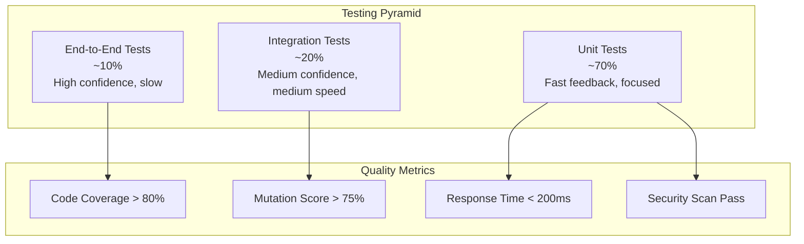

# 🧪 **Testing Strategy & Quality Assurance**

_Comprehensive testing documentation for the Tourii Backend platform_

_Last Updated: June 17, 2025_

## 📋 **Table of Contents**

1. [Testing Philosophy](#testing-philosophy)
2. [Test Architecture](#test-architecture)
3. [Test Types & Coverage](#test-types--coverage)
4. [Testing Infrastructure](#testing-infrastructure)
5. [Quality Gates](#quality-gates)
6. [Performance Testing](#performance-testing)
7. [Security Testing](#security-testing)
8. [Best Practices](#best-practices)

## 🎯 **Testing Philosophy**

### **Testing Pyramid**



### **Testing Principles**

- **🔄 Test-Driven Development**: Write tests before implementation when possible
- **🏗️ Arrange-Act-Assert**: Clear test structure for maintainability
- **🔬 Isolated Tests**: Each test should be independent and deterministic
- **📊 Meaningful Coverage**: Focus on business logic and critical paths
- **⚡ Fast Feedback**: Unit tests run in milliseconds, integration tests in seconds
- **🛡️ Security-First**: Include security testing at every level

## 🏗️ **Test Architecture**

### **Test Organization**

```
tourii-backend/
├── libs/core/test/              # Shared test utilities
│   ├── fixtures/                # Test data fixtures
│   ├── mocks/                   # Mock implementations
│   ├── factories/               # Data factories
│   └── utils/                   # Test helper functions
├── libs/core/src/**/*.spec.ts   # Unit tests (co-located)
├── apps/tourii-backend/test/    # Integration & E2E tests
│   ├── e2e/                     # End-to-end test suites
│   ├── integration/             # Integration test suites
│   ├── security/                # Security test suites
│   └── performance/             # Performance test suites
└── apps/tourii-onchain/test/    # Blockchain-specific tests
    ├── contracts/               # Smart contract tests
    └── integration/             # Web3 integration tests
```

### **Test Configuration**

```typescript
// jest.config.ts - Main configuration
export default {
  preset: 'ts-jest',
  testEnvironment: 'node',
  roots: ['<rootDir>/libs/', '<rootDir>/apps/'],
  testMatch: ['**/*.spec.ts', '**/*.test.ts'],
  collectCoverageFrom: [
    'libs/**/*.ts',
    'apps/**/*.ts',
    '!**/*.spec.ts',
    '!**/*.test.ts',
    '!**/node_modules/**',
    '!**/dist/**',
  ],
  coverageThreshold: {
    global: {
      branches: 80,
      functions: 80,
      lines: 80,
      statements: 80,
    },
  },
  setupFilesAfterEnv: ['<rootDir>/test/setup.ts'],
  moduleNameMapper: {
    '^@app/core(.*)$': '<rootDir>/libs/core/src$1',
    '^@app/core-test(.*)$': '<rootDir>/libs/core/test$1',
  },
};
```

## 📊 **Test Types & Coverage**

### **Unit Tests (70%)**

#### **Repository Layer Testing**

```typescript
describe('QuestRepositoryDb', () => {
  let repository: QuestRepositoryDb;
  let prisma: PrismaService;
  let cachingService: CachingService;

  beforeEach(async () => {
    const module = await Test.createTestingModule({
      providers: [
        QuestRepositoryDb,
        {
          provide: PrismaService,
          useValue: createMockPrismaService(),
        },
        {
          provide: CachingService,
          useValue: createMockCachingService(),
        },
      ],
    }).compile();

    repository = module.get<QuestRepositoryDb>(QuestRepositoryDb);
    prisma = module.get<PrismaService>(PrismaService);
    cachingService = module.get<CachingService>(CachingService);
  });

  describe('fetchQuestById', () => {
    it('should return quest with tasks when quest exists', async () => {
      // Arrange
      const questId = 'quest-123';
      const expectedQuest = QuestFactory.create({ questId });
      jest.spyOn(prisma.quest, 'findUnique').mockResolvedValue(expectedQuest);

      // Act
      const result = await repository.fetchQuestById(questId);

      // Assert
      expect(result).toEqual(expectedQuest);
      expect(prisma.quest.findUnique).toHaveBeenCalledWith({
        where: { quest_id: questId, del_flag: false },
        include: expect.objectContaining({
          quest_tasks: expect.any(Object),
        }),
      });
    });

    it('should throw exception when quest not found', async () => {
      // Arrange
      const questId = 'non-existent';
      jest.spyOn(prisma.quest, 'findUnique').mockResolvedValue(null);

      // Act & Assert
      await expect(repository.fetchQuestById(questId)).rejects.toThrow(
        TouriiBackendAppException,
      );
    });

    it('should use cached result when available', async () => {
      // Arrange
      const questId = 'quest-123';
      const cachedQuest = QuestFactory.create({ questId });
      jest.spyOn(cachingService, 'getOrSet').mockResolvedValue(cachedQuest);

      // Act
      const result = await repository.fetchQuestById(questId);

      // Assert
      expect(result).toEqual(cachedQuest);
      expect(cachingService.getOrSet).toHaveBeenCalledWith(
        `quest:${questId}`,
        expect.any(Function),
        3600,
      );
    });
  });
});
```

#### **Service Layer Testing**

```typescript
describe('TouriiBackendService', () => {
  let service: TouriiBackendService;
  let questRepository: QuestRepository;
  let userRepository: UserRepository;

  beforeEach(async () => {
    const module = await Test.createTestingModule({
      providers: [
        TouriiBackendService,
        {
          provide: 'QUEST_REPOSITORY_TOKEN',
          useValue: createMockQuestRepository(),
        },
        {
          provide: 'USER_REPOSITORY_TOKEN',
          useValue: createMockUserRepository(),
        },
      ],
    }).compile();

    service = module.get<TouriiBackendService>(TouriiBackendService);
    questRepository = module.get<QuestRepository>('QUEST_REPOSITORY_TOKEN');
    userRepository = module.get<UserRepository>('USER_REPOSITORY_TOKEN');
  });

  describe('completeStoryWithQuestUnlocking', () => {
    it('should unlock quests when story is completed', async () => {
      // Arrange
      const userId = 'user-123';
      const chapterId = 'chapter-456';
      const expectedUnlockedQuests = [QuestFactory.create()];

      jest
        .spyOn(questRepository, 'fetchQuestsByTouristSpotId')
        .mockResolvedValue(expectedUnlockedQuests);

      // Act
      const result = await service.completeStoryWithQuestUnlocking(
        userId,
        chapterId,
      );

      // Assert
      expect(result.unlockedQuests).toEqual(expectedUnlockedQuests);
      expect(result.rewards.magatamaPointsEarned).toBeGreaterThan(0);
    });
  });
});
```

### **Integration Tests (20%)**

#### **API Endpoint Testing**

```typescript
describe('Quest API Integration', () => {
  let app: INestApplication;
  let prisma: PrismaService;

  beforeAll(async () => {
    const module = await Test.createTestingModule({
      imports: [AppModule],
    }).compile();

    app = module.createNestApplication();
    prisma = module.get<PrismaService>(PrismaService);

    // Apply middleware and pipes
    app.useGlobalPipes(new ValidationPipe());
    app.useGlobalInterceptors(new ErrorInterceptor());

    await app.init();
  });

  beforeEach(async () => {
    await cleanDb(); // Clean database state
    await seedTestData(); // Set up test data
  });

  describe('GET /quests', () => {
    it('should return paginated quests with correct filters', async () => {
      // Arrange
      const expectedQuests = await createTestQuests(5);

      // Act
      const response = await request(app.getHttpServer())
        .get('/quests')
        .query({ page: 1, limit: 3, questType: 'SOLO' })
        .set('x-api-key', TEST_API_KEY)
        .set('accept-version', '1.0.0')
        .expect(200);

      // Assert
      expect(response.body.data).toHaveLength(3);
      expect(response.body.pagination.currentPage).toBe(1);
      expect(response.body.pagination.totalPages).toBe(2);
      expect(response.body.data[0]).toMatchObject({
        questId: expect.any(String),
        questName: expect.any(String),
        questType: 'SOLO',
      });
    });

    it('should require valid API key', async () => {
      // Act & Assert
      await request(app.getHttpServer())
        .get('/quests')
        .set('accept-version', '1.0.0')
        .expect(401);
    });

    it('should validate version header', async () => {
      // Act & Assert
      await request(app.getHttpServer())
        .get('/quests')
        .set('x-api-key', TEST_API_KEY)
        .set('accept-version', 'invalid-version')
        .expect(400);
    });
  });

  describe('POST /quests/create-quest', () => {
    it('should create quest with valid data', async () => {
      // Arrange
      const questData = {
        questName: 'Test Quest',
        questDesc: 'A test quest',
        questType: 'SOLO',
        touristSpotId: 'spot-123',
        totalMagatamaPointAwarded: 100,
      };

      // Act
      const response = await request(app.getHttpServer())
        .post('/quests/create-quest')
        .set('x-api-key', TEST_API_KEY)
        .set('accept-version', '1.0.0')
        .send(questData)
        .expect(201);

      // Assert
      expect(response.body).toMatchObject({
        questId: expect.any(String),
        questName: questData.questName,
        questType: questData.questType,
      });

      // Verify in database
      const createdQuest = await prisma.quest.findUnique({
        where: { quest_id: response.body.questId },
      });
      expect(createdQuest).toBeTruthy();
    });
  });
});
```

#### **Database Integration Testing**

```typescript
describe('User Story Log Repository Integration', () => {
  let repository: UserStoryLogRepositoryDb;
  let prisma: PrismaService;

  beforeAll(async () => {
    const module = await Test.createTestingModule({
      providers: [UserStoryLogRepositoryDb, PrismaService],
    }).compile();

    repository = module.get<UserStoryLogRepositoryDb>(UserStoryLogRepositoryDb);
    prisma = module.get<PrismaService>(PrismaService);
  });

  beforeEach(async () => {
    await cleanDb();
    await seedRequiredData();
  });

  describe('completeStoryWithQuestUnlocking', () => {
    it('should complete story and unlock related quests', async () => {
      // Arrange
      const { userId, chapterId, expectedQuests } =
        await setupStoryCompletion();

      // Act
      const result = await repository.completeStoryWithQuestUnlocking(
        userId,
        chapterId,
      );

      // Assert
      expect(result.unlockedQuests).toHaveLength(expectedQuests.length);
      expect(result.rewards.magatamaPointsEarned).toBe(50); // 10 base + 40 quest unlock

      // Verify database state
      const storyLog = await prisma.user_story_log.findFirst({
        where: { user_id: userId, story_chapter_id: chapterId },
      });
      expect(storyLog?.status).toBe(StoryStatus.COMPLETED);
    });

    it('should handle concurrent story completions safely', async () => {
      // Arrange
      const { userId, chapterId } = await setupStoryCompletion();

      // Act - Simulate concurrent requests
      const promises = Array(5)
        .fill(null)
        .map(() =>
          repository.completeStoryWithQuestUnlocking(userId, chapterId),
        );

      const results = await Promise.allSettled(promises);

      // Assert - Only one should succeed, others should handle gracefully
      const successful = results.filter((r) => r.status === 'fulfilled');
      expect(successful).toHaveLength(1);

      const failed = results.filter((r) => r.status === 'rejected');
      expect(failed.length).toBeGreaterThan(0);
    });
  });
});
```

### **End-to-End Tests (10%)**

#### **User Journey Testing**

```typescript
describe('Complete User Journey E2E', () => {
  let app: INestApplication;
  let userToken: string;

  beforeAll(async () => {
    app = await createTestApp();
    await app.init();
  });

  describe('Quest Completion Journey', () => {
    it('should complete full quest lifecycle', async () => {
      // Step 1: User registration
      const signupResponse = await request(app.getHttpServer())
        .post('/auth/signup')
        .send({
          email: 'test@example.com',
          socialProvider: 'google',
          socialId: 'google-123',
        })
        .expect(201);

      const userId = signupResponse.body.userId;

      // Step 2: Get available quests
      const questsResponse = await request(app.getHttpServer())
        .get('/quests')
        .set('x-api-key', TEST_API_KEY)
        .set('accept-version', '1.0.0')
        .query({ userId })
        .expect(200);

      expect(questsResponse.body.data.length).toBeGreaterThan(0);
      const questId = questsResponse.body.data[0].questId;

      // Step 3: Start quest
      const questDetails = await request(app.getHttpServer())
        .get(`/quests/${questId}`)
        .set('x-api-key', TEST_API_KEY)
        .set('accept-version', '1.0.0')
        .query({ userId })
        .expect(200);

      expect(questDetails.body.tasks.length).toBeGreaterThan(0);
      const taskId = questDetails.body.tasks[0].taskId;

      // Step 4: Complete task (photo upload)
      const photoBuffer = fs.readFileSync('test/fixtures/sample-photo.jpg');
      await request(app.getHttpServer())
        .post(`/quests/tasks/${taskId}/photo-upload`)
        .set('x-api-key', TEST_API_KEY)
        .set('accept-version', '1.0.0')
        .set('x-user-id', userId)
        .attach('file', photoBuffer, 'photo.jpg')
        .expect(200);

      // Step 5: Verify quest progress
      const updatedQuest = await request(app.getHttpServer())
        .get(`/quests/${questId}`)
        .set('x-api-key', TEST_API_KEY)
        .set('accept-version', '1.0.0')
        .query({ userId })
        .expect(200);

      expect(updatedQuest.body.tasks[0].isCompleted).toBe(true);

      // Step 6: Verify user profile updated
      const userProfile = await request(app.getHttpServer())
        .get('/user/me')
        .set('x-api-key', TEST_API_KEY)
        .set('accept-version', '1.0.0')
        .set('x-user-id', userId)
        .expect(200);

      expect(userProfile.body.totalMagatamaPoints).toBeGreaterThan(0);
    });
  });
});
```

## 🔧 **Testing Infrastructure**

### **Test Data Management**

#### **Factories Pattern**

```typescript
// Test data factories for consistent test data
export class QuestFactory {
  static create(overrides: Partial<QuestEntity> = {}): QuestEntity {
    return {
      questId: faker.string.uuid(),
      questName: faker.lorem.words(3),
      questDesc: faker.lorem.paragraph(),
      questType: faker.helpers.arrayElement(['SOLO', 'GROUP']),
      touristSpotId: faker.string.uuid(),
      totalMagatamaPointAwarded: faker.number.int({ min: 10, max: 100 }),
      isPremium: false,
      isUnlocked: true,
      delFlag: false,
      insUserId: 'system',
      updUserId: 'system',
      insDateTime: new Date(),
      updDateTime: new Date(),
      tasks: [],
      ...overrides,
    };
  }

  static createMany(
    count: number,
    overrides: Partial<QuestEntity> = {},
  ): QuestEntity[] {
    return Array.from({ length: count }, () => this.create(overrides));
  }
}

export class UserFactory {
  static create(overrides: Partial<UserEntity> = {}): UserEntity {
    return {
      userId: faker.string.uuid(),
      username: faker.internet.userName(),
      email: faker.internet.email(),
      password: faker.internet.password(),
      discordId: faker.string.alphanumeric(10),
      googleEmail: faker.internet.email(),
      passportWalletAddress: faker.finance.ethereumAddress(),
      level: LevelType.BRONZE,
      totalMagatamaPoint: faker.number.int({ min: 0, max: 1000 }),
      ...overrides,
    };
  }
}
```

#### **Database Seeding for Tests**

```typescript
// Test database seeding utilities
export class TestDataSeeder {
  constructor(private prisma: PrismaService) {}

  async seedCompleteScenario(): Promise<TestScenario> {
    // Create test users
    const users = await this.prisma.user.createMany({
      data: UserFactory.createMany(3).map((user) => ({
        user_id: user.userId,
        username: user.username,
        email: user.email,
        password: user.password,
        ins_user_id: 'test',
        upd_user_id: 'test',
      })),
    });

    // Create test stories and chapters
    const story = await this.prisma.story.create({
      data: {
        story_id: faker.string.uuid(),
        saga_name: 'Test Saga',
        saga_desc: 'A test saga',
        order: 1,
        ins_user_id: 'test',
        upd_user_id: 'test',
      },
    });

    // Create test quests and tasks
    const quests = await this.createQuestsWithTasks(5);

    return {
      users: users.map((u) => u.user_id),
      storyId: story.story_id,
      questIds: quests.map((q) => q.quest_id),
    };
  }

  async cleanDatabase(): Promise<void> {
    // Clean in correct order to respect foreign key constraints
    await this.prisma.user_task_log.deleteMany();
    await this.prisma.user_story_log.deleteMany();
    await this.prisma.quest_task.deleteMany();
    await this.prisma.quest.deleteMany();
    await this.prisma.story_chapter.deleteMany();
    await this.prisma.story.deleteMany();
    await this.prisma.tourist_spot.deleteMany();
    await this.prisma.model_route.deleteMany();
    await this.prisma.user.deleteMany();
  }
}
```

### **Mock Services**

```typescript
// Mock implementations for external dependencies
export const createMockGooglePlacesService =
  (): Partial<LocationInfoRepository> => ({
    getLocationInfo: jest.fn().mockResolvedValue({
      name: 'Test Location',
      formattedAddress: '123 Test St, Test City',
      phoneNumber: '+1234567890',
      rating: 4.5,
      images: [],
    }),
  });

export const createMockWeatherService = (): Partial<WeatherInfoRepository> => ({
  getCurrentWeatherByGeoInfoList: jest.fn().mockResolvedValue([
    {
      touristSpotName: 'Test Location',
      temperature: 25,
      description: 'Sunny',
      humidity: 60,
      windSpeed: 10,
    },
  ]),
});

export const createMockCachingService = (): Partial<CachingService> => ({
  getOrSet: jest
    .fn()
    .mockImplementation(async (key, fetchFn) => await fetchFn()),
  clearAll: jest.fn().mockResolvedValue(undefined),
  clearPattern: jest.fn().mockResolvedValue(undefined),
});
```

## 🚀 **Quality Gates**

### **Automated Quality Checks**

```yaml
# GitHub Actions workflow for quality gates
name: Quality Gates
on: [push, pull_request]

jobs:
  unit-tests:
    runs-on: ubuntu-latest
    steps:
      - uses: actions/checkout@v3
      - uses: actions/setup-node@v3
      - run: pnpm install
      - run: pnpm test:unit
      - run: pnpm test:coverage

      # Fail if coverage below threshold
      - name: Check coverage threshold
        run: |
          COVERAGE=$(pnpm test:coverage --passWithNoTests --silent | grep "All files" | awk '{print $10}' | sed 's/%//')
          if [ $COVERAGE -lt 80 ]; then
            echo "Coverage $COVERAGE% is below 80% threshold"
            exit 1
          fi

  integration-tests:
    runs-on: ubuntu-latest
    services:
      postgres:
        image: postgres:14
        env:
          POSTGRES_PASSWORD: test
        options: >-
          --health-cmd pg_isready
          --health-interval 10s
          --health-timeout 5s
          --health-retries 5
      redis:
        image: redis:7
        options: >-
          --health-cmd "redis-cli ping"
          --health-interval 10s
          --health-timeout 5s
          --health-retries 5
    steps:
      - uses: actions/checkout@v3
      - uses: actions/setup-node@v3
      - run: pnpm install
      - run: pnpm prisma:migrate:test
      - run: pnpm test:integration

  security-tests:
    runs-on: ubuntu-latest
    steps:
      - uses: actions/checkout@v3
      - uses: actions/setup-node@v3
      - run: pnpm install
      - run: pnpm audit
      - run: pnpm test:security
      - name: Run security scan
        uses: securecodewarrior/github-action-add-sarif@v1
        with:
          sarif-file: security-scan-results.sarif

  performance-tests:
    runs-on: ubuntu-latest
    steps:
      - uses: actions/checkout@v3
      - uses: actions/setup-node@v3
      - run: pnpm install
      - run: pnpm build
      - run: pnpm test:performance
      - name: Check performance thresholds
        run: |
          # Fail if API response time > 200ms
          RESPONSE_TIME=$(cat performance-results.json | jq '.averageResponseTime')
          if [ $RESPONSE_TIME -gt 200 ]; then
            echo "Average response time ${RESPONSE_TIME}ms exceeds 200ms threshold"
            exit 1
          fi
```

### **Code Quality Metrics**

```typescript
// Jest configuration for quality metrics
module.exports = {
  collectCoverageFrom: [
    'libs/**/*.ts',
    'apps/**/*.ts',
    '!**/*.spec.ts',
    '!**/*.test.ts',
    '!**/node_modules/**',
  ],
  coverageThreshold: {
    global: {
      branches: 80,
      functions: 80,
      lines: 80,
      statements: 80,
    },
    // Higher thresholds for critical modules
    'libs/core/src/domain/**/*.ts': {
      branches: 90,
      functions: 90,
      lines: 90,
      statements: 90,
    },
    'libs/core/src/infrastructure/datasource/**/*.ts': {
      branches: 85,
      functions: 85,
      lines: 85,
      statements: 85,
    },
  },
  coverageReporters: ['text', 'html', 'lcov', 'json-summary'],
  testResultsProcessor: 'jest-sonar-reporter',
};
```

## ⚡ **Performance Testing**

### **Load Testing with Artillery**

```yaml
# artillery-config.yml
config:
  target: 'http://localhost:4000'
  phases:
    - duration: 60
      arrivalRate: 10
      name: 'Warm-up'
    - duration: 120
      arrivalRate: 50
      name: 'Load test'
    - duration: 60
      arrivalRate: 100
      name: 'Stress test'
  headers:
    x-api-key: '{{ $env.TEST_API_KEY }}'
    accept-version: '1.0.0'

scenarios:
  - name: 'Quest browsing flow'
    weight: 70
    flow:
      - get:
          url: '/health-check'
      - get:
          url: '/quests'
          qs:
            page: 1
            limit: 20
      - think: 2
      - get:
          url: '/quests/{{ $randomString() }}'
          capture:
            - json: '$.questId'
              as: 'questId'

  - name: 'User authentication flow'
    weight: 30
    flow:
      - post:
          url: '/auth/signup'
          json:
            email: 'test-{{ $randomString() }}@example.com'
            socialProvider: 'google'
            socialId: 'google-{{ $randomString() }}'
          capture:
            - json: '$.userId'
              as: 'userId'
      - get:
          url: '/user/me'
          headers:
            x-user-id: '{{ userId }}'
```

### **Database Performance Testing**

```typescript
describe('Database Performance Tests', () => {
  let prisma: PrismaService;

  beforeAll(async () => {
    prisma = new PrismaService();
    await prisma.$connect();

    // Seed large dataset for performance testing
    await seedLargeDataset(10000); // 10k quests, 50k tasks
  });

  describe('Quest fetching performance', () => {
    it('should fetch paginated quests within performance threshold', async () => {
      const startTime = Date.now();

      const result = await prisma.quest.findMany({
        take: 20,
        skip: 0,
        where: { del_flag: false },
        include: {
          quest_tasks: {
            where: { del_flag: false },
          },
          tourist_spot: true,
        },
      });

      const endTime = Date.now();
      const responseTime = endTime - startTime;

      expect(responseTime).toBeLessThan(100); // 100ms threshold
      expect(result.length).toBeLessThanOrEqual(20);
    });

    it('should handle complex filtering efficiently', async () => {
      const startTime = Date.now();

      const result = await prisma.quest.findMany({
        where: {
          del_flag: false,
          is_unlocked: true,
          quest_type: 'SOLO',
          tourist_spot: {
            model_route: {
              region: 'Tokyo',
            },
          },
        },
        include: {
          quest_tasks: true,
          tourist_spot: {
            include: {
              model_route: true,
            },
          },
        },
      });

      const responseTime = Date.now() - startTime;

      expect(responseTime).toBeLessThan(200); // 200ms threshold for complex queries
    });
  });
});
```

## 🛡️ **Security Testing**

### **Security Test Suite**

```typescript
describe('Security Tests', () => {
  let app: INestApplication;

  beforeAll(async () => {
    app = await createTestApp();
  });

  describe('Authentication Security', () => {
    it('should reject requests without API key', async () => {
      await request(app.getHttpServer()).get('/quests').expect(401);
    });

    it('should reject requests with invalid API key', async () => {
      await request(app.getHttpServer())
        .get('/quests')
        .set('x-api-key', 'invalid-key')
        .set('accept-version', '1.0.0')
        .expect(401);
    });

    it('should validate JWT tokens properly', async () => {
      const invalidToken = 'eyJhbGciOiJIUzI1NiIsInR5cCI6IkpXVCJ9.invalid';

      await request(app.getHttpServer())
        .get('/user/me')
        .set('Authorization', `Bearer ${invalidToken}`)
        .expect(401);
    });
  });

  describe('Input Validation Security', () => {
    it('should prevent SQL injection in query parameters', async () => {
      await request(app.getHttpServer())
        .get('/quests')
        .query({ questType: "'; DROP TABLE quest; --" })
        .set('x-api-key', TEST_API_KEY)
        .set('accept-version', '1.0.0')
        .expect(400); // Should be blocked by validation
    });

    it('should sanitize file upload inputs', async () => {
      const maliciousFile = Buffer.from('<?php system($_GET["cmd"]); ?>');

      await request(app.getHttpServer())
        .post('/quests/tasks/task-123/photo-upload')
        .set('x-api-key', TEST_API_KEY)
        .set('accept-version', '1.0.0')
        .set('x-user-id', 'user-123')
        .attach('file', maliciousFile, 'malicious.php')
        .expect(400); // Should reject non-image files
    });
  });

  describe('Rate Limiting Security', () => {
    it('should enforce rate limits on sensitive endpoints', async () => {
      const promises = Array(10)
        .fill(null)
        .map(() =>
          request(app.getHttpServer()).post('/auth/signup').send({
            email: 'test@example.com',
            socialProvider: 'google',
            socialId: 'google-123',
          }),
        );

      const results = await Promise.allSettled(promises);
      const tooManyRequests = results.filter(
        (r) => r.status === 'fulfilled' && r.value.status === 429,
      );

      expect(tooManyRequests.length).toBeGreaterThan(0);
    });
  });

  describe('CORS Security', () => {
    it('should block requests from unauthorized origins', async () => {
      await request(app.getHttpServer())
        .get('/quests')
        .set('Origin', 'https://malicious-site.com')
        .set('x-api-key', TEST_API_KEY)
        .set('accept-version', '1.0.0')
        .expect(403); // Should be blocked by CORS
    });
  });
});
```

### **Penetration Testing Scripts**

```bash
#!/bin/bash
# security-test.sh - Automated security testing

echo "🔒 Running Security Test Suite"

# Test 1: API Key validation
echo "Testing API key validation..."
curl -s -w "%{http_code}" http://localhost:4000/quests | grep -q "401" && echo "✅ API key validation working" || echo "❌ API key validation failed"

# Test 2: Rate limiting
echo "Testing rate limiting..."
for i in {1..20}; do
    curl -s -w "%{http_code}" -H "x-api-key: $TEST_API_KEY" -H "accept-version: 1.0.0" http://localhost:4000/auth/signup &
done
wait
echo "✅ Rate limiting test completed"

# Test 3: Input validation
echo "Testing input validation..."
curl -s -w "%{http_code}" -H "x-api-key: $TEST_API_KEY" -H "accept-version: 1.0.0" "http://localhost:4000/quests?questType='; DROP TABLE quest; --" | grep -q "400" && echo "✅ SQL injection protection working" || echo "❌ SQL injection protection failed"

# Test 4: CORS validation
echo "Testing CORS validation..."
curl -s -w "%{http_code}" -H "Origin: https://malicious-site.com" -H "x-api-key: $TEST_API_KEY" -H "accept-version: 1.0.0" http://localhost:4000/quests | grep -q "403" && echo "✅ CORS protection working" || echo "❌ CORS protection failed"

echo "🔒 Security test suite completed"
```

## 📋 **Best Practices**

### **Test Writing Guidelines**

1. **📝 Descriptive Test Names**

   ```typescript
   // ❌ Bad
   it('should work', () => {});

   // ✅ Good
   it('should unlock premium quests when user completes 5 stories', () => {});
   ```

2. **🏗️ Arrange-Act-Assert Pattern**

   ```typescript
   it('should create quest with valid data', async () => {
     // Arrange
     const questData = QuestFactory.create();
     const expectedResult = { questId: expect.any(String) };

     // Act
     const result = await questService.createQuest(questData);

     // Assert
     expect(result).toMatchObject(expectedResult);
   });
   ```

3. **🔬 Test Isolation**

   ```typescript
   beforeEach(async () => {
     await cleanDb(); // Each test starts with clean state
     await seedRequiredData(); // Minimal required data
   });
   ```

4. **📊 Meaningful Assertions**

   ```typescript
   // ❌ Vague assertion
   expect(result).toBeTruthy();

   // ✅ Specific assertion
   expect(result.unlockedQuests).toHaveLength(3);
   expect(result.rewards.magatamaPointsEarned).toBe(150);
   ```

### **Continuous Testing Strategy**

```yaml
# Testing pipeline stages
stages:
  pre-commit:
    - run: pnpm test:unit:changed # Only changed files
    - run: pnpm lint:fix # Auto-fix lint issues

  pull-request:
    - run: pnpm test:unit # All unit tests
    - run: pnpm test:integration # Integration tests
    - run: pnpm test:security # Security tests

  main-branch:
    - run: pnpm test:all # Full test suite
    - run: pnpm test:e2e # End-to-end tests
    - run: pnpm test:performance # Performance tests

  release:
    - run: pnpm test:production # Production-like tests
    - run: pnpm test:smoke # Smoke tests
```

### **Test Maintenance**

1. **🔄 Regular Test Review**

   - Review test coverage monthly
   - Update tests when requirements change
   - Remove obsolete tests
   - Refactor duplicated test code

2. **📊 Test Metrics Monitoring**

   - Track test execution time trends
   - Monitor flaky test occurrences
   - Measure test coverage over time
   - Track security test pass rates

3. **🎯 Test Quality Improvement**
   - Regular test code reviews
   - Test-driven development adoption
   - Performance test optimization
   - Security test enhancement

---

**📋 This testing strategy should be reviewed and updated quarterly to ensure it meets evolving quality requirements and security standards.**

_For specific test implementation examples, refer to the actual test files in the codebase._
