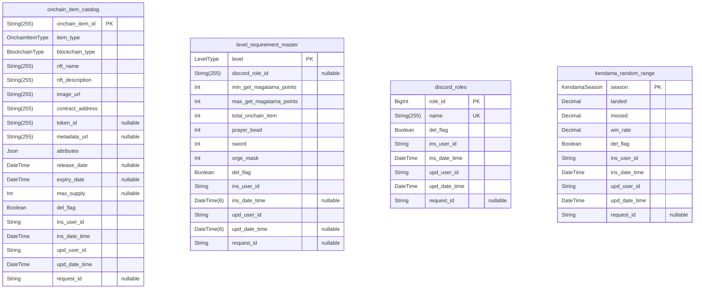
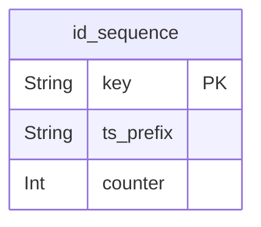

# Tourii Database
> Generated by [`prisma-markdown`](https://github.com/samchon/prisma-markdown)

- [Users](#users)
- [Gamification](#gamification)
- [Master](#master)
- [default](#default)

## Users

```mermaid
erDiagram
"user" {
  String(255) user_id PK
  String username UK
  String discord_id UK "nullable"
  String(255) discord_username "nullable"
  String twitter_id UK "nullable"
  String(255) twitter_username "nullable"
  String google_email UK "nullable"
  String email UK "nullable"
  String password
  String refresh_token "nullable"
  String passport_wallet_address UK "nullable"
  String perks_wallet_address UK
  String encrypted_private_key "nullable"
  String latest_ip_address "nullable"
  Boolean is_premium
  Int total_quest_completed
  Float total_travel_distance
  UserRoleType role
  DateTime registered_at
  DateTime discord_joined_at
  Boolean is_banned
  Boolean del_flag
  String ins_user_id
  DateTime ins_date_time
  String upd_user_id
  DateTime upd_date_time
  String request_id "nullable"
}
"user_achievement" {
  String(255) user_achievement_id PK
  String user_id FK
  String(255) achievement_name
  String(255) achievement_desc "nullable"
  String(255) icon_url "nullable"
  AchievementType achievement_type
  Int magatama_point_awarded
  Boolean del_flag
  String ins_user_id
  DateTime ins_date_time
  String upd_user_id
  DateTime upd_date_time
  String request_id "nullable"
}
"user_info" {
  String(255) user_info_id PK
  String user_id FK,UK
  String digital_passport_address UK
  String log_nft_address
  PassportType user_digital_passport_type "nullable"
  LevelType level "nullable"
  Float discount_rate "nullable"
  Int magatama_points
  Int magatama_bags "nullable"
  Int total_quest_completed
  Float total_travel_distance
  Boolean is_premium
  Int prayer_bead "nullable"
  Int sword "nullable"
  Int orge_mask "nullable"
  Boolean del_flag
  String ins_user_id
  DateTime ins_date_time
  String upd_user_id
  DateTime upd_date_time
  String request_id "nullable"
}
"user_onchain_item" {
  String(255) user_onchain_item_id PK
  String user_id FK "nullable"
  OnchainItemType item_type
  String item_txn_hash UK
  BlockchainType blockchain_type
  DateTime(6) minted_at "nullable"
  String onchain_item_id UK "nullable"
  OnchainItemStatus status
  Boolean del_flag
  String ins_user_id
  DateTime ins_date_time
  String upd_user_id
  DateTime upd_date_time
  String request_id "nullable"
}
"user_item_claim_log" {
  String(255) user_item_claim_log_id PK
  String user_id FK
  String(255) onchain_item_id "nullable"
  String(255) offchain_item_name "nullable"
  Int item_amount
  String item_details "nullable"
  ItemType type
  DateTime(6) claimed_at "nullable"
  ItemStatus status
  String(255) error_msg "nullable"
  Boolean del_flag
  String ins_user_id
  DateTime ins_date_time
  String upd_user_id
  DateTime upd_date_time
  String request_id "nullable"
}
"user_story_log" {
  String(255) user_story_log_id PK
  String user_id FK
  String story_chapter_id
  StoryStatus status
  DateTime(6) unlocked_at "nullable"
  DateTime(6) finished_at "nullable"
  Boolean del_flag
  String ins_user_id
  DateTime ins_date_time
  String upd_user_id
  DateTime upd_date_time
  String request_id "nullable"
}
"user_quest_log" {
  String(255) user_quest_log_id PK
  String user_id FK
  String quest_id
  QuestStatus status
  TaskType action
  String user_response "nullable"
  Json group_activity_members
  Json submission_data "nullable"
  String failed_reason "nullable"
  DateTime(6) completed_at "nullable"
  DateTime(6) claimed_at "nullable"
  Int total_magatama_point_awarded
  Boolean del_flag
  String ins_user_id
  DateTime ins_date_time
  String upd_user_id
  DateTime upd_date_time
  String request_id "nullable"
}
"user_travel_log" {
  String(255) user_travel_log_id PK
  String user_id FK
  String quest_id
  String task_id
  String tourist_spot_id
  Float user_longitude
  Float user_latitude
  Float travel_distance_from_target "nullable"
  Float travel_distance
  String qr_code_value "nullable"
  CheckInMethod check_in_method "nullable"
  Boolean detected_fraud "nullable"
  String fraud_reason "nullable"
  Boolean del_flag
  String ins_user_id
  DateTime ins_date_time
  String upd_user_id
  DateTime upd_date_time
  String request_id "nullable"
}
"user_invite_log" {
  String(255) invite_log_id PK
  String user_id FK
  String invitee_discord_id "nullable"
  String invitee_user_id "nullable"
  Int magatama_point_awarded
  Boolean del_flag
  String ins_user_id
  DateTime ins_date_time
  String upd_user_id
  DateTime upd_date_time
  String request_id "nullable"
}
"discord_activity_log" {
  String(255) discord_activity_log_id PK
  String user_id FK
  String(255) activity_type
  String activity_details "nullable"
  Int magatama_point_awarded
  Boolean del_flag
  String ins_user_id
  DateTime ins_date_time
  String upd_user_id
  DateTime upd_date_time
  String request_id "nullable"
}
"discord_rewarded_roles" {
  String(255) discord_rewarded_roles_id PK
  String user_id FK
  BigInt role_id
  Int magatama_point_awarded
  Boolean del_flag
  String ins_user_id
  DateTime ins_date_time
  String upd_user_id
  DateTime upd_date_time
  String request_id "nullable"
}
"discord_user_roles" {
  String(255) discord_user_roles_id PK
  String user_id FK
  BigInt role_id FK
  Boolean del_flag
  String ins_user_id
  DateTime ins_date_time
  String upd_user_id
  DateTime upd_date_time
  String request_id "nullable"
}
"user_achievement" }o--|| "user" : user
"user_info" |o--|| "user" : user
"user_onchain_item" }o--o| "user" : user
"user_item_claim_log" }o--|| "user" : user
"user_story_log" }o--|| "user" : user
"user_quest_log" }o--|| "user" : user
"user_travel_log" }o--|| "user" : user
"user_invite_log" }o--|| "user" : user
"discord_activity_log" }o--|| "user" : user
"discord_rewarded_roles" }o--|| "user" : user
"discord_user_roles" }o--|| "user" : user
```

### `user`
-----------------------------------------------------------
USERS & AUTHENTICATION
-----------------------------------------------------------
User entity.

Represents a registered user of the Tourii application with all their
authentication information, platform connections, wallet addresses, and
user-specific settings. Users can authenticate through various methods
including Discord, Twitter, and Google.

Users can have multiple achievements, onchain items, and can participate in
various activities tracked through logs. Premium status and role types
define access levels and privileges in the system.

**Properties**
  - `user_id`: User ID with format TSUYYYYMM-rand1-DDHHMI-rand2-obfCounter
  - `username`: Tourii System Username
  - `discord_id`
    > Discord System User Id
    > 
    > Unique identifier from Discord authentication
  - `discord_username`: Discord User Name
  - `twitter_id`
    > Twitter System User Id
    > 
    > Unique identifier from Twitter authentication
  - `twitter_username`: Twitter User Name
  - `google_email`
    > Google System User Id
    > 
    > User's email address from Google authentication
  - `email`: User Email
  - `password`
    > User Password
    > 
    > Hashed password for native authentication
  - `refresh_token`
    > Refresh Token
    > 
    > Bearer for rotating refresh token (hashed or plaintext)
    > Each time we issue a new refresh token, we replace this field.
  - `passport_wallet_address`
    > Digital passport Wallet Address
    > 
    > Blockchain wallet address for digital passport
  - `perks_wallet_address`
    > Travel perk NFT Wallet Address
    > 
    > Blockchain wallet address for travel perks
  - `encrypted_private_key`: Encrypted private key for the user's wallet
  - `latest_ip_address`: User's latest IP address
  - `is_premium`
    > User is premium or not
    > 
    > Indicates whether user has premium subscription
  - `total_quest_completed`: Total number of quests completed by user
  - `total_travel_distance`: Total travel distance recorded by user
  - `role`
    > User role in the system
    > 
    > | Role         | Description                                           |
    > |--------------|-------------------------------------------------------|
    > | USER         | Regular user with standard permissions                |
    > | MODERATOR    | User with moderation capabilities                     |
    > | ADMIN        | User with full administrative access                  |
  - `registered_at`: Initial registration timestamp
  - `discord_joined_at`: When user joined Discord
  - `is_banned`: Indicates if user is banned from the platform
  - `del_flag`: Soft delete flag
  - `ins_user_id`: ID of user who created this record
  - `ins_date_time`: Timestamp of record creation
  - `upd_user_id`: ID of user who last updated this record
  - `upd_date_time`: Timestamp of last record update
  - `request_id`: Request ID for tracing

### `user_achievement`
User Achievement entity

Records achievements earned by users in the Tourii application.
Each achievement represents a milestone or accomplishment in the user's
journey, categorized by type and awarding magatama points.
Achievements can be related to stories, travel, exploration, community
engagement, or general milestones.

**Properties**
  - `user_achievement_id`: Unique identifier for the achievement record UATYYYYMM-rand1-DDHHMI-rand2-obfCounter
  - `user_id`: Associated user ID
  - `achievement_name`: Name of the achievement
  - `achievement_desc`: Detailed description of the achievement
  - `icon_url`: URL to the achievement icon image
  - `achievement_type`
    > Category of the achievement
    > 
    > | Type         | Description                                 |
    > |--------------|---------------------------------------------|
    > | UNKNOWN      | Uncategorized achievement type              |
    > | STORY        | Achievement related to Story                |
    > | TRAVEL       | Achievement related to Travel               |
    > | EXPLORE      | Achievement related to Exploration          |
    > | COMMUNITY    | Achievement related to User Engagement      |
    > | MILESTONE    | Achievement related to Milestone            |
  - `magatama_point_awarded`: Amount of magatama points awarded for this achievement
  - `del_flag`: Soft delete flag
  - `ins_user_id`: ID of user who created this record
  - `ins_date_time`: Timestamp of record creation
  - `upd_user_id`: ID of user who last updated this record
  - `upd_date_time`: Timestamp of last record update
  - `request_id`: Request ID for tracing

### `user_info`
User Information entity

Contains extended profile information for Tourii users including their
digital passport details, progression level, in-game currency balances,
and collectible items. This model stores user-specific game metrics and
preferences that extend beyond the core user authentication data.

Each user has exactly one user_info record created upon registration.
The model tracks progression through the Tourii world with level systems
and collectible items that unlock additional features.

**Properties**
  - `user_info_id`: Unique identifier for the user info record UIFYYYYMM-rand1-DDHHMI-rand2-obfCounter
  - `user_id`: Associated user ID (one-to-one relationship)
  - `digital_passport_address`: Blockchain address for the user's digital passport
  - `log_nft_address`: Blockchain address for the user's log NFT
  - `user_digital_passport_type`
    > Type of digital passport assigned to the user
    > 
    > | Type         | Description                                 |
    > |--------------|---------------------------------------------|
    > | BONJIN       | Standard human passport type                |
    > | AMATSUKAMI   | Celestial deity passport type               |
    > | KUNITSUKAMI  | Earthly deity passport type                 |
    > | YOKAI        | Supernatural being passport type            |
  - `level`
    > Current level classification of the user
    > 
    > | Level        | Description                                 |
    > |--------------|---------------------------------------------|
    > | BONJIN       | Base human level                            |
    > | E_CLASS_*    | Entry level for each passport type          |
    > | D_CLASS_*    | Beginner level for each passport type       |
    > | C_CLASS_*    | Intermediate level for each passport type   |
    > | B_CLASS_*    | Advanced level for each passport type       |
    > | A_CLASS_*    | Expert level for each passport type         |
    > | S_CLASS_*    | Master level for each passport type         |
  - `discount_rate`: User's discount rate for premium features (as a decimal)
  - `magatama_points`: Current balance of magatama points (in-game currency)
  - `magatama_bags`: Number of magatama bags collected
  - `total_quest_completed`: Total number of quests completed by the user
  - `total_travel_distance`: Total distance traveled by the user (in kilometers)
  - `is_premium`: Indicates whether the user has a premium subscription
  - `prayer_bead`: Number of prayer beads collected (collectible item)
  - `sword`: Number of swords collected (collectible item)
  - `orge_mask`: Number of orge masks collected (collectible item)
  - `del_flag`: Soft delete flag
  - `ins_user_id`: ID of user who created this record
  - `ins_date_time`: Timestamp of record creation
  - `upd_user_id`: ID of user who last updated this record
  - `upd_date_time`: Timestamp of last record update
  - `request_id`: Request ID for tracing

### `user_onchain_item`
User Onchain Item entity

Tracks blockchain items owned by users in the Tourii application.
These items include digital passports, log NFTs, and travel perks, 
each with their respective blockchain details and status.

This model maintains the relationship between users and their on-chain
assets across different blockchain networks (VARA, CAMINO), recording
transaction hashes, minting timestamps, and current item status.

**Properties**
  - `user_onchain_item_id`: Unique identifier for the onchain item record OICYYYYMM-rand1-DDHHMI-rand2-obfCounter
  - `user_id`: Associated user ID
  - `item_type`
    > Type of blockchain item (LOG_NFT, DIGITAL_PASSPORT, PERK)
    > 
    > | Type             | Description                             |
    > |------------------|-----------------------------------------|
    > | UNKNOWN          | Unknown item type                       |
    > | LOG_NFT          | Log NFT item type                       |
    > | DIGITAL_PASSPORT | Digital passport item type              |
    > | PERK             | Travel perk item type                   |
  - `item_txn_hash`
    > Blockchain transaction hash
    > Can be digital_passport_address, log_nft_address, or perk_address
  - `blockchain_type`
    > Blockchain network where the item exists
    > 
    > | Type         | Description                                 |
    > |--------------|---------------------------------------------|
    > | UNKNOWN      | Unknown blockchain type                     |
    > | VARA         | Vara blockchain type                        |
    > | CAMINO       | Camino blockchain type                      |
  - `minted_at`: Timestamp when the item was minted on blockchain
  - `onchain_item_id`: Onchain identifier for the item
  - `status`
    > Current status of the onchain item
    > 
    > | Status       | Description                                 |
    > |--------------|---------------------------------------------|
    > | ACTIVE       | Active item status                          |
    > | USED         | Used item status                            |
    > | EXPIRED      | Item is no longer valid                     |
    > | PENDING      | Item is in the process of being minted      |
  - `del_flag`: Soft delete flag
  - `ins_user_id`: ID of user who created this record
  - `ins_date_time`: Timestamp of record creation
  - `upd_user_id`: ID of user who last updated this record
  - `upd_date_time`: Timestamp of last record update
  - `request_id`: Request ID for tracing

### `user_item_claim_log`
User Item Claim Log entity

Records the history of items claimed by users in the Tourii application,
tracking both blockchain (onchain) and application-based (offchain) items.
Each record includes details about the item, claim timestamp, quantity,
and status (success or failure).

This model provides a complete audit trail of all user rewards and
serves as a record for troubleshooting failed claims.

**Properties**
  - `user_item_claim_log_id`: Unique identifier for the claim log record UICYYYYMM-rand1-DDHHMI-rand2-obfCounter
  - `user_id`: Associated user ID
  - `onchain_item_id`: ID of the onchain item (if applicable)
  - `offchain_item_name`: Name of the offchain item (if applicable)
  - `item_amount`: Quantity of the item claimed
  - `item_details`: Additional details about the item
  - `type`
    > Type of item (onchain or offchain)
    > 
    > | Type         | Description                                 |
    > |--------------|---------------------------------------------|
    > | ONCHAIN      | Item stored on blockchain                   |
    > | OFFCHAIN     | Item stored in application database         |
  - `claimed_at`: Timestamp when the item was claimed
  - `status`
    > Status of the claim (SUCCESS or FAILED)
    > 
    > | Status       | Description                                 |
    > |--------------|---------------------------------------------|
    > | SUCCESS      | Item was successfully claimed               |
    > | FAILED       | Item claim failed                           |
  - `error_msg`: Error message for failed claims
  - `del_flag`: Soft delete flag
  - `ins_user_id`: ID of user who created this record
  - `ins_date_time`: Timestamp of record creation
  - `upd_user_id`: ID of user who last updated this record
  - `upd_date_time`: Timestamp of last record update
  - `request_id`: Request ID for tracing

### `user_story_log`
User Story Log entity

Tracks user progress through stories in the Tourii application.
Each record represents a user's interaction with a specific story,
including their reading status and timestamps for when they started
and completed the story.

This model enables progress tracking, personalized content delivery,
and analytics about user engagement with narrative content.

**Properties**
  - `user_story_log_id`: Unique identifier for the story log record USLYYYYMM-rand1-DDHHMI-rand2-obfCounter
  - `user_id`: Associated user ID
  - `story_chapter_id`: ID of the story being tracked
  - `status`
    > Current status of the story for this user
    > 
    > | Status       | Description                                                   |
    > |--------------|---------------------------------------------------------------|
    > | UNREAD       | Story is available but user hasn't started reading it yet     |
    > | IN_PROGRESS  | User has started the story but hasn't finished it             |
    > | COMPLETED    | User has finished reading the entire story                    |
  - `unlocked_at`
    > Timestamp when user started reading the story
    > Recorded when user clicks the start reading button
  - `finished_at`: Timestamp when user finished reading the story
  - `del_flag`: Soft delete flag
  - `ins_user_id`: ID of user who created this record
  - `ins_date_time`: Timestamp of record creation
  - `upd_user_id`: ID of user who last updated this record
  - `upd_date_time`: Timestamp of last record update
  - `request_id`: Request ID for tracing

### `user_quest_log`
User Quest Log entity

Records user engagement with quests in the Tourii application, including
progress status, responses, completion evidence, and rewards.
This model tracks the entire lifecycle of a user's interaction with a quest,
from initial access to reward claiming.

Used for tracking quest completions, premium quest purchases,
quest success/failure, and reward distribution.

**Properties**
  - `user_quest_log_id`: Unique identifier for the quest log record UQLYYYYMM-rand1-DDHHMI-rand2-obfCounter
  - `user_id`: Associated user ID
  - `quest_id`: ID of the quest
  - `status`
    > Current status of the quest for this user
    > 
    > | Status       | Description                                 |
    > |--------------|---------------------------------------------|
    > | AVAILABLE    | Quest is available to be started            |
    > | ONGOING      | Quest is currently in progress              |
    > | COMPLETED    | Quest has been successfully completed       |
    > | FAILED       | Quest was not completed successfully        |
  - `action`
    > Type of action required for the quest
    > 
    > | Type              | Description                                  |
    > |-------------------|----------------------------------------------|
    > | VISIT_LOCATION    | Requires physical presence at a location     |
    > | PHOTO_UPLOAD      | Requires uploading a photo                   |
    > | ANSWER_TEXT       | Requires text response                       |
    > | SELECT_OPTION     | Requires selecting from predefined options   |
    > | SHARE_SOCIAL      | Requires sharing on social media             |
    > | CHECK_IN          | Requires checking in at a location           |
    > | GROUP_ACTIVITY    | Requires participation in a group activity   |
    > | LOCAL_INTERACTION | Requires interaction with locals             |
  - `user_response`: User's textual response to the quest
  - `group_activity_members`
    > List of group members for GROUP_ACTIVITY task type
    > user_id, discord_id, and group_name are required fields.
    > Example: [
    > { "user_id": "user1", "discord_id": "1234567890", "group_name": "Team A" },
    > { "user_id": "user2", "discord_id": "0987654321", "group_name": "Team A" }
    > ]
    > Note: This field is used for GROUP_ACTIVITY task type only.
    > It is not required for other task types.
  - `submission_data`
    > Metadata for proof of completion
    > Example: {"image_url": "https://cdn.tourii.app/images/harajiri_main.jpg", "qr_code_value": "XG45-7YV9"}
  - `failed_reason`: Reason for quest failure, if applicable
  - `completed_at`: Timestamp when user completed the quest
  - `claimed_at`: Timestamp when user claimed the quest reward
  - `total_magatama_point_awarded`: Total magatama points awarded for this quest
  - `del_flag`: Soft delete flag
  - `ins_user_id`: ID of user who created this record
  - `ins_date_time`: Timestamp of record creation
  - `upd_user_id`: ID of user who last updated this record
  - `upd_date_time`: Timestamp of last record update
  - `request_id`: Request ID for tracing

### `user_travel_log`
User Travel Log entity

Records physical travel activities of users in the Tourii application,
particularly for offline quests. This model captures location data,
check-in methods, and verification details to confirm a user's presence
at specific tourist spots.

The model includes anti-fraud measures and stores geographic coordinates
to calculate travel distances and verify proximity to target locations.

**Properties**
  - `user_travel_log_id`: Unique identifier for the travel log record UTLYYYYMM-rand1-DDHHMI-rand2-obfCounter
  - `user_id`: Associated user ID
  - `quest_id`: ID of the associated quest
  - `task_id`: ID of the specific task within the quest
  - `tourist_spot_id`: ID of the tourist spot visited
  - `user_longitude`: User's longitude coordinate at check-in
  - `user_latitude`: User's latitude coordinate at check-in
  - `travel_distance_from_target`
    > Distance in meters from the target location
    > Represents GPS accuracy and user's proximity to the target point
  - `travel_distance`: Total distance traveled for this activity (in kilometers)
  - `qr_code_value`: Value of scanned QR code, if applicable
  - `check_in_method`
    > Method used for location verification (QR_CODE or GPS)
    > 
    > | Method       | Description                                 |
    > |--------------|---------------------------------------------|
    > | QR_CODE      | Verification via QR code scan               |
    > | GPS          | Verification via GPS location               |
  - `detected_fraud`: Flag indicating potential fraudulent check-in
  - `fraud_reason`: Explanation for fraud detection, if applicable
  - `del_flag`: Soft delete flag
  - `ins_user_id`: ID of user who created this record
  - `ins_date_time`: Timestamp of record creation
  - `upd_user_id`: ID of user who last updated this record
  - `upd_date_time`: Timestamp of last record update
  - `request_id`: Request ID for tracing

### `user_invite_log`
User Invitation Log entity

Tracks user invitations and referrals in the Tourii application.
This model records when users invite others to the platform and the 
rewards they receive for successful referrals.

The model supports both Discord-based invitations and direct Tourii
system invites, maintaining the relationship between inviters and invitees.

**Properties**
  - `invite_log_id`: Unique identifier for the invitation log record UILYYYYMM-rand1-DDHHMI-rand2-obfCounter
  - `user_id`: ID of the user who sent the invitation
  - `invitee_discord_id`: Discord ID of the invited user
  - `invitee_user_id`: Tourii user ID of the invited user (once registered)
  - `magatama_point_awarded`: Magatama points awarded for the invitation
  - `del_flag`: Soft delete flag
  - `ins_user_id`: ID of user who created this record
  - `ins_date_time`: Timestamp of record creation
  - `upd_user_id`: ID of user who last updated this record
  - `upd_date_time`: Timestamp of last record update
  - `request_id`: Request ID for tracing

### `discord_activity_log`
Discord Activity Log entity

Records user activities and engagements within the Discord community.
This model tracks various Discord-based actions performed by users
and the magatama points awarded for these activities.

Used for tracking user engagement metrics, rewarding community participation,
and integrating Discord interactions with the Tourii application ecosystem.

**Properties**
  - `discord_activity_log_id`: Unique identifier for the Discord activity log record DAYYYYYMM-rand1-DDHHMI-rand2-obfCounter
  - `user_id`: Associated user ID
  - `activity_type`
    > Type of Discord activity performed
    > Examples: "message_sent", "voice_participation", "emoji_reaction"
  - `activity_details`
    > Additional details about the activity
    > Could include channel name, message content summary, etc.
  - `magatama_point_awarded`: Magatama points awarded for this activity
  - `del_flag`: Soft delete flag
  - `ins_user_id`: ID of user who created this record
  - `ins_date_time`: Timestamp of record creation
  - `upd_user_id`: ID of user who last updated this record
  - `upd_date_time`: Timestamp of last record update
  - `request_id`: Request ID for tracing

### `discord_rewarded_roles`
Discord Rewarded Roles entity

Tracks Discord roles awarded to users as rewards for their activities
and achievements in the Tourii ecosystem. Each record documents a role
granted to a user and the associated magatama point reward.

This model facilitates the integration between Discord community status
and in-app rewards, helping maintain consistent recognition across platforms.

**Properties**
  - `discord_rewarded_roles_id`: Unique identifier for the rewarded role record DRRYYYYMM-rand1-DDHHMI-rand2-obfCounter
  - `user_id`: Associated user ID
  - `role_id`: Discord role ID granted to the user
  - `magatama_point_awarded`: Magatama points awarded for receiving this role
  - `del_flag`: Soft delete flag
  - `ins_user_id`: ID of user who created this record
  - `ins_date_time`: Timestamp of record creation
  - `upd_user_id`: ID of user who last updated this record
  - `upd_date_time`: Timestamp of last record update
  - `request_id`: Request ID for tracing

### `discord_user_roles`
Discord User Roles entity

Maps the current Discord roles assigned to each user in the Discord server.
This model maintains the many-to-many relationship between users and 
Discord roles, enabling role-based permissions and features both in
Discord and the Tourii application.

Used for determining user access levels, displaying role badges,
and tailoring content based on community status.

**Properties**
  - `discord_user_roles_id`: Unique identifier for the user role mapping DURYYYYMM-rand1-DDHHMI-rand2-obfCounter
  - `user_id`: Associated user ID
  - `role_id`: Discord role ID assigned to the user
  - `del_flag`: Soft delete flag
  - `ins_user_id`: ID of user who created this record
  - `ins_date_time`: Timestamp of record creation
  - `upd_user_id`: ID of user who last updated this record
  - `upd_date_time`: Timestamp of last record update
  - `request_id`: Request ID for tracing

## Gamification

```mermaid
erDiagram
"story" {
  String(255) story_id PK
  String(255) saga_name
  String saga_desc
  String(255) background_media "nullable"
  String(255) map_image "nullable"
  String(255) location "nullable"
  Int order
  Boolean is_prologue
  Boolean is_selected
  Boolean del_flag
  String ins_user_id
  DateTime ins_date_time
  String upd_user_id
  DateTime upd_date_time
  String request_id "nullable"
}
"story_chapter" {
  String(255) story_chapter_id PK
  String story_id FK
  String(255) tourist_spot_id
  String(255) chapter_number
  String(255) chapter_title
  String chapter_desc
  String(255) chapter_image
  String(255) character_name_list
  String(255) real_world_image
  String(255) chapter_video_url
  String(255) chapter_video_mobile_url
  String(255) chapter_pdf_url
  Boolean is_unlocked
  Boolean del_flag
  String ins_user_id
  DateTime ins_date_time
  String upd_user_id
  DateTime upd_date_time
  String request_id "nullable"
}
"model_route" {
  String(255) model_route_id PK
  String story_id FK
  String(255) route_name
  Json recommendation
  String(255) region
  String region_desc "nullable"
  Float region_latitude
  Float region_longitude
  String(255) region_background_media "nullable"
  Boolean del_flag
  String ins_user_id
  DateTime ins_date_time
  String upd_user_id
  DateTime upd_date_time
  String request_id "nullable"
}
"tourist_spot" {
  String(255) tourist_spot_id PK
  String model_route_id FK
  String story_chapter_id
  String(255) tourist_spot_name
  String tourist_spot_desc
  Float latitude
  Float longitude
  String(255) best_visit_time "nullable"
  String(255) address "nullable"
  String(255) story_chapter_link "nullable"
  String(255) tourist_spot_hashtag
  Json image_set "nullable"
  Boolean del_flag
  String ins_user_id
  DateTime ins_date_time
  String upd_user_id
  DateTime upd_date_time
  String request_id "nullable"
}
"quest" {
  String(255) quest_id PK
  String(255) tourist_spot_id FK
  String(255) quest_name
  String quest_desc
  QuestType quest_type
  String(255) quest_image "nullable"
  Boolean is_unlocked
  Boolean is_premium
  Int total_magatama_point_awarded
  RewardType reward_type
  Json reward_items
  Boolean del_flag
  String ins_user_id
  DateTime ins_date_time
  String upd_user_id
  DateTime upd_date_time
  String request_id "nullable"
}
"quest_task" {
  String(255) quest_task_id PK
  String quest_id FK
  TaskTheme task_theme
  TaskType task_type
  String(255) task_name
  String task_desc
  Boolean is_unlocked
  String(255) required_action
  Json group_activity_members
  Json select_options
  Json anti_cheat_rules
  Int magatama_point_awarded
  Int total_magatama_point_awarded
  Boolean del_flag
  String ins_user_id
  DateTime ins_date_time
  String upd_user_id
  DateTime upd_date_time
  String request_id "nullable"
}
"story_chapter" }o--|| "story" : story
"model_route" }o--|| "story" : story
"tourist_spot" }o--|| "model_route" : model_route
"quest" }o--|| "tourist_spot" : tourist_spot
"quest_task" }o--|| "quest" : quest
```

### `story`
Story Saga entity

Represents the overarching narrative structure of the Tourii universe.
Each story saga contains multiple chapters, each with its own unique
storyline, characters, and events. Story sagas serve as the framework
for organizing adventures across different geographic regions.

The model links related stories and travel routes, creating a cohesive
narrative experience that guides users through both virtual storytelling
and real-world exploration.

**Properties**
  - `story_id`: Unique identifier for the story saga STOYYYYMM-rand1-DDHHMI-rand2-obfCounter
  - `saga_name`: Name of the story saga (e.g., "Prologue", "Bungo Ono")
  - `saga_desc`: Detailed description of the saga's narrative
  - `background_media`: URL to the saga's cover media (image or video)
  - `map_image`: URL to the map image for the saga
  - `location`: Real-world location of the saga (e.g., "Tokyo")
  - `order`: Display order in the saga list
  - `is_prologue`: Whether the saga is a prologue
  - `is_selected`: Whether the saga is selected by default
  - `del_flag`: Soft delete flag
  - `ins_user_id`: ID of user who created this record
  - `ins_date_time`: Timestamp of record creation
  - `upd_user_id`: ID of user who last updated this record
  - `upd_date_time`: Timestamp of last record update
  - `request_id`: Request ID for tracing

### `story_chapter`
Story entity

Represents an individual chapter or narrative segment within a story saga.
Each story contains specific content (text, images, videos) that delivers
the narrative experience to users. Stories are typically tied to specific
tourist spots in the real world, creating a bridge between the virtual
narrative and physical locations.

The model includes multiple media types to support rich storytelling
across different devices and contexts.

**Properties**
  - `story_chapter_id`: Unique identifier for the story chapter SCTYYYYMM-rand1-DDHHMI-rand2-obfCounter
  - `story_id`: ID of the parent story saga
  - `tourist_spot_id`: ID of the associated tourist spot
  - `chapter_number`: Chapter number or position (e.g., "Prologue", "Chapter 1")
  - `chapter_title`: Title of the story chapter
  - `chapter_desc`: Detailed description or content of the chapter
  - `chapter_image`: URL to the fictional chapter image
  - `character_name_list`
    > List of character names involved in the chapter; Act as a key data save at client side
    > Example: ["Kagura", "Kagutsuchi"]
  - `real_world_image`: URL to the real-world location image
  - `chapter_video_url`: URL to the chapter video for desktop viewing
  - `chapter_video_mobile_url`: URL to the chapter video optimized for mobile
  - `chapter_pdf_url`: URL to the downloadable PDF version
  - `is_unlocked`: Whether the chapter is available to users without prerequisites
  - `del_flag`: Soft delete flag
  - `ins_user_id`: ID of user who created this record
  - `ins_date_time`: Timestamp of record creation
  - `upd_user_id`: ID of user who last updated this record
  - `upd_date_time`: Timestamp of last record update
  - `request_id`: Request ID for tracing

### `model_route`
Model Route entity

Represents a specific travel route within a story saga, connecting
various tourist spots into a cohesive journey. Routes can include
recommendations for activities, food, or experiences, enhancing
the real-world exploration aspect of the Tourii experience.

Routes serve as paths through both the narrative and physical landscape,
guiding users through a sequence of locations that tell a connected story.

**Properties**
  - `model_route_id`: Unique identifier for the travel route MRTYYYYMM-rand1-DDHHMI-rand2-obfCounter
  - `story_id`: ID of the parent story
  - `route_name`: Name of the travel route
  - `recommendation`
    > List of recommendations for this route
    > Examples: ["Local Food", "Local Hidden Legends", "Nature"]
  - `region`
    > Region of the route
    > Get it from model story = saga_name
  - `region_desc`: Description of the region
  - `region_latitude`: Latitude of the region
  - `region_longitude`: Longitude of the region
  - `region_background_media`
    > URL to the region's cover media (image or video) Get it from model story = background_media 
    > multiple model route that with the same region will be the same media
  - `del_flag`: Soft delete flag
  - `ins_user_id`: ID of user who created this record
  - `ins_date_time`: Timestamp of record creation
  - `upd_user_id`: ID of user who last updated this record
  - `upd_date_time`: Timestamp of last record update
  - `request_id`: Request ID for tracing

### `tourist_spot`
Tourist Spot entity

Represents a specific physical location in the real world that is part
of the Tourii experience. Each tourist spot is associated with a travel
route and may contain quests for users to complete. Spots include
geographic coordinates, visiting information, and images to help
users locate and engage with the destination.

This model bridges the virtual narrative with real-world locations,
enabling location-based gameplay and exploration.

**Properties**
  - `tourist_spot_id`: Unique identifier for the tourist spot TSTYYYYMM-rand1-DDHHMI-rand2-obfCounter
  - `model_route_id`: ID of the associated travel route
  - `story_chapter_id`: ID of the associated story chapter
  - `tourist_spot_name`: Name of the tourist spot
  - `tourist_spot_desc`: Detailed description of the tourist spot
  - `latitude`: Geographic latitude coordinate
  - `longitude`: Geographic longitude coordinate
  - `best_visit_time`: Recommended visiting hours (e.g., "10:00 - 18:00")
  - `address`
    > Physical address of the location
    > Get from Google Map API
  - `story_chapter_link`: Link to the related story chapter
  - `tourist_spot_hashtag`
    > Hashtags associated with this location
    > Example: ["#Tokyo", "#Japan"]
  - `image_set`
    > Image set for the tourist spot
    > Format: {
    > "main": "https://cdn.tourii.app/images/harajiri_main.jpg",
    > "small": [
    > "https://cdn.tourii.app/images/harajiri_1.jpg",
    > "https://cdn.tourii.app/images/harajiri_2.jpg"
    > ]
    > }
  - `del_flag`: Soft delete flag
  - `ins_user_id`: ID of user who created this record
  - `ins_date_time`: Timestamp of record creation
  - `upd_user_id`: ID of user who last updated this record
  - `upd_date_time`: Timestamp of last record update
  - `request_id`: Request ID for tracing

### `quest`
Quest entity

Represents a challenge or activity that users can complete at a specific
tourist spot. Quests include tasks, rewards, and point values, forming
the core gameplay mechanics of the Tourii application. Quests can be
premium (requiring subscription) or free, and award magatama points
upon completion.

This model connects the narrative elements with interactive gameplay,
incentivizing users to visit locations and engage with the content.

**Properties**
  - `quest_id`: Unique identifier for the quest QSTYYYYMM-rand1-DDHHMI-rand2-obfCounter
  - `tourist_spot_id`: ID of the associated tourist spot
  - `quest_name`: Name of the quest
  - `quest_desc`: Detailed description of the quest
  - `quest_type`
    > Category/classification of the quest
    > 
    > | Type              | Description                                  |
    > |-------------------|----------------------------------------------|
    > | UNKNOWN           | Unknown or unclassified quest type           |
    > | TRAVEL_TO_EARN    | Earn rewards by traveling to locations       |
    > | EARN_TO_TRAVEL    | Earn travel opportunities through activities |
    > | CAMPAIGN          | Quest part of a promotional campaign         |
    > | COMMUNITY_EVENT   | Quest associated with community events       |
  - `quest_image`: URL to the quest's main image
  - `is_unlocked`: Whether the quest is available without prerequisites
  - `is_premium`: Whether this is a premium quest requiring subscription
  - `total_magatama_point_awarded`: Total magatama points awarded for completing all tasks
  - `reward_type`
    > Category of reward provided upon completion
    > 
    > | Type                   | Description                                |
    > |------------------------|--------------------------------------------|
    > | UNKNOWN                | Uncategorized reward                       |
    > | LOCAL_EXPERIENCES      | Unique, exclusive, or hidden local gems    |
    > | CULINARY               | Food-related rewards or tastings           |
    > | ADVENTURE_NATURE       | Outdoor, nature, or activity-based rewards |
    > | CULTURAL_COMMUNITY     | Cultural learning or social impact rewards |
    > | HIDDEN_PERKS           | Secret/bonus perks not usually available   |
    > | SURPRISE_TREATS        | Randomized or surprise gifts               |
    > | BONUS_UPGRADES         | Upgrades to experiences, like VIP access   |
    > | SOCIAL_RECOGNITION     | Community shout-outs or profile boosts     |
    > | RETURNING_VISITOR_BONUS| Loyalty rewards for coming back            |
    > | ELITE_EXPERIENCES      | High-end or premium experiences            |
    > | WELLNESS               | Spa, wellness, or relaxation-related       |
    > | SHOPPING               | Souvenirs, discounts, or vouchers          |
    > | ENTERTAINMENT          | Concerts, shows, or festivals              |
    > | TRANSPORT_CONNECTIVITY | Travel perks like transport or Wi-Fi       |
    > | LOCAL_PARTNERSHIPS     | Partner-provided rewards (e.g., brands)    |
  - `reward_items`
    > Detailed information about reward items
    > Format: [
    > {
    > "item_name": "Local Food",
    > "item_desc": "Local Food Desc",
    > "item_image": "https://cdn.tourii.app/images/harajiri_main.jpg"
    > }
    > ]
  - `del_flag`: Soft delete flag
  - `ins_user_id`: ID of user who created this record
  - `ins_date_time`: Timestamp of record creation
  - `upd_user_id`: ID of user who last updated this record
  - `upd_date_time`: Timestamp of last record update
  - `request_id`: Request ID for tracing

### `quest_task`
Quest Task entity

Represents an individual task or step within a quest. Tasks can take
various forms (answer questions, visit locations, upload photos, etc.)
defined by the task_type. Each task type has specific behaviors and
required actions configured through specialized JSON structures.

This model includes anti-cheat mechanisms, response validation, and
point allocation to ensure fair and engaging gameplay.

**Properties**
  - `quest_task_id`: Unique identifier for the quest task TSKYYYYMM-rand1-DDHHMI-rand2-obfCounter
  - `quest_id`: ID of the parent quest
  - `task_theme`
    > Thematic category of the task
    > 
    > | Theme        | Description                                 |
    > |--------------|---------------------------------------------|
    > | STORY        | Story-related tasks                         |
    > | LOCAL_CULTURE| Tasks focused on local culture exploration  |
    > | FOOD         | Food-related tasks                          |
    > | URBAN_EXPLORE| Urban exploration tasks                     |
    > | NATURE       | Nature-focused tasks                        |
  - `task_type`
    > Behavior type of the task (defines required actions and validation)
    > 
    > | Type              | Description                                  |
    > |-------------------|----------------------------------------------|
    > | VISIT_LOCATION    | Requires physical presence at a location     |
    > | PHOTO_UPLOAD      | Requires uploading a photo                   |
    > | ANSWER_TEXT       | Requires text response                       |
    > | SELECT_OPTION     | Requires selecting from predefined options   |
    > | SHARE_SOCIAL      | Requires sharing on social media             |
    > | CHECK_IN          | Requires checking in at a location           |
    > | GROUP_ACTIVITY    | Requires participation in a group activity   |
    > | LOCAL_INTERACTION | Requires interaction with locals             |
  - `task_name`: Name or title of the task
  - `task_desc`
    > Task instructions shown to the user.
    > 
    > | task_type       | Example Prompt                                                |
    > |-----------------|----------------------------------------------------------------|
    > | VISIT_LOCATION  | Visit and check in at Harajiri Falls to earn points!         |
    > | ANSWER_TEXT     | Describe your experience at the shrine in one sentence.      |
    > | SELECT_OPTION   | What meal does Suratahiko serve Ninigi?                      |
    > | SHARE_SOCIAL    | Tweet about your ideal fantasy vehicle with #TouriiAdventure |
    > | PHOTO_UPLOAD    | Upload a photo of the lanterns at Harajiri Falls!            |
    > | QR_SCAN         | Find and scan the hidden QR code near the waterfall.         |
    > | GROUP_ACTIVITY  | Join a team and complete a scavenger hunt together!          |
  - `is_unlocked`: Whether the task is available without prerequisites
  - `required_action`
    > Extra requirements for task completion.
    > 
    > | task_type       | Example required_action                                         |
    > |-----------------|------------------------------------------------------------------|
    > | VISIT_LOCATION  | { "GPS_required": true }                                        |
    > | ANSWER_TEXT     | null                                                            |
    > | SELECT_OPTION   | null                                                            |
    > | SHARE_SOCIAL    | { "platform": "Twitter", "hashtag": "#TouriiAdventure", ... }   |
    > | PHOTO_UPLOAD    | { "min_resolution": "1080x720" }                                |
    > | QR_SCAN         | { "qr_code_value": "XG45-7YV9" }                                 |
    > | GROUP_ACTIVITY  | { "min_participants": 3 }                                        |
  - `group_activity_members`
    > List of group members for GROUP_ACTIVITY task type
    > user_id, discord_id, and group_name are required fields.
    > Example: [
    > { "user_id": "user1", "discord_id": "1234567890", "group_name": "Team A" },
    > { "user_id": "user2", "discord_id": "0987654321", "group_name": "Team A" }
    > ]
    > Note: This field is used for GROUP_ACTIVITY task type only.
    > It is not required for other task types.
  - `select_options`
    > Options for SELECT_OPTION task type
    > 
    > Format: [
    > { "option_text": "Ramen", "answer_flag": false },
    > { "option_text": "Soba", "answer_flag": true, "image": "https://..." }
    > ]
  - `anti_cheat_rules`
    > Rules to prevent abuse or duplicate submissions.
    > 
    > | task_type       | Example anti_cheat_rules                                      |
    > |-----------------|----------------------------------------------------------------|
    > | VISIT_LOCATION  | { "claim_once": true, "cooldown_hours": 24 }                  |
    > | ANSWER_TEXT     | { "only_once": true }                                         |
    > | SELECT_OPTION   | { "max_attempts": 1 }                                         |
    > | SHARE_SOCIAL    | { "verify_link": true, "only_once": true }                   |
    > | PHOTO_UPLOAD    | { "claim_once": true }                                        |
    > | QR_SCAN         | { "claim_once": true }                                        |
    > | GROUP_ACTIVITY  | { "verify_team": true }                                       |
  - `magatama_point_awarded`: Magatama points awarded for completing this task
  - `total_magatama_point_awarded`: Total points for compound or repeatable tasks
  - `del_flag`: Soft delete flag
  - `ins_user_id`: ID of user who created this record
  - `ins_date_time`: Timestamp of record creation
  - `upd_user_id`: ID of user who last updated this record
  - `upd_date_time`: Timestamp of last record update
  - `request_id`: Request ID for tracing

## Master

### `onchain_item_catalog`
Onchain Item Catalog entity

Serves as a master catalog of all blockchain items available in the Tourii
ecosystem. This model contains metadata for NFTs including digital passports,
log NFTs, and travel perks across different blockchain networks.

The catalog includes detailed information about each item's appearance,
blockchain location, supply limits, and validity period, enabling
consistent item management and minting operations.

**Properties**
  - `onchain_item_id`: Unique identifier for the catalog item OICYYYYMM-rand1-DDHHMI-rand2-obfCounter
  - `item_type`
    > Type of the blockchain item
    > 
    > | Type             | Description                             |
    > |------------------|-----------------------------------------|
    > | UNKNOWN          | Unknown item type                       |
    > | LOG_NFT          | Log NFT item type                       |
    > | DIGITAL_PASSPORT | Digital passport item type              |
    > | PERK             | Travel perk item type                   |
  - `blockchain_type`
    > Blockchain network where the item exists
    > 
    > | Type         | Description                                 |
    > |--------------|---------------------------------------------|
    > | UNKNOWN      | Unknown blockchain type                     |
    > | VARA         | Vara blockchain type                        |
    > | CAMINO       | Camino blockchain type                      |
  - `nft_name`: Name of the NFT as it appears on blockchain
  - `nft_description`: Detailed description of the NFT
  - `image_url`: URL to the NFT image
  - `contract_address`: Blockchain contract address for the NFT
  - `token_id`: Token ID within the contract (used by digital passports)
  - `metadata_url`: URL to the item's metadata (used by perks and log NFTs)
  - `attributes`: Additional attributes of the NFT (used by perks and log NFTs)
  - `release_date`: Date when the NFT becomes available
  - `expiry_date`: Date when the NFT expires or becomes invalid
  - `max_supply`: Maximum number of items that can be minted (0 = unlimited)
  - `del_flag`: Soft delete flag
  - `ins_user_id`: ID of user who created this record
  - `ins_date_time`: Timestamp of record creation
  - `upd_user_id`: ID of user who last updated this record
  - `upd_date_time`: Timestamp of last record update
  - `request_id`: Request ID for tracing

### `level_requirement_master`
Level Requirement Master entity

Defines the progression system for user levels in the Tourii application.
This model specifies the requirements for each level, including magatama
point thresholds, collectible item counts, and associated Discord roles.

Used for automatic level-up calculations, reward eligibility, and
determining user capabilities based on their progression status.

**Properties**
  - `level`: User level type (primary key)
  - `discord_role_id`: Associated Discord role ID for this level
  - `min_get_magatama_points`: Minimum magatama points required to reach this level
  - `max_get_magatama_points`: Maximum magatama points for this level (before next level)
  - `total_onchain_item`: Total number of blockchain items required
  - `prayer_bead`: Number of prayer beads required
  - `sword`: Number of swords required
  - `orge_mask`: Number of orge masks required
  - `del_flag`: Soft delete flag
  - `ins_user_id`: ID of user who created this record
  - `ins_date_time`: Timestamp of record creation
  - `upd_user_id`: ID of user who last updated this record
  - `upd_date_time`: Timestamp of last record update
  - `request_id`: Request ID for tracing

### `discord_roles`
Discord Roles master table

Serves as a reference table for all Discord roles used in the Tourii ecosystem.
This model stores the official record of Discord roles that can be assigned
to users, maintaining consistency between the Discord server and the application.

Used for role management, permission assignments, and ensuring data integrity
when working with Discord integration features.

**Properties**
  - `role_id`: Discord's own unique identifier for the role
  - `name`: Human-readable name of the Discord role
  - `del_flag`: Soft delete flag
  - `ins_user_id`: ID of user who created this record
  - `ins_date_time`: Timestamp of record creation
  - `upd_user_id`: ID of user who last updated this record
  - `upd_date_time`: Timestamp of last record update
  - `request_id`: Request ID for tracing

### `kendama_random_range`
Kendama Game Settings entity

Configures the parameters for the kendama mini-game, a casual
game available within the Tourii application. This model stores
probability values that determine game outcomes and win rates
across different seasons or events.

Used by the game system to calculate success chances and
provide variety in gameplay experience through different seasons.

**Properties**
  - `season`
    > Game season type (primary key)
    > 
    > | Season       | Description                                 |
    > |--------------|---------------------------------------------|
    > | NORMAL       | Standard season                             |
    > | EVENT        | Special event season with different rules/rewards|
  - `landed`: Success probability multiplier
  - `missed`: Failure probability multiplier
  - `win_rate`: Target win rate for this season
  - `del_flag`: Soft delete flag
  - `ins_user_id`: ID of user who created this record
  - `ins_date_time`: Timestamp of record creation
  - `upd_user_id`: ID of user who last updated this record
  - `upd_date_time`: Timestamp of last record update
  - `request_id`: Request ID for tracing

## default

### `id_sequence`
ID Sequence generator model
Used for generating sequential IDs with custom prefixes for various entity types

**Properties**
  - `key`: Unique identifier for the sequence type
  - `ts_prefix`: Timestamp prefix format for the ID
  - `counter`: Current counter value for this sequence