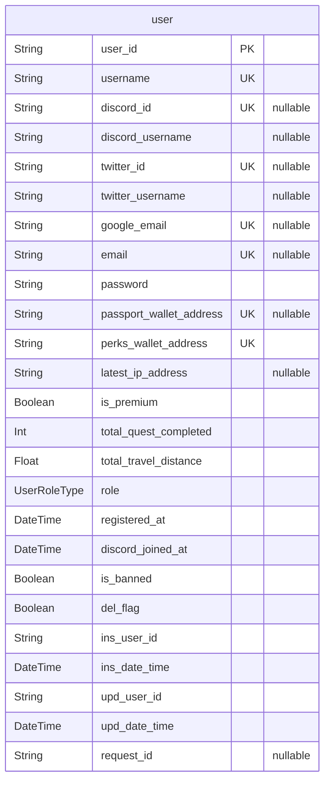

# Tourii Database
> Generated by [`prisma-markdown`](https://github.com/samchon/prisma-markdown)

- [Users](#users)
- [default](#default)

## Users

### `user`
-----------------------------------------------------------
USERS & AUTHENTICATION
-----------------------------------------------------------
User entity.

Represents a registered user of the Tourii application with all their
authentication information, platform connections, wallet addresses, and
user-specific settings. Users can authenticate through various methods
including Discord, Twitter, and Google.

Users can have multiple achievements, onchain items, and can participate in
various activities tracked through logs. Premium status and role types
define access levels and privileges in the system.

**Properties**
  - `user_id`: User ID with format TSUYYYYMM-rand1-DDHHMI-rand2-obfCounter
  - `username`: Tourii System Username
  - `discord_id`
    > Discord System User Id
    > 
    > Unique identifier from Discord authentication
  - `discord_username`: Discord User Name
  - `twitter_id`
    > Twitter System User Id
    > 
    > Unique identifier from Twitter authentication
  - `twitter_username`: Twitter User Name
  - `google_email`
    > Google System User Id
    > 
    > User's email address from Google authentication
  - `email`: User Email
  - `password`
    > User Password
    > 
    > Hashed password for native authentication
  - `passport_wallet_address`
    > Digital passport Wallet Address
    > 
    > Blockchain wallet address for digital passport
  - `perks_wallet_address`
    > Travel perk NFT Wallet Address
    > 
    > Blockchain wallet address for travel perks
  - `latest_ip_address`: User's latest IP address
  - `is_premium`
    > User is premium or not
    > 
    > Indicates whether user has premium subscription
  - `total_quest_completed`: Total number of quests completed by user
  - `total_travel_distance`: Total travel distance recorded by user
  - `role`: User role in the system
  - `registered_at`: Initial registration timestamp
  - `discord_joined_at`: When user joined Discord
  - `is_banned`: Indicates if user is banned from the platform
  - `del_flag`: Soft delete flag
  - `ins_user_id`: ID of user who created this record
  - `ins_date_time`: Timestamp of record creation
  - `upd_user_id`: ID of user who last updated this record
  - `upd_date_time`: Timestamp of last record update
  - `request_id`: Request ID for tracing

## default

```mermaid
erDiagram
"id_sequence" {
  String key PK
  String ts_prefix
  Int counter
}
"user_achievement" {
  String user_achievement_id PK
  String user_id FK
  String achievement_name
  String description
  String icon_url "nullable"
  String achievement_type "nullable"
  Int magatama_point_awarded
  Boolean del_flag
  String ins_user_id
  DateTime ins_date_time
  String upd_user_id
  DateTime upd_date_time
  String request_id "nullable"
}
"user_info" {
  String user_info_id PK
  String user_id FK
  String digital_passport_address UK
  String log_nft_address
  PassportType user_digital_passport_type "nullable"
  String level "nullable"
  Float discount_rate "nullable"
  Int magatama_points
  Int magatama_bags "nullable"
  Int total_quest_completed
  Float total_travel_distance
  Boolean is_premium
  Int prayer_bead "nullable"
  Int sword "nullable"
  Int orge_mask "nullable"
  Boolean del_flag
  String ins_user_id
  DateTime ins_date_time
  String upd_user_id
  DateTime upd_date_time
  String request_id "nullable"
}
"user_onchain_item" {
  String user_onchain_item_id PK
  String user_id FK "nullable"
  OnchainItemType item_type
  String item_txn_hash UK
  BlockchainType blockchain_type
  DateTime minted_at "nullable"
  String onchain_item_id UK "nullable"
  OnchainItemStatus status
  Boolean del_flag
  String ins_user_id
  DateTime ins_date_time
  String upd_user_id
  DateTime upd_date_time
  String request_id "nullable"
}
"user_item_claim_log" {
  String user_item_claim_log_id PK
  String user_id FK
  String onchain_item_id "nullable"
  String offchain_item_name "nullable"
  Int item_amount
  String item_details "nullable"
  ItemType type
  DateTime claimed_at "nullable"
  ItemStatus status
  String error_msg "nullable"
  Boolean del_flag
  String ins_user_id
  DateTime ins_date_time
  String upd_user_id
  DateTime upd_date_time
  String request_id "nullable"
}
"invite_log" {
  Int id PK
  String user_id FK
  String invitee_discord_id "nullable"
  String invitee_user_id "nullable"
  Int magatama_point_awarded
  Boolean del_flag
  String ins_user_id
  DateTime ins_date_time
  String upd_user_id
  DateTime upd_date_time
  String request_id "nullable"
}
"discord_activity_log" {
  String discord_activity_log_id PK
  String user_id FK
  String activity_type
  Int magatama_point_awarded
  String activity_details "nullable"
  Boolean del_flag
  String ins_user_id
  DateTime ins_date_time
  String upd_user_id
  DateTime upd_date_time
  String request_id "nullable"
}
"discord_rewarded_roles" {
  String discord_rewarded_roles_id PK
  String user_id FK
  BigInt role_id
  Int magatama_point_awarded
  Boolean del_flag
  String ins_user_id
  DateTime ins_date_time
  String upd_user_id
  DateTime upd_date_time
  String request_id "nullable"
}
"discord_user_roles" {
  String discord_user_roles_id PK
  String user_id FK
  BigInt role_id FK
  Boolean del_flag
  String ins_user_id
  DateTime ins_date_time
  String upd_user_id
  DateTime upd_date_time
  String request_id "nullable"
}
"discord_roles" {
  BigInt role_id PK
  String name UK
  Boolean del_flag
  String ins_user_id
  DateTime ins_date_time
  String upd_user_id
  DateTime upd_date_time
  String request_id "nullable"
}
"onchain_item_catalog" {
  String onchain_item_id PK
  OnchainItemType item_type
  String nft_name
  String nft_description
  String image_url
  String contract_address
  String token_id "nullable"
  String metadata_url "nullable"
  Json attributes
  DateTime release_date "nullable"
  DateTime expiry_date "nullable"
  Int max_supply "nullable"
  Boolean del_flag
  String ins_user_id
  DateTime ins_date_time
  String upd_user_id
  DateTime upd_date_time
  String request_id "nullable"
}
"level_requirement_master" {
  LevelType level PK
  String discord_role_id "nullable"
  Int min_get_magatama_points
  Int max_get_magatama_points
  Int total_onchain_item
  Int prayer_bead
  Int sword
  Int orge_mask
  Boolean del_flag
  String ins_user_id
  DateTime ins_date_time "nullable"
  String upd_user_id
  DateTime upd_date_time "nullable"
  String request_id "nullable"
}
"kendama_random_range" {
  KendamaSeason season PK
  Decimal landed
  Decimal missed
  Decimal win_rate
  Boolean del_flag
  String ins_user_id
  DateTime ins_date_time
  String upd_user_id
  DateTime upd_date_time
  String request_id "nullable"
}
"discord_user_roles" }o--|| "discord_roles" : discord_roles
```

### `id_sequence`

**Properties**
  - `key`: 
  - `ts_prefix`: 
  - `counter`: 

### `user_achievement`

**Properties**
  - `user_achievement_id`: 
  - `user_id`: 
  - `achievement_name`: 
  - `description`: 
  - `icon_url`: 
  - `achievement_type`: 
  - `magatama_point_awarded`: 
  - `del_flag`: 
  - `ins_user_id`: 
  - `ins_date_time`: 
  - `upd_user_id`: 
  - `upd_date_time`: 
  - `request_id`: 

### `user_info`

**Properties**
  - `user_info_id`: 
  - `user_id`: 
  - `digital_passport_address`: 
  - `log_nft_address`: 
  - `user_digital_passport_type`: 
  - `level`: 
  - `discount_rate`: 
  - `magatama_points`: 
  - `magatama_bags`: 
  - `total_quest_completed`: 
  - `total_travel_distance`: 
  - `is_premium`: 
  - `prayer_bead`: 
  - `sword`: 
  - `orge_mask`: 
  - `del_flag`: 
  - `ins_user_id`: 
  - `ins_date_time`: 
  - `upd_user_id`: 
  - `upd_date_time`: 
  - `request_id`: 

### `user_onchain_item`

**Properties**
  - `user_onchain_item_id`: 
  - `user_id`: 
  - `item_type`: 
  - `item_txn_hash`: 
  - `blockchain_type`: 
  - `minted_at`: 
  - `onchain_item_id`: 
  - `status`: 
  - `del_flag`: 
  - `ins_user_id`: 
  - `ins_date_time`: 
  - `upd_user_id`: 
  - `upd_date_time`: 
  - `request_id`: 

### `user_item_claim_log`

**Properties**
  - `user_item_claim_log_id`: 
  - `user_id`: 
  - `onchain_item_id`: 
  - `offchain_item_name`: 
  - `item_amount`: 
  - `item_details`: 
  - `type`: 
  - `claimed_at`: 
  - `status`: 
  - `error_msg`: 
  - `del_flag`: 
  - `ins_user_id`: 
  - `ins_date_time`: 
  - `upd_user_id`: 
  - `upd_date_time`: 
  - `request_id`: 

### `invite_log`

**Properties**
  - `id`: 
  - `user_id`: 
  - `invitee_discord_id`: 
  - `invitee_user_id`: 
  - `magatama_point_awarded`: 
  - `del_flag`: 
  - `ins_user_id`: 
  - `ins_date_time`: 
  - `upd_user_id`: 
  - `upd_date_time`: 
  - `request_id`: 

### `discord_activity_log`

**Properties**
  - `discord_activity_log_id`: 
  - `user_id`: 
  - `activity_type`: 
  - `magatama_point_awarded`: 
  - `activity_details`: 
  - `del_flag`: 
  - `ins_user_id`: 
  - `ins_date_time`: 
  - `upd_user_id`: 
  - `upd_date_time`: 
  - `request_id`: 

### `discord_rewarded_roles`

**Properties**
  - `discord_rewarded_roles_id`: 
  - `user_id`: 
  - `role_id`: 
  - `magatama_point_awarded`: 
  - `del_flag`: 
  - `ins_user_id`: 
  - `ins_date_time`: 
  - `upd_user_id`: 
  - `upd_date_time`: 
  - `request_id`: 

### `discord_user_roles`

**Properties**
  - `discord_user_roles_id`: 
  - `user_id`: 
  - `role_id`: 
  - `del_flag`: 
  - `ins_user_id`: 
  - `ins_date_time`: 
  - `upd_user_id`: 
  - `upd_date_time`: 
  - `request_id`: 

### `discord_roles`

**Properties**
  - `role_id`: 
  - `name`: 
  - `del_flag`: 
  - `ins_user_id`: 
  - `ins_date_time`: 
  - `upd_user_id`: 
  - `upd_date_time`: 
  - `request_id`: 

### `onchain_item_catalog`

**Properties**
  - `onchain_item_id`: 
  - `item_type`: 
  - `nft_name`: 
  - `nft_description`: 
  - `image_url`: 
  - `contract_address`: 
  - `token_id`: 
  - `metadata_url`: 
  - `attributes`: 
  - `release_date`: 
  - `expiry_date`: 
  - `max_supply`: 
  - `del_flag`: 
  - `ins_user_id`: 
  - `ins_date_time`: 
  - `upd_user_id`: 
  - `upd_date_time`: 
  - `request_id`: 

### `level_requirement_master`

**Properties**
  - `level`: 
  - `discord_role_id`: 
  - `min_get_magatama_points`: 
  - `max_get_magatama_points`: 
  - `total_onchain_item`: 
  - `prayer_bead`: 
  - `sword`: 
  - `orge_mask`: 
  - `del_flag`: 
  - `ins_user_id`: 
  - `ins_date_time`: 
  - `upd_user_id`: 
  - `upd_date_time`: 
  - `request_id`: 

### `kendama_random_range`

**Properties**
  - `season`: 
  - `landed`: 
  - `missed`: 
  - `win_rate`: 
  - `del_flag`: 
  - `ins_user_id`: 
  - `ins_date_time`: 
  - `upd_user_id`: 
  - `upd_date_time`: 
  - `request_id`: 