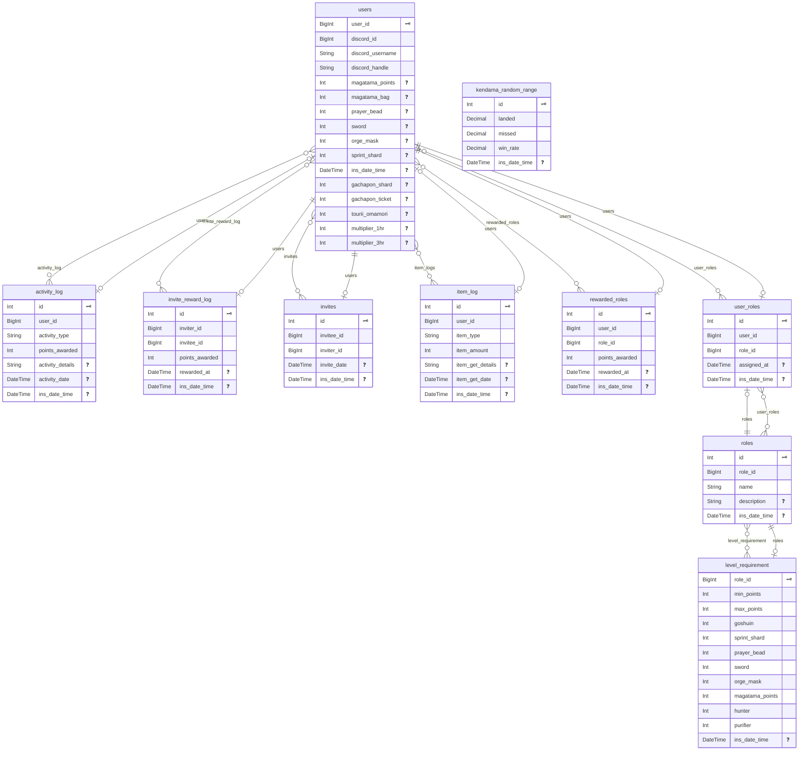

```mermaid
erDiagram

  "users" {
    BigInt user_id "🗝️"
    BigInt discord_id 
    String discord_username 
    String discord_handle 
    Int magatama_points "❓"
    Int magatama_bag "❓"
    Int prayer_bead "❓"
    Int sword "❓"
    Int orge_mask "❓"
    Int sprint_shard "❓"
    DateTime ins_date_time "❓"
    Int gachapon_shard "❓"
    Int gachapon_ticket "❓"
    Int tourii_omamori "❓"
    Int multiplier_1hr "❓"
    Int multiplier_3hr "❓"
    }
  

  "activity_log" {
    Int id "🗝️"
    BigInt user_id 
    String activity_type 
    Int points_awarded 
    String activity_details "❓"
    DateTime activity_date "❓"
    DateTime ins_date_time "❓"
    }
  

  "invite_reward_log" {
    Int id "🗝️"
    BigInt inviter_id 
    BigInt invitee_id 
    Int points_awarded 
    DateTime rewarded_at "❓"
    DateTime ins_date_time "❓"
    }
  

  "invites" {
    Int id "🗝️"
    BigInt invitee_id 
    BigInt inviter_id 
    DateTime invite_date "❓"
    DateTime ins_date_time "❓"
    }
  

  "item_log" {
    Int id "🗝️"
    BigInt user_id 
    String item_type 
    Int item_amount 
    String item_get_details "❓"
    DateTime item_get_date "❓"
    DateTime ins_date_time "❓"
    }
  

  "kendama_random_range" {
    Int id "🗝️"
    Decimal landed 
    Decimal missed 
    Decimal win_rate 
    DateTime ins_date_time "❓"
    }
  

  "level_requirement" {
    BigInt role_id "🗝️"
    Int min_points 
    Int max_points 
    Int goshuin 
    Int sprint_shard 
    Int prayer_bead 
    Int sword 
    Int orge_mask 
    Int magatama_points 
    Int hunter 
    Int purifier 
    DateTime ins_date_time "❓"
    }
  

  "rewarded_roles" {
    Int id "🗝️"
    BigInt user_id 
    BigInt role_id 
    Int points_awarded 
    DateTime rewarded_at "❓"
    DateTime ins_date_time "❓"
    }
  

  "roles" {
    Int id "🗝️"
    BigInt role_id 
    String name 
    String description "❓"
    DateTime ins_date_time "❓"
    }
  

  "user_roles" {
    Int id "🗝️"
    BigInt user_id 
    BigInt role_id 
    DateTime assigned_at "❓"
    DateTime ins_date_time "❓"
    }
  
    "users" o{--}o "user_roles" : "user_roles"
    "users" o{--}o "rewarded_roles" : "rewarded_roles"
    "users" o{--}o "item_log" : "item_logs"
    "users" o{--}o "invites" : "invites"
    "users" o{--}o "invite_reward_log" : "invite_reward_log"
    "users" o{--}o "activity_log" : "activity_log"
    "activity_log" o|--|o "users" : "users"
    "invite_reward_log" o|--|| "users" : "users"
    "invites" o|--|| "users" : "users"
    "item_log" o|--|o "users" : "users"
    "level_requirement" o|--|| "roles" : "roles"
    "rewarded_roles" o|--|| "users" : "users"
    "roles" o{--}o "user_roles" : "user_roles"
    "roles" o{--}o "level_requirement" : "level_requirement"
    "user_roles" o|--|| "roles" : "roles"
    "user_roles" o|--|| "users" : "users"
```
