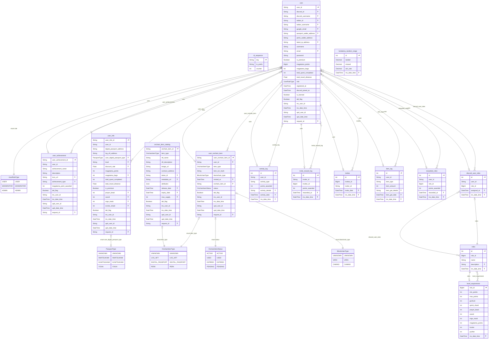

```mermaid
erDiagram

        UserRoleType {
            USER USER
MODERATOR MODERATOR
ADMIN ADMIN
        }
    


        PassportType {
            UNKNOWN UNKNOWN
AMATSUKAMI AMATSUKAMI
KUNITSUKAMI KUNITSUKAMI
YOKAI YOKAI
        }
    


        OnchainItemType {
            UNKNOWN UNKNOWN
LOG_NFT LOG_NFT
DIGITAL_PASSPORT DIGITAL_PASSPORT
PERK PERK
        }
    


        OnchainItemStatus {
            ACTIVE ACTIVE
USED USED
EXPIRED EXPIRED
PENDING PENDING
        }
    


        BlockchainType {
            UNKNOWN UNKNOWN
VARA VARA
CAMINO CAMINO
        }
    
  "id_sequence" {
    String key "🗝️"
    String ts_prefix 
    Int counter 
    }
  

  "user" {
    String user_id "🗝️"
    String discord_id "❓"
    String discord_username "❓"
    String twitter_id "❓"
    String twitter_username "❓"
    String google_email "❓"
    String passport_wallet_address "❓"
    String perks_wallet_address 
    String latest_ip_address "❓"
    String username 
    String email "❓"
    String password 
    Boolean is_premium 
    BigInt magatama_points 
    Int magatama_bags 
    Int total_quest_completed 
    Float total_travel_distance 
    UserRoleType role 
    DateTime registered_at 
    DateTime discord_joined_at 
    Boolean is_banned 
    Boolean del_flag 
    String ins_user_id 
    DateTime ins_date_time 
    String upd_user_id 
    DateTime upd_date_time 
    String request_id "❓"
    }
  

  "user_achievement" {
    String user_achievement_id "🗝️"
    String user_id 
    String achievement_name 
    String description 
    String icon_url "❓"
    String achievement_type "❓"
    Int magatama_point_awarded 
    Boolean del_flag 
    String ins_user_id 
    DateTime ins_date_time 
    String upd_user_id 
    DateTime upd_date_time 
    String request_id "❓"
    }
  

  "user_info" {
    String user_info_id "🗝️"
    String user_id 
    String digital_passport_address 
    String log_nft_address 
    PassportType user_digital_passport_type "❓"
    String level "❓"
    Float discount_rate "❓"
    Int magatama_points 
    Int magatama_bags "❓"
    Int total_quest_completed 
    Float total_travel_distance 
    Boolean is_premium 
    Int prayer_bead "❓"
    Int sword "❓"
    Int orge_mask "❓"
    Int evolve_shard "❓"
    Boolean del_flag 
    String ins_user_id 
    DateTime ins_date_time 
    String upd_user_id 
    DateTime upd_date_time 
    String request_id "❓"
    }
  

  "user_onchain_item" {
    String user_onchain_item_id "🗝️"
    String user_id "❓"
    OnchainItemType item_type 
    String item_txn_hash 
    BlockchainType blockchain_type 
    DateTime minted_at "❓"
    String onchain_item_id "❓"
    OnchainItemStatus status 
    Boolean del_flag 
    String ins_user_id 
    DateTime ins_date_time 
    String upd_user_id 
    DateTime upd_date_time 
    String request_id "❓"
    }
  

  "onchain_item_catalog" {
    String onchain_item_id "🗝️"
    OnchainItemType item_type 
    String nft_name 
    String nft_description 
    String image_url 
    String contract_address 
    String token_id "❓"
    String metadata_url "❓"
    Json attributes 
    DateTime release_date "❓"
    DateTime expiry_date "❓"
    Int max_supply "❓"
    Boolean del_flag 
    String ins_user_id 
    DateTime ins_date_time 
    String upd_user_id 
    DateTime upd_date_time 
    String request_id "❓"
    }
  

  "activity_log" {
    Int id "🗝️"
    String user_id 
    String activity_type 
    Int points_awarded 
    String activity_details "❓"
    DateTime activity_date "❓"
    DateTime ins_date_time "❓"
    }
  

  "invite_reward_log" {
    Int id "🗝️"
    String inviter_id 
    BigInt invitee_id 
    Int points_awarded 
    DateTime rewarded_at "❓"
    DateTime ins_date_time "❓"
    }
  

  "invites" {
    Int id "🗝️"
    BigInt invitee_id 
    String inviter_id 
    DateTime invite_date "❓"
    DateTime ins_date_time "❓"
    }
  

  "item_log" {
    Int id "🗝️"
    String user_id 
    String item_type 
    Int item_amount 
    String item_get_details "❓"
    DateTime item_get_date "❓"
    DateTime ins_date_time "❓"
    }
  

  "kendama_random_range" {
    Int id "🗝️"
    Decimal landed 
    Decimal missed 
    Decimal win_rate 
    DateTime ins_date_time "❓"
    }
  

  "level_requirement" {
    BigInt role_id "🗝️"
    Int min_points 
    Int max_points 
    Int goshuin 
    Int sprint_shard 
    Int prayer_bead 
    Int sword 
    Int orge_mask 
    Int magatama_points 
    Int hunter 
    Int purifier 
    DateTime ins_date_time "❓"
    }
  

  "rewarded_roles" {
    Int id "🗝️"
    String user_id 
    BigInt role_id 
    Int points_awarded 
    DateTime rewarded_at "❓"
    DateTime ins_date_time "❓"
    }
  

  "roles" {
    Int id "🗝️"
    BigInt role_id 
    String name 
    String description "❓"
    DateTime ins_date_time "❓"
    }
  

  "discord_user_roles" {
    Int id "🗝️"
    String user_id 
    BigInt role_id 
    DateTime assigned_at "❓"
    DateTime ins_date_time "❓"
    }
  
    "user" o|--|| "UserRoleType" : "enum:role"
    "user" o{--}o "user_achievement" : "user_achievements"
    "user" o{--}o "user_info" : "user_info"
    "user" o{--}o "user_onchain_item" : "user_onchain_item"
    "user" o{--}o "discord_user_roles" : "discord_user_roles"
    "user" o{--}o "rewarded_roles" : "rewarded_roles"
    "user" o{--}o "item_log" : "item_logs"
    "user" o{--}o "invites" : "invites"
    "user" o{--}o "invite_reward_log" : "invite_reward_log"
    "user" o{--}o "activity_log" : "activity_log"
    "user_achievement" o|--|| "user" : "user"
    "user_info" o|--|o "PassportType" : "enum:user_digital_passport_type"
    "user_info" o|--|| "user" : "user"
    "user_onchain_item" o|--|| "OnchainItemType" : "enum:item_type"
    "user_onchain_item" o|--|| "BlockchainType" : "enum:blockchain_type"
    "user_onchain_item" o|--|| "OnchainItemStatus" : "enum:status"
    "user_onchain_item" o|--|o "user" : "user"
    "onchain_item_catalog" o|--|| "OnchainItemType" : "enum:item_type"
    "activity_log" o|--|o "user" : "user"
    "invite_reward_log" o|--|| "user" : "user"
    "invites" o|--|| "user" : "user"
    "item_log" o|--|o "user" : "user"
    "level_requirement" o|--|| "roles" : "roles"
    "rewarded_roles" o|--|| "user" : "user"
    "roles" o{--}o "discord_user_roles" : "discord_user_roles"
    "roles" o{--}o "level_requirement" : "level_requirement"
    "discord_user_roles" o|--|| "roles" : "roles"
    "discord_user_roles" o|--|| "user" : "user"
```
