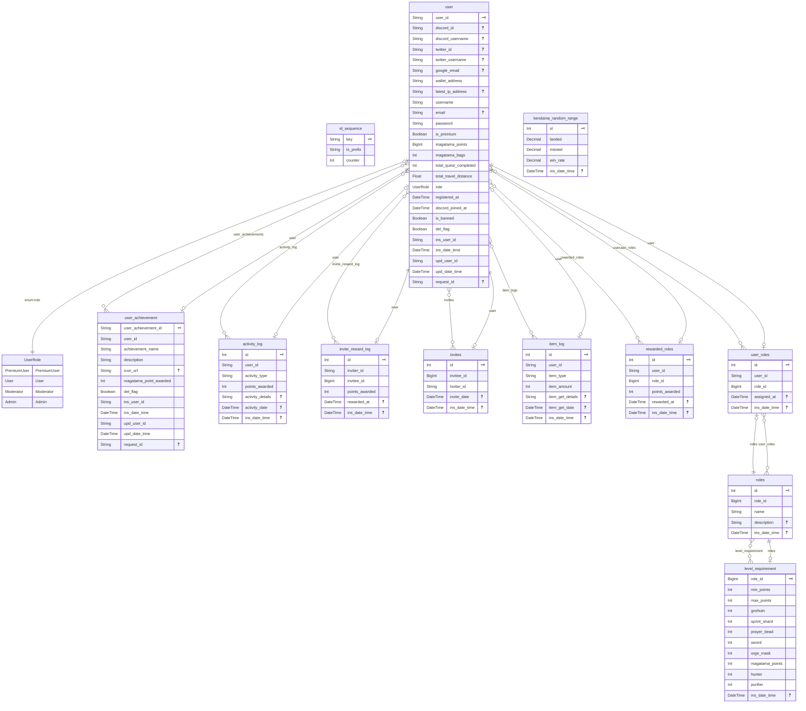

```mermaid
erDiagram

        UserRole {
            PremiumUser PremiumUser
User User
Moderator Moderator
Admin Admin
        }
    
  "id_sequence" {
    String key "🗝️"
    String ts_prefix 
    Int counter 
    }
  

  "user" {
    String user_id "🗝️"
    String discord_id "❓"
    String discord_username "❓"
    String twitter_id "❓"
    String twitter_username "❓"
    String google_email "❓"
    String wallet_address 
    String latest_ip_address "❓"
    String username 
    String email "❓"
    String password 
    Boolean is_premium 
    BigInt magatama_points 
    Int magatama_bags 
    Int total_quest_completed 
    Float total_travel_distance 
    UserRole role 
    DateTime registered_at 
    DateTime discord_joined_at 
    Boolean is_banned 
    Boolean del_flag 
    String ins_user_id 
    DateTime ins_date_time 
    String upd_user_id 
    DateTime upd_date_time 
    String request_id "❓"
    }
  

  "user_achievement" {
    String user_achievement_id "🗝️"
    String user_id 
    String achievement_name 
    String description 
    String icon_url "❓"
    Int magatama_point_awarded 
    Boolean del_flag 
    String ins_user_id 
    DateTime ins_date_time 
    String upd_user_id 
    DateTime upd_date_time 
    String request_id "❓"
    }
  

  "activity_log" {
    Int id "🗝️"
    String user_id 
    String activity_type 
    Int points_awarded 
    String activity_details "❓"
    DateTime activity_date "❓"
    DateTime ins_date_time "❓"
    }
  

  "invite_reward_log" {
    Int id "🗝️"
    String inviter_id 
    BigInt invitee_id 
    Int points_awarded 
    DateTime rewarded_at "❓"
    DateTime ins_date_time "❓"
    }
  

  "invites" {
    Int id "🗝️"
    BigInt invitee_id 
    String inviter_id 
    DateTime invite_date "❓"
    DateTime ins_date_time "❓"
    }
  

  "item_log" {
    Int id "🗝️"
    String user_id 
    String item_type 
    Int item_amount 
    String item_get_details "❓"
    DateTime item_get_date "❓"
    DateTime ins_date_time "❓"
    }
  

  "kendama_random_range" {
    Int id "🗝️"
    Decimal landed 
    Decimal missed 
    Decimal win_rate 
    DateTime ins_date_time "❓"
    }
  

  "level_requirement" {
    BigInt role_id "🗝️"
    Int min_points 
    Int max_points 
    Int goshuin 
    Int sprint_shard 
    Int prayer_bead 
    Int sword 
    Int orge_mask 
    Int magatama_points 
    Int hunter 
    Int purifier 
    DateTime ins_date_time "❓"
    }
  

  "rewarded_roles" {
    Int id "🗝️"
    String user_id 
    BigInt role_id 
    Int points_awarded 
    DateTime rewarded_at "❓"
    DateTime ins_date_time "❓"
    }
  

  "roles" {
    Int id "🗝️"
    BigInt role_id 
    String name 
    String description "❓"
    DateTime ins_date_time "❓"
    }
  

  "user_roles" {
    Int id "🗝️"
    String user_id 
    BigInt role_id 
    DateTime assigned_at "❓"
    DateTime ins_date_time "❓"
    }
  
    "user" o|--|| "UserRole" : "enum:role"
    "user" o{--}o "user_achievement" : "user_achievements"
    "user" o{--}o "user_roles" : "user_roles"
    "user" o{--}o "rewarded_roles" : "rewarded_roles"
    "user" o{--}o "item_log" : "item_logs"
    "user" o{--}o "invites" : "invites"
    "user" o{--}o "invite_reward_log" : "invite_reward_log"
    "user" o{--}o "activity_log" : "activity_log"
    "user_achievement" o|--|| "user" : "user"
    "activity_log" o|--|o "user" : "user"
    "invite_reward_log" o|--|| "user" : "user"
    "invites" o|--|| "user" : "user"
    "item_log" o|--|o "user" : "user"
    "level_requirement" o|--|| "roles" : "roles"
    "rewarded_roles" o|--|| "user" : "user"
    "roles" o{--}o "user_roles" : "user_roles"
    "roles" o{--}o "level_requirement" : "level_requirement"
    "user_roles" o|--|| "roles" : "roles"
    "user_roles" o|--|| "user" : "user"
```
