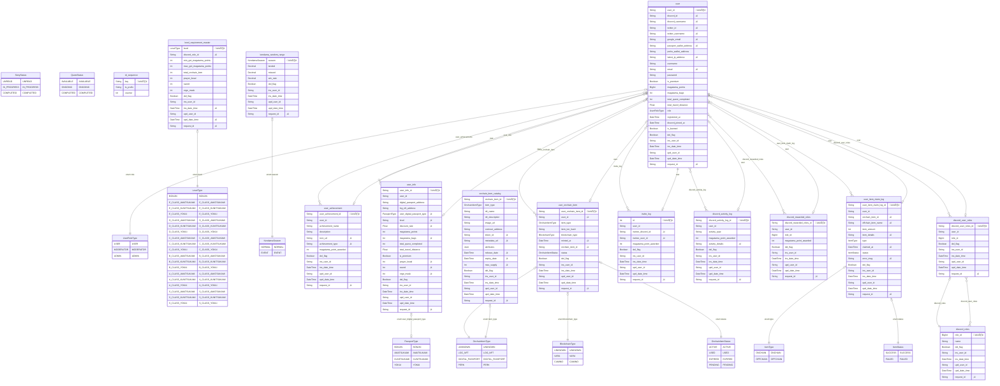

```mermaid
erDiagram

        UserRoleType {
            USER USER
MODERATOR MODERATOR
ADMIN ADMIN
        }
    


        PassportType {
            BONJIN BONJIN
AMATSUKAMI AMATSUKAMI
KUNITSUKAMI KUNITSUKAMI
YOKAI YOKAI
        }
    


        OnchainItemType {
            UNKNOWN UNKNOWN
LOG_NFT LOG_NFT
DIGITAL_PASSPORT DIGITAL_PASSPORT
PERK PERK
        }
    


        OnchainItemStatus {
            ACTIVE ACTIVE
USED USED
EXPIRED EXPIRED
PENDING PENDING
        }
    


        BlockchainType {
            UNKNOWN UNKNOWN
VARA VARA
CAMINO CAMINO
        }
    


        LevelType {
            BONJIN BONJIN
E_CLASS_AMATSUKAMI E_CLASS_AMATSUKAMI
E_CLASS_KUNITSUKAMI E_CLASS_KUNITSUKAMI
E_CLASS_YOKAI E_CLASS_YOKAI
D_CLASS_AMATSUKAMI D_CLASS_AMATSUKAMI
D_CLASS_KUNITSUKAMI D_CLASS_KUNITSUKAMI
D_CLASS_YOKAI D_CLASS_YOKAI
C_CLASS_AMATSUKAMI C_CLASS_AMATSUKAMI
C_CLASS_KUNITSUKAMI C_CLASS_KUNITSUKAMI
C_CLASS_YOKAI C_CLASS_YOKAI
B_CLASS_AMATSUKAMI B_CLASS_AMATSUKAMI
B_CLASS_KUNITSUKAMI B_CLASS_KUNITSUKAMI
B_CLASS_YOKAI B_CLASS_YOKAI
A_CLASS_AMATSUKAMI A_CLASS_AMATSUKAMI
A_CLASS_KUNITSUKAMI A_CLASS_KUNITSUKAMI
A_CLASS_YOKAI A_CLASS_YOKAI
S_CLASS_AMATSUKAMI S_CLASS_AMATSUKAMI
S_CLASS_KUNITSUKAMI S_CLASS_KUNITSUKAMI
S_CLASS_YOKAI S_CLASS_YOKAI
        }
    


        StoryStatus {
            UNREAD UNREAD
IN_PROGRESS IN_PROGRESS
COMPLETED COMPLETED
        }
    


        QuestStatus {
            AVAILABLE AVAILABLE
ONGOING ONGOING
COMPLETED COMPLETED
        }
    


        ItemStatus {
            SUCCESS SUCCESS
FAILED FAILED
        }
    


        ItemType {
            ONCHAIN ONCHAIN
OFFCHAIN OFFCHAIN
        }
    


        KendamaSeason {
            NORMAL NORMAL
EVENT EVENT
        }
    
  "id_sequence" {
    String key "🗝️"
    String ts_prefix 
    Int counter 
    }
  

  "user" {
    String user_id "🗝️"
    String discord_id "‚ùì"
    String discord_username "‚ùì"
    String twitter_id "‚ùì"
    String twitter_username "‚ùì"
    String google_email "‚ùì"
    String passport_wallet_address "‚ùì"
    String perks_wallet_address 
    String latest_ip_address "‚ùì"
    String username 
    String email "‚ùì"
    String password 
    Boolean is_premium 
    BigInt magatama_points 
    Int magatama_bags 
    Int total_quest_completed 
    Float total_travel_distance 
    UserRoleType role 
    DateTime registered_at 
    DateTime discord_joined_at 
    Boolean is_banned 
    Boolean del_flag 
    String ins_user_id 
    DateTime ins_date_time 
    String upd_user_id 
    DateTime upd_date_time 
    String request_id "‚ùì"
    }
  

  "user_achievement" {
    String user_achievement_id "🗝️"
    String user_id 
    String achievement_name 
    String description 
    String icon_url "‚ùì"
    String achievement_type "‚ùì"
    Int magatama_point_awarded 
    Boolean del_flag 
    String ins_user_id 
    DateTime ins_date_time 
    String upd_user_id 
    DateTime upd_date_time 
    String request_id "‚ùì"
    }
  

  "user_info" {
    String user_info_id "🗝️"
    String user_id 
    String digital_passport_address 
    String log_nft_address 
    PassportType user_digital_passport_type "‚ùì"
    String level "‚ùì"
    Float discount_rate "‚ùì"
    Int magatama_points 
    Int magatama_bags "‚ùì"
    Int total_quest_completed 
    Float total_travel_distance 
    Boolean is_premium 
    Int prayer_bead "‚ùì"
    Int sword "‚ùì"
    Int orge_mask "‚ùì"
    Boolean del_flag 
    String ins_user_id 
    DateTime ins_date_time 
    String upd_user_id 
    DateTime upd_date_time 
    String request_id "‚ùì"
    }
  

  "user_onchain_item" {
    String user_onchain_item_id "🗝️"
    String user_id "‚ùì"
    OnchainItemType item_type 
    String item_txn_hash 
    BlockchainType blockchain_type 
    DateTime minted_at "‚ùì"
    String onchain_item_id "‚ùì"
    OnchainItemStatus status 
    Boolean del_flag 
    String ins_user_id 
    DateTime ins_date_time 
    String upd_user_id 
    DateTime upd_date_time 
    String request_id "‚ùì"
    }
  

  "user_item_claim_log" {
    String user_item_claim_log_id "🗝️"
    String user_id 
    String onchain_item_id "‚ùì"
    String offchain_item_name "‚ùì"
    Int item_amount 
    String item_details "‚ùì"
    ItemType type 
    DateTime claimed_at "‚ùì"
    ItemStatus status 
    String error_msg "‚ùì"
    Boolean del_flag 
    String ins_user_id 
    DateTime ins_date_time 
    String upd_user_id 
    DateTime upd_date_time 
    String request_id "‚ùì"
    }
  

  "invite_log" {
    Int id "🗝️"
    String user_id 
    String invitee_discord_id "‚ùì"
    String invitee_user_id "‚ùì"
    Int magatama_point_awarded 
    Boolean del_flag 
    String ins_user_id 
    DateTime ins_date_time 
    String upd_user_id 
    DateTime upd_date_time 
    String request_id "‚ùì"
    }
  

  "discord_activity_log" {
    String discord_activity_log_id "🗝️"
    String user_id 
    String activity_type 
    Int magatama_point_awarded 
    String activity_details "‚ùì"
    Boolean del_flag 
    String ins_user_id 
    DateTime ins_date_time 
    String upd_user_id 
    DateTime upd_date_time 
    String request_id "‚ùì"
    }
  

  "discord_rewarded_roles" {
    String discord_rewarded_roles_id "🗝️"
    String user_id 
    BigInt role_id 
    Int magatama_point_awarded 
    Boolean del_flag 
    String ins_user_id 
    DateTime ins_date_time 
    String upd_user_id 
    DateTime upd_date_time 
    String request_id "‚ùì"
    }
  

  "discord_user_roles" {
    String discord_user_roles_id "🗝️"
    String user_id 
    BigInt role_id 
    Boolean del_flag 
    String ins_user_id 
    DateTime ins_date_time 
    String upd_user_id 
    DateTime upd_date_time 
    String request_id "‚ùì"
    }
  

  "discord_roles" {
    BigInt role_id "🗝️"
    String name 
    Boolean del_flag 
    String ins_user_id 
    DateTime ins_date_time 
    String upd_user_id 
    DateTime upd_date_time 
    String request_id "‚ùì"
    }
  

  "onchain_item_catalog" {
    String onchain_item_id "🗝️"
    OnchainItemType item_type 
    String nft_name 
    String nft_description 
    String image_url 
    String contract_address 
    String token_id "‚ùì"
    String metadata_url "‚ùì"
    Json attributes 
    DateTime release_date "‚ùì"
    DateTime expiry_date "‚ùì"
    Int max_supply "‚ùì"
    Boolean del_flag 
    String ins_user_id 
    DateTime ins_date_time 
    String upd_user_id 
    DateTime upd_date_time 
    String request_id "‚ùì"
    }
  

  "level_requirement_master" {
    LevelType level "🗝️"
    String discord_role_id "‚ùì"
    Int min_get_magatama_points 
    Int max_get_magatama_points 
    Int total_onchain_item 
    Int prayer_bead 
    Int sword 
    Int orge_mask 
    Boolean del_flag 
    String ins_user_id 
    DateTime ins_date_time "‚ùì"
    String upd_user_id 
    DateTime upd_date_time "‚ùì"
    String request_id "‚ùì"
    }
  

  "kendama_random_range" {
    KendamaSeason season "🗝️"
    Decimal landed 
    Decimal missed 
    Decimal win_rate 
    Boolean del_flag 
    String ins_user_id 
    DateTime ins_date_time 
    String upd_user_id 
    DateTime upd_date_time 
    String request_id "‚ùì"
    }
  
    "user" o|--|| "UserRoleType" : "enum:role"
    "user" o{--}o "user_achievement" : "user_achievements"
    "user" o{--}o "user_info" : "user_info"
    "user" o{--}o "user_onchain_item" : "user_onchain_item"
    "user" o{--}o "user_item_claim_log" : "user_item_claim_log"
    "user" o{--}o "discord_activity_log" : "discord_activity_log"
    "user" o{--}o "discord_user_roles" : "discord_user_roles"
    "user" o{--}o "discord_rewarded_roles" : "discord_rewarded_roles"
    "user" o{--}o "invite_log" : "invite_log"
    "user_achievement" o|--|| "user" : "user"
    "user_info" o|--|o "PassportType" : "enum:user_digital_passport_type"
    "user_info" o|--|| "user" : "user"
    "user_onchain_item" o|--|| "OnchainItemType" : "enum:item_type"
    "user_onchain_item" o|--|| "BlockchainType" : "enum:blockchain_type"
    "user_onchain_item" o|--|| "OnchainItemStatus" : "enum:status"
    "user_onchain_item" o|--|o "user" : "user"
    "user_item_claim_log" o|--|| "ItemType" : "enum:type"
    "user_item_claim_log" o|--|| "ItemStatus" : "enum:status"
    "user_item_claim_log" o|--|| "user" : "user"
    "invite_log" o|--|| "user" : "user"
    "discord_activity_log" o|--|o "user" : "user"
    "discord_rewarded_roles" o|--|| "user" : "user"
    "discord_user_roles" o|--|| "discord_roles" : "discord_roles"
    "discord_user_roles" o|--|| "user" : "user"
    "discord_roles" o{--}o "discord_user_roles" : "discord_user_roles"
    "onchain_item_catalog" o|--|| "OnchainItemType" : "enum:item_type"
    "level_requirement_master" o|--|| "LevelType" : "enum:level"
    "kendama_random_range" o|--|| "KendamaSeason" : "enum:season"
```
