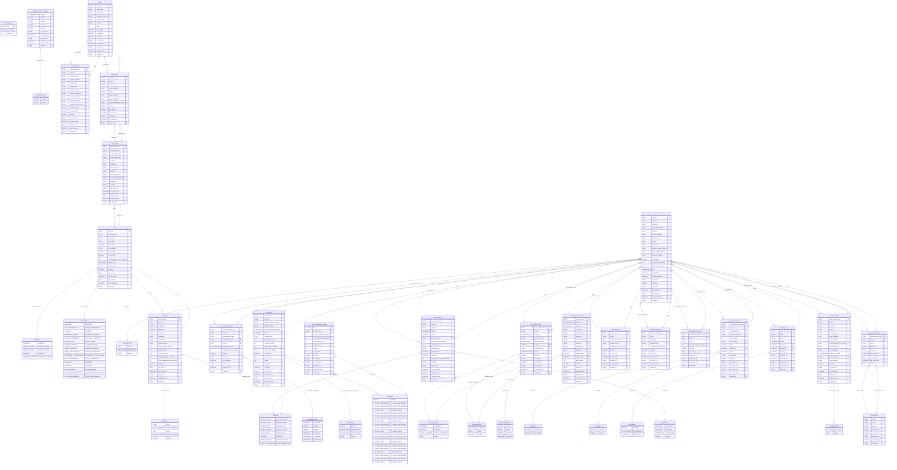

```mermaid
erDiagram

        StoryStatus {
            UNREAD UNREAD
IN_PROGRESS IN_PROGRESS
COMPLETED COMPLETED
        }
    


        PassportType {
            BONJIN BONJIN
AMATSUKAMI AMATSUKAMI
KUNITSUKAMI KUNITSUKAMI
YOKAI YOKAI
        }
    


        LevelType {
            BONJIN BONJIN
E_CLASS_AMATSUKAMI E_CLASS_AMATSUKAMI
E_CLASS_KUNITSUKAMI E_CLASS_KUNITSUKAMI
E_CLASS_YOKAI E_CLASS_YOKAI
D_CLASS_AMATSUKAMI D_CLASS_AMATSUKAMI
D_CLASS_KUNITSUKAMI D_CLASS_KUNITSUKAMI
D_CLASS_YOKAI D_CLASS_YOKAI
C_CLASS_AMATSUKAMI C_CLASS_AMATSUKAMI
C_CLASS_KUNITSUKAMI C_CLASS_KUNITSUKAMI
C_CLASS_YOKAI C_CLASS_YOKAI
B_CLASS_AMATSUKAMI B_CLASS_AMATSUKAMI
B_CLASS_KUNITSUKAMI B_CLASS_KUNITSUKAMI
B_CLASS_YOKAI B_CLASS_YOKAI
A_CLASS_AMATSUKAMI A_CLASS_AMATSUKAMI
A_CLASS_KUNITSUKAMI A_CLASS_KUNITSUKAMI
A_CLASS_YOKAI A_CLASS_YOKAI
S_CLASS_AMATSUKAMI S_CLASS_AMATSUKAMI
S_CLASS_KUNITSUKAMI S_CLASS_KUNITSUKAMI
S_CLASS_YOKAI S_CLASS_YOKAI
        }
    


        QuestStatus {
            AVAILABLE AVAILABLE
ONGOING ONGOING
COMPLETED COMPLETED
FAILED FAILED
        }
    


        ItemStatus {
            SUCCESS SUCCESS
FAILED FAILED
        }
    


        ItemType {
            ONCHAIN ONCHAIN
OFFCHAIN OFFCHAIN
        }
    


        QuestType {
            UNKNOWN UNKNOWN
TRAVEL_TO_EARN TRAVEL_TO_EARN
EARN_TO_TRAVEL EARN_TO_TRAVEL
CAMPAIGN CAMPAIGN
COMMUNITY_EVENT COMMUNITY_EVENT
        }
    


        RewardType {
            UNKNOWN UNKNOWN
LOCAL_EXPERIENCES LOCAL_EXPERIENCES
CULINARY CULINARY
ADVENTURE_NATURE ADVENTURE_NATURE
CULTURAL_COMMUNITY CULTURAL_COMMUNITY
HIDDEN_PERKS HIDDEN_PERKS
SURPRISE_TREATS SURPRISE_TREATS
BONUS_UPGRADES BONUS_UPGRADES
SOCIAL_RECOGNITION SOCIAL_RECOGNITION
RETURNING_VISITOR_BONUS RETURNING_VISITOR_BONUS
ELITE_EXPERIENCES ELITE_EXPERIENCES
WELLNESS WELLNESS
SHOPPING SHOPPING
ENTERTAINMENT ENTERTAINMENT
TRANSPORT_CONNECTIVITY TRANSPORT_CONNECTIVITY
LOCAL_PARTNERSHIPS LOCAL_PARTNERSHIPS
        }
    


        TaskTheme {
            STORY STORY
LOCAL_CULTURE LOCAL_CULTURE
FOOD FOOD
URBAN_EXPLORE URBAN_EXPLORE
NATURE NATURE
        }
    


        TaskType {
            VISIT_LOCATION VISIT_LOCATION
PHOTO_UPLOAD PHOTO_UPLOAD
ANSWER_TEXT ANSWER_TEXT
SELECT_OPTION SELECT_OPTION
SHARE_SOCIAL SHARE_SOCIAL
CHECK_IN CHECK_IN
GROUP_ACTIVITY GROUP_ACTIVITY
LOCAL_INTERACTION LOCAL_INTERACTION
        }
    


        CheckInMethod {
            QR_CODE QR_CODE
GPS GPS
        }
    


        AchievementType {
            UNKNOWN UNKNOWN
STORY STORY
TRAVEL TRAVEL
EXPLORE EXPLORE
COMMUNITY COMMUNITY
MILESTONE MILESTONE
        }
    


        OnchainItemType {
            UNKNOWN UNKNOWN
LOG_NFT LOG_NFT
DIGITAL_PASSPORT DIGITAL_PASSPORT
PERK PERK
        }
    


        OnchainItemStatus {
            ACTIVE ACTIVE
USED USED
EXPIRED EXPIRED
PENDING PENDING
        }
    


        BlockchainType {
            UNKNOWN UNKNOWN
VARA VARA
CAMINO CAMINO
        }
    


        UserRoleType {
            USER USER
MODERATOR MODERATOR
ADMIN ADMIN
        }
    


        KendamaSeason {
            NORMAL NORMAL
EVENT EVENT
        }
    
  "id_sequence" {
    String key "🗝️"
    String ts_prefix 
    Int counter 
    }
  

  "user" {
    String user_id "🗝️"
    String username 
    String discord_id "❓"
    String discord_username "❓"
    String twitter_id "❓"
    String twitter_username "❓"
    String google_email "❓"
    String email "❓"
    String password 
    String passport_wallet_address "❓"
    String perks_wallet_address 
    String latest_ip_address "❓"
    Boolean is_premium 
    Int total_quest_completed 
    Float total_travel_distance 
    UserRoleType role 
    DateTime registered_at 
    DateTime discord_joined_at 
    Boolean is_banned 
    Boolean del_flag 
    String ins_user_id 
    DateTime ins_date_time 
    String upd_user_id 
    DateTime upd_date_time 
    String request_id "❓"
    }
  

  "user_achievement" {
    String user_achievement_id "🗝️"
    String user_id 
    String achievement_name 
    String achievement_desc "❓"
    String icon_url "❓"
    AchievementType achievement_type 
    Int magatama_point_awarded 
    Boolean del_flag 
    String ins_user_id 
    DateTime ins_date_time 
    String upd_user_id 
    DateTime upd_date_time 
    String request_id "❓"
    }
  

  "user_info" {
    String user_info_id "🗝️"
    String user_id 
    String digital_passport_address 
    String log_nft_address 
    PassportType user_digital_passport_type "❓"
    LevelType level "❓"
    Float discount_rate "❓"
    Int magatama_points 
    Int magatama_bags "❓"
    Int total_quest_completed 
    Float total_travel_distance 
    Boolean is_premium 
    Int prayer_bead "❓"
    Int sword "❓"
    Int orge_mask "❓"
    Boolean del_flag 
    String ins_user_id 
    DateTime ins_date_time 
    String upd_user_id 
    DateTime upd_date_time 
    String request_id "❓"
    }
  

  "user_onchain_item" {
    String user_onchain_item_id "🗝️"
    String user_id "❓"
    OnchainItemType item_type 
    String item_txn_hash 
    BlockchainType blockchain_type 
    DateTime minted_at "❓"
    String onchain_item_id "❓"
    OnchainItemStatus status 
    Boolean del_flag 
    String ins_user_id 
    DateTime ins_date_time 
    String upd_user_id 
    DateTime upd_date_time 
    String request_id "❓"
    }
  

  "user_item_claim_log" {
    String user_item_claim_log_id "🗝️"
    String user_id 
    String onchain_item_id "❓"
    String offchain_item_name "❓"
    Int item_amount 
    String item_details "❓"
    ItemType type 
    DateTime claimed_at "❓"
    ItemStatus status 
    String error_msg "❓"
    Boolean del_flag 
    String ins_user_id 
    DateTime ins_date_time 
    String upd_user_id 
    DateTime upd_date_time 
    String request_id "❓"
    }
  

  "user_story_log" {
    String user_story_log_id "🗝️"
    String user_id 
    String story_id 
    StoryStatus status 
    DateTime unlocked_at "❓"
    DateTime finished_at "❓"
    Boolean del_flag 
    String ins_user_id 
    DateTime ins_date_time 
    String upd_user_id 
    DateTime upd_date_time 
    String request_id "❓"
    }
  

  "user_quest_log" {
    String user_quest_log_id "🗝️"
    String user_id 
    String quest_id 
    QuestStatus status 
    TaskType action 
    String user_response "❓"
    Json group_activity_members 
    Json submission_data "❓"
    String failed_reason "❓"
    DateTime completed_at "❓"
    DateTime claimed_at "❓"
    Int total_magatama_point_awarded 
    Boolean del_flag 
    String ins_user_id 
    DateTime ins_date_time 
    String upd_user_id 
    DateTime upd_date_time 
    String request_id "❓"
    }
  

  "user_travel_log" {
    String user_travel_log_id "🗝️"
    String user_id 
    String quest_id 
    String task_id 
    String tourist_spot_id 
    Float user_longitude 
    Float user_latitude 
    Float travel_distance_from_target "❓"
    Float travel_distance 
    String qr_code_value "❓"
    CheckInMethod check_in_method "❓"
    Boolean detected_fraud "❓"
    String fraud_reason "❓"
    Boolean del_flag 
    String ins_user_id 
    DateTime ins_date_time 
    String upd_user_id 
    DateTime upd_date_time 
    String request_id "❓"
    }
  

  "user_invite_log" {
    String invite_log_id "🗝️"
    String user_id 
    String invitee_discord_id "❓"
    String invitee_user_id "❓"
    Int magatama_point_awarded 
    Boolean del_flag 
    String ins_user_id 
    DateTime ins_date_time 
    String upd_user_id 
    DateTime upd_date_time 
    String request_id "❓"
    }
  

  "discord_activity_log" {
    String discord_activity_log_id "🗝️"
    String user_id 
    String activity_type 
    String activity_details "❓"
    Int magatama_point_awarded 
    Boolean del_flag 
    String ins_user_id 
    DateTime ins_date_time 
    String upd_user_id 
    DateTime upd_date_time 
    String request_id "❓"
    }
  

  "discord_rewarded_roles" {
    String discord_rewarded_roles_id "🗝️"
    String user_id 
    BigInt role_id 
    Int magatama_point_awarded 
    Boolean del_flag 
    String ins_user_id 
    DateTime ins_date_time 
    String upd_user_id 
    DateTime upd_date_time 
    String request_id "❓"
    }
  

  "discord_user_roles" {
    String discord_user_roles_id "🗝️"
    String user_id 
    BigInt role_id 
    Boolean del_flag 
    String ins_user_id 
    DateTime ins_date_time 
    String upd_user_id 
    DateTime upd_date_time 
    String request_id "❓"
    }
  

  "story" {
    String story_id "🗝️"
    String saga_name 
    String saga_desc 
    String background_media "❓"
    String map_image "❓"
    String location "❓"
    Int order 
    Boolean is_prologue 
    Boolean is_selected 
    Boolean del_flag 
    String ins_user_id 
    DateTime ins_date_time 
    String upd_user_id 
    DateTime upd_date_time 
    String request_id "❓"
    }
  

  "story_chapter" {
    String story_chapter_id "🗝️"
    String story_id 
    String tourist_spot_id 
    String chapter_number 
    String chapter_title 
    String chapter_desc 
    String chapter_image 
    String character_name_list 
    String real_world_image 
    String chapter_video_url 
    String chapter_video_mobile_url 
    String chapter_pdf_url 
    Boolean is_unlocked 
    Boolean del_flag 
    String ins_user_id 
    DateTime ins_date_time 
    String upd_user_id 
    DateTime upd_date_time 
    String request_id "❓"
    }
  

  "model_route" {
    String model_route_id "🗝️"
    String story_id 
    String route_name 
    Json recommendation 
    String region 
    Float region_latitude 
    Float region_longitude 
    String region_background_media "❓"
    Boolean del_flag 
    String ins_user_id 
    DateTime ins_date_time 
    String upd_user_id 
    DateTime upd_date_time 
    String request_id "❓"
    }
  

  "tourist_spot" {
    String tourist_spot_id "🗝️"
    String model_route_id 
    String tourist_spot_name 
    String tourist_spot_desc 
    Float latitude 
    Float longitude 
    String best_visit_time "❓"
    String address "❓"
    String story_chapter_link "❓"
    String tourist_spot_hashtag 
    Json image_set "❓"
    Boolean del_flag 
    String ins_user_id 
    DateTime ins_date_time 
    String upd_user_id 
    DateTime upd_date_time 
    String request_id "❓"
    }
  

  "quest" {
    String quest_id "🗝️"
    String tourist_spot_id 
    String quest_name 
    String quest_desc 
    QuestType quest_type 
    String quest_image "❓"
    Boolean is_unlocked 
    Boolean is_premium 
    Int total_magatama_point_awarded 
    RewardType reward_type 
    Json reward_items 
    Boolean del_flag 
    String ins_user_id 
    DateTime ins_date_time 
    String upd_user_id 
    DateTime upd_date_time 
    String request_id "❓"
    }
  

  "quest_task" {
    String quest_task_id "🗝️"
    String quest_id 
    TaskTheme task_theme 
    TaskType task_type 
    String task_name 
    String task_desc 
    Boolean is_unlocked 
    String required_action 
    Json group_activity_members 
    Json select_options 
    Json anti_cheat_rules 
    Int magatama_point_awarded 
    Int total_magatama_point_awarded 
    Boolean del_flag 
    String ins_user_id 
    DateTime ins_date_time 
    String upd_user_id 
    DateTime upd_date_time 
    String request_id "❓"
    }
  

  "onchain_item_catalog" {
    String onchain_item_id "🗝️"
    OnchainItemType item_type 
    BlockchainType blockchain_type 
    String nft_name 
    String nft_description 
    String image_url 
    String contract_address 
    String token_id "❓"
    String metadata_url "❓"
    Json attributes 
    DateTime release_date "❓"
    DateTime expiry_date "❓"
    Int max_supply "❓"
    Boolean del_flag 
    String ins_user_id 
    DateTime ins_date_time 
    String upd_user_id 
    DateTime upd_date_time 
    String request_id "❓"
    }
  

  "level_requirement_master" {
    LevelType level "🗝️"
    String discord_role_id "❓"
    Int min_get_magatama_points 
    Int max_get_magatama_points 
    Int total_onchain_item 
    Int prayer_bead 
    Int sword 
    Int orge_mask 
    Boolean del_flag 
    String ins_user_id 
    DateTime ins_date_time "❓"
    String upd_user_id 
    DateTime upd_date_time "❓"
    String request_id "❓"
    }
  

  "discord_roles" {
    BigInt role_id "🗝️"
    String name 
    Boolean del_flag 
    String ins_user_id 
    DateTime ins_date_time 
    String upd_user_id 
    DateTime upd_date_time 
    String request_id "❓"
    }
  

  "kendama_random_range" {
    KendamaSeason season "🗝️"
    Decimal landed 
    Decimal missed 
    Decimal win_rate 
    Boolean del_flag 
    String ins_user_id 
    DateTime ins_date_time 
    String upd_user_id 
    DateTime upd_date_time 
    String request_id "❓"
    }
  
    "user" o|--|| "UserRoleType" : "enum:role"
    "user" o{--}o "user_achievement" : "user_achievements"
    "user" o{--}o "user_info" : "user_info"
    "user" o{--}o "user_onchain_item" : "user_onchain_item"
    "user" o{--}o "user_item_claim_log" : "user_item_claim_log"
    "user" o{--}o "user_story_log" : "user_story_log"
    "user" o{--}o "user_quest_log" : "user_quest_log"
    "user" o{--}o "user_travel_log" : "user_travel_log"
    "user" o{--}o "discord_activity_log" : "discord_activity_log"
    "user" o{--}o "discord_user_roles" : "discord_user_roles"
    "user" o{--}o "discord_rewarded_roles" : "discord_rewarded_roles"
    "user" o{--}o "user_invite_log" : "user_invite_log"
    "user_achievement" o|--|| "AchievementType" : "enum:achievement_type"
    "user_achievement" o|--|| "user" : "user"
    "user_info" o|--|o "PassportType" : "enum:user_digital_passport_type"
    "user_info" o|--|o "LevelType" : "enum:level"
    "user_info" o|--|| "user" : "user"
    "user_onchain_item" o|--|| "OnchainItemType" : "enum:item_type"
    "user_onchain_item" o|--|| "BlockchainType" : "enum:blockchain_type"
    "user_onchain_item" o|--|| "OnchainItemStatus" : "enum:status"
    "user_onchain_item" o|--|o "user" : "user"
    "user_item_claim_log" o|--|| "ItemType" : "enum:type"
    "user_item_claim_log" o|--|| "ItemStatus" : "enum:status"
    "user_item_claim_log" o|--|| "user" : "user"
    "user_story_log" o|--|| "StoryStatus" : "enum:status"
    "user_story_log" o|--|| "user" : "user"
    "user_quest_log" o|--|| "QuestStatus" : "enum:status"
    "user_quest_log" o|--|| "TaskType" : "enum:action"
    "user_quest_log" o|--|| "user" : "user"
    "user_travel_log" o|--|o "CheckInMethod" : "enum:check_in_method"
    "user_travel_log" o|--|| "user" : "user"
    "user_invite_log" o|--|| "user" : "user"
    "discord_activity_log" o|--|o "user" : "user"
    "discord_rewarded_roles" o|--|| "user" : "user"
    "discord_user_roles" o|--|| "discord_roles" : "discord_roles"
    "discord_user_roles" o|--|| "user" : "user"
    "story" o{--}o "story_chapter" : "story_chapter"
    "story" o{--}o "model_route" : "model_route"
    "story_chapter" o|--|| "story" : "story"
    "model_route" o|--|| "story" : "story"
    "model_route" o{--}o "tourist_spot" : "tourist_spot"
    "tourist_spot" o|--|| "model_route" : "model_route"
    "tourist_spot" o{--}o "quest" : "quest"
    "quest" o|--|| "QuestType" : "enum:quest_type"
    "quest" o|--|| "RewardType" : "enum:reward_type"
    "quest" o|--|| "tourist_spot" : "tourist_spot"
    "quest" o{--}o "quest_task" : "quest_task"
    "quest_task" o|--|| "TaskTheme" : "enum:task_theme"
    "quest_task" o|--|| "TaskType" : "enum:task_type"
    "quest_task" o|--|| "quest" : "quest"
    "onchain_item_catalog" o|--|| "OnchainItemType" : "enum:item_type"
    "onchain_item_catalog" o|--|| "BlockchainType" : "enum:blockchain_type"
    "level_requirement_master" o|--|| "LevelType" : "enum:level"
    "discord_roles" o{--}o "discord_user_roles" : "discord_user_roles"
    "kendama_random_range" o|--|| "KendamaSeason" : "enum:season"
```
